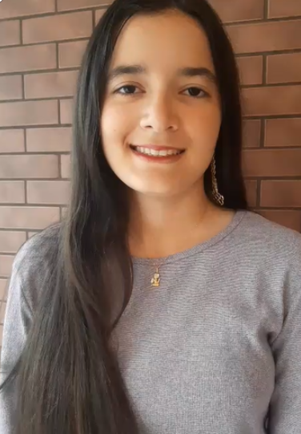
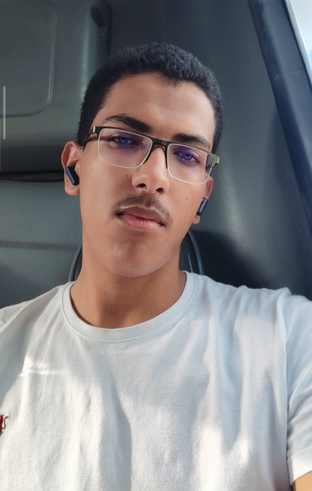

# Secretaria de Estado de Saúde do Distrito Federal - SES-DF
## Exames de Carga Viral de HIV, Hepatite B, Hepatite C e Contagem de Linfócitos T CD4 e CD8

## Grupo 02

## Introdução

Este repositório tem como objetivo armazenar todos os artefatos produzidos durante o projeto da disciplina de Interação Humano-Computador (IHC), ministrada pelo professor André Barros de Sales na Faculdade UnB Gama (FGA). O projeto visa avaliar o portal de agendamento da [Secretaria de Estado de Saúde do Distrito Federal](https://agenda.df.gov.br/posto.html;jsessionid=cRuQ8w2jbDmkFE09XeSEiAKm841ugFoNlO8MgbcV.000suticsv112?servico=54165098), com base nos fundamentos práticos e teóricos aprendidos em IHC, apontando sugestões de melhorias para os problemas de usabilidade encontrados.

## O site

A Secretaria de Estado de Saúde do Distrito Federal é o órgão responsável pela formulação e execução da política de saúde no âmbito do DF. O <a href="https://agenda.df.gov.br/posto.html;jsessionid=cRuQ8w2jbDmkFE09XeSEiAKm841ugFoNlO8MgbcV.000suticsv112?servico=54165098">Portal de Agendamento da SES-DF</a> oferece o serviço de marcação online para diversos procedimentos e exames, incluindo os de alta complexidade como Carga Viral de HIV, Hepatites e Contagem de Linfócitos. Nesta documentação, estão dispostos os artefatos produzidos no decorrer da disciplina. O objetivo principal deste projeto é realizar pesquisas com os usuários do sistema, identificar atritos na jornada do paciente e planejar como a interface pode ser aprimorada para garantir maior acessibilidade aos cidadãos.

## Integrantes da equipe

Heatmap de Disponibilidade: <a href="https://docs.google.com/spreadsheets/d/1Jm0rxqWhgBwGmKBtouq9D5yVQB8GpTcptL05fGTCjNI/edit?gid=1105040389#gid=1105040389">Heatmap</a> 

Nossa equipe de trabalho é composta pelos estudantes da Universidade de Brasília presentes na Tabela 1.

<table style="margin-left: auto; margin-right: auto;">
<tr>
    <td align="center">
      <a href="https://github.com/TiagoUNB">
        
        <h5 class="text-center">Tiago Geovane da Silva Sousa</h5>
      </a>
    </td>
    <td align="center">
      <a href="https://github.com/MLuana725">
        
        <h5 class="text-center">Maria Luana Soares Lopes</h5>
      </a>
    </td>
    <td align="center">
      <a href="https://github.com/Bryan70897">
        
        <h5 class="text-center">Bryan Smith Rodrigues Cavalcante</h5>
      </a>
    </td>
    <td align="center">
      <a href="https://github.com/GuilhermeCarvalho2024"> 
        <h5 class="text-center">Guilherme de Carvalho</h5>
      </a>
    </td>
    <td align="center">
      <a href="https://github.com/Lucasft16"> 
        <h5 class="text-center">Lucas Fujimoto</h5>
      </a>
    </td>
    <td align="center">
      <a href="https://github.com/luanludry">
        
        <h5 class="text-center">Luan Ludry Souza</h5>
      </a>
    </td>
    <td align="center">
      <a href="https://github.com/TerminaKng05">
        
        <h5 class="text-center">Samuel Felipe Lira de Souza</h5>
      </a>
    </td>
</tr>
</table>

 Tabela 1: Equipe de trabalho (Fonte: autor, 2026).</

## Histórico de versão

Data       | Versão | Descrição                               | Autor(es)           | Revisor(es)        
:----------:|:------:|:--------------------------------------|:-------------------:|:---------------:
10/04/2026| 1.0| Criação do Readme com a informações dos integrantes da Equipe| Tiago Geovane| Maria Luana
