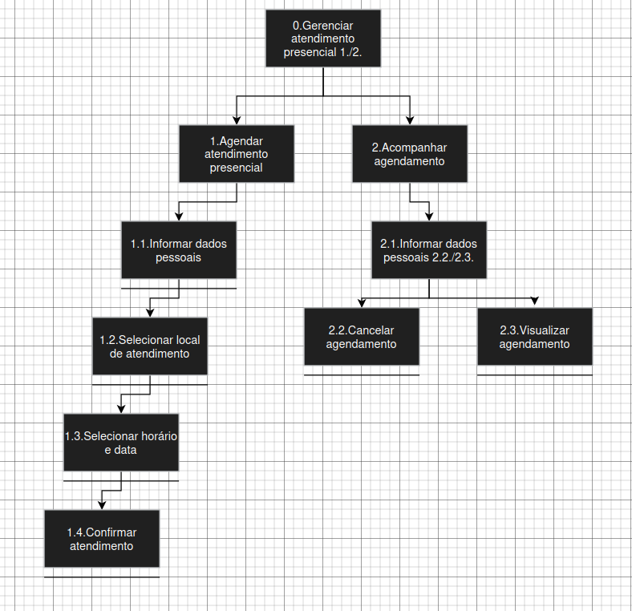
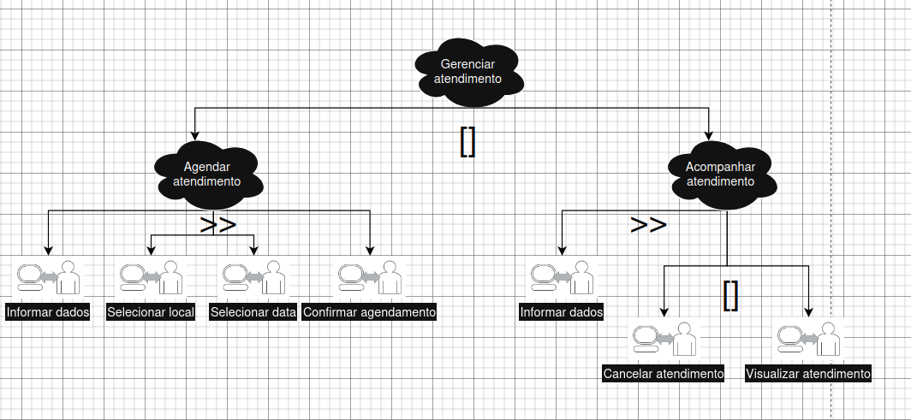

# Análise de tarefas para o agendamento presencial

## Grupo 02

---

## Tabela de Contribuição

| Integrante | Contribuição |
|:----------:|:-------------|
| Lucas Fujimoto | Criação do arquivo de analise de tarefas |

Tabela 1: Tabela de contribuição (Fonte: FUJIMOTO, Lucas, 2026).

---

## Bibliografia

>BARBOSA, Simone; SILVA, Bruno. **Interação Humano-Computador**. Rio de Janeiro: Elsevier, 2010.

> TRIBUNAL SUPERIOR ELEITORAL. **AGENDAMENTO PARA ATENDIMENTO PRESENCIAL**. Disponível em: [https://www.tre-df.jus.br/servicos-eleitorais/agendamento/atendimento-presencial-agendamento-1](https://www.tre-df.jus.br/servicos-eleitorais/agendamento/atendimento-presencial-agendamento-1). Acesso em: 02 maio 2026.

---

## Histórico de Versão

| Data | Versão | Descrição | Autor(es) | Revisor(es) |
|:----:|:------:|:----------|:---------:|:-----------:|
| 02/05/2026 | 1.0 | Criação da análise de tarefas para agendamento presensial do TSE | Lucas Fujimoto | Bryan Smith |
| 23/05/2026 | 1.1 | Padronização do artefato | Tiago | - |

---

# Análise Hierárquica de Tarefas

| Objetivos / Operações | Problemas e Recomendações | 
|---|---|
| 0. Gerenciar atendimento presencial | **Input:** Necessidade de agendar um novo serviço ou consultar um agendamento existente.   **Feedback:** O agendamento foi criado ou consultado com sucesso. |
| 1. Agendar atendimento presencial | **Input:** Necessidade de realizar um serviço presencial.   **Feedback:** Comprovante de agendamento é gerado e exibido na tela. |
| 1.1 Informar dados pessoais | **Input:** Formulário de identificação do eleitor.   **Plano:** Preencher os dados e completar a verificação de humanidade.   **Feedback:** O sistema valida os dados e avança para a próxima etapa. |
| 1.2 Selecionar local de atendimento | **Input:** Lista ou mapa com os postos de atendimento.   **Plano:** Escolher o local mais conveniente na lista.   **Feedback:** O local selecionado é destacado e o sistema avança. |
| 1.3 Selecionar horário e data | **Input:** Calendário com datas e horários disponíveis.   **Plano:** Escolher uma data e um horário vagos.   **Feedback:** A data e o horário são marcados e o sistema avança para a confirmação. |
| 1.4 Confirmar agendamento | **Input:** Tela de revisão com todos os dados do agendamento.   **Plano:** Revisar as informações e clicar no botão de confirmação.   **Feedback:** Mensagem de sucesso e exibição do comprovante/protocolo. |
| 2. Acompanhar agendamento | **Input:** Necessidade de verificar ou cancelar um agendamento existente.   **Feedback:** O status do agendamento é exibido ou modificado. |
| 2.1 Informar dados pessoais | **Input:** Formulário de identificação para localizar o agendamento.   **Plano:** Preencher os dados para encontrar o agendamento.   **Feedback:** Os detalhes do agendamento são exibidos na tela. |
| 2.2 Cancelar agendamento | **Input:** Agendamento existente visível na tela.   **Plano:** Clicar na opção "Cancelar" e confirmar a ação.   **Feedback:** Mensagem confirmando o cancelamento do agendamento. |
| 2.3 Visualizar agendamento | **Input:** Agendamento existente visível na tela.   **Plano:** Clicar na opção para visualizar ou imprimir o comprovante.   **Feedback:** O comprovante do agendamento é exibido ou o download é iniciado. |

Tabela 1: Representação da HTA em tabela (Fonte: FUJIMOTO, Lucas, 2026).

A seguir na imagem 1, apresentamos o diagrama de análise hierárquica de tarefas da funcionalidade do agendamento presencial.

Imagem 1: Imagem do diagrama HTA do agendamento presencial (Fonte: FUJIMOTO, Lucas, 2026).

# Árvore de Tarefas Concorrentes

Nessa parte, apresentamos o diagrama de árvore de tarefas concorrentes, a partir da imagem 2.

Imagem 2: Imagem do diagrama CTT do agendamento presencial (Fonte: FUJIMOTO, Lucas, 2026).

---

## Agradecimentos

Agradecemos à IA Generativa **Gemini** pelo suporte na elaboração deste documento. A ferramenta foi utilizada para Revisar a estrutura para o formato md. Todo o conteúdo técnico e as decisões de projeto foram definidos pelos integrantes da equipe; o Gemini atuou como assistente de formatação e redação, sem interferir nas escolhas metodológicas do grupo.
