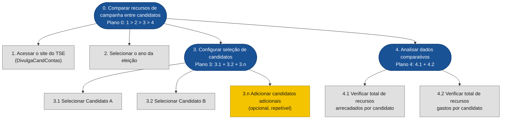
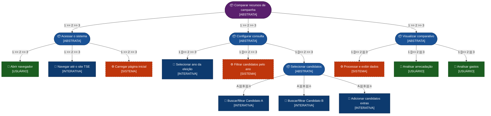

# Análise de Tarefas — DivulgaCandContas/TSE
## Grupo 02

---

## Histórico de Versão

| Data | Versão | Descrição | Autor(es) | Revisor(es) |
|:----:|:------:|:----------|:---------:|:-----------:|
| 02/05/2026 | 1.0 | Criação do documento | Tiago Geovane | Nome do Revisor |

---

## Introdução

Este documento apresenta a **Análise de Tarefas** referente ao objetivo de usuário de realizar um comparativo entre candidatos sobre o total de recursos arrecadados e gastos de campanha, utilizando o sistema **DivulgaCandContas**, mantido pelo Tribunal Superior Eleitoral (TSE), disponível em [divulgacandcontas.tse.jus.br](https://divulgacandcontas.tse.jus.br).

A análise de tarefas é um instrumento fundamental em IHC para compreender **o que os usuários fazem, como fazem e por que fazem**, antes de qualquer intervenção de design ou avaliação de sistema (Barbosa et al., 2021). Ela permite mapear o trabalho real do usuário em termos de objetivos, ações e relações entre tarefas, revelando problemas de usabilidade e oportunidades de melhoria na interface.

O fluxo analisado compreende as seguintes etapas macro:

1. O usuário acessa o site.
2. Escolhe o **ano da eleição** desejado.
3. **Seleciona os candidatos** a serem comparados.
4. **Visualiza os dados** de arrecadação e gastos na tela.


<div style="text-align: left">
<p>Imagem 1: Print do site (Fonte: divulgacandcontas.tse.jus.br, 2026).</p>
</div>


Foram aplicadas três técnicas complementares, conforme descritas em Barbosa et al. (2021): a **Análise Hierárquica de Tarefas (HTA)**, o modelo **ConcurTaskTrees (CTT)** e o modelo **GOMS** na variante **CMN-GOMS**, com estimativa de tempo via **KLM**.

---

## Análise de Tarefas

### 1. Análise Hierárquica de Tarefas (HTA)

A **Análise Hierárquica de Tarefas** (HTA — *Hierarchical Task Analysis*) foi desenvolvida na década de 1960 para entender competências exibidas em tarefas complexas e não repetitivas (Annett, 2003). Ela decompõe o objetivo principal em subobjetivos, organizados em **planos** que descrevem a relação entre eles: sequencial (`>`), paralelo (`+`) ou por seleção (`/`). No nível mais baixo da hierarquia, cada subobjetivo é alcançado por uma **operação**, a unidade fundamental da HTA. Segue abaixo a imagem 2 que é a definição do livro de HTA (Barbosa et al., 2021, p. 178).

<div align="center">

</div>

<div style="text-align: left">
<p>Imagem 2: Referencia do livro (Fonte: Barbosa et AL, 2026).</p>
</div>

#### 1.1 Diagrama HTA




> **Legenda:** Nós arredondados (azuis) = subobjetivos com plano; nós retangulares (cinza) = operações; nó amarelo = tarefa opcional/repetível.
>
> **Plano 0:** Sequencial (`1 > 2 > 3 > 4`) — cada passo deve ser concluído antes do próximo.
> **Plano 3:** Paralelo (`3.1 + 3.2 + 3.n`) — os dois candidatos obrigatórios devem ser selecionados; candidatos adicionais são opcionais.
> **Plano 4:** Paralelo (`4.1 + 4.2`) — os dois tipos de dados podem ser consultados em qualquer ordem.

---

#### 1.2 Tabela HTA

| Objetivos / Operações | Problemas e Recomendações |
|---|---|
| **0. Comparar recursos de campanha entre candidatos** — _Plano 0: 1 > 2 > 3 > 4_ | **Input:** acesso à internet e URL do site TSE. **Feedback:** exibição dos dados de arrecadação e gastos por candidato selecionado. **Plano:** acessar o site, selecionar o ano, selecionar candidatos e consultar os dados. |
| **1. Acessar o site do TSE** | **Ação:** digitar a URL ou buscar no Google. **Problema:** URL pouco conhecida; dependência de mecanismo de busca. **Recomendação:** garantir boa indexação nos buscadores e divulgar o endereço oficial. |
| **2. Selecionar o ano da eleição** | **Ação:** identificar e interagir com o filtro de ano disponível na interface. **Problema:** usuário pode não saber em qual ano a eleição desejada ocorreu. **Recomendação:** exibir anos em ordem decrescente e indicar o tipo de eleição (municipal, estadual, federal). |
| **3. Configurar seleção de candidatos** — _Plano 3: 3.1 + 3.2 + 3.n_ | **Plano:** selecionar ao menos dois candidatos para viabilizar o comparativo. |
| **3.1 Selecionar Candidato A** | **Ação:** buscar ou filtrar o candidato por nome, partido ou cargo. **Problema:** nomes similares ou homônimos podem dificultar a identificação correta. **Recomendação:** exibir CPF parcial, partido e cargo como desambiguadores. |
| **3.2 Selecionar Candidato B** | **Ação:** repetir o processo de seleção para o segundo candidato. **Problema:** ausência de mecanismo de seleção múltipla explícita pode confundir o usuário. **Recomendação:** fornecer uma área de "candidatos selecionados" visível durante toda a navegação. |
| **3.n Adicionar candidatos adicionais** | **Ação:** repetir a seleção para outros candidatos (opcional). **Problema:** limite de candidatos não informado ao usuário. **Recomendação:** indicar claramente o número máximo de candidatos comparáveis. |
| **4. Analisar dados comparativos** — _Plano 4: 4.1 + 4.2_ | **Plano:** verificar arrecadação e gastos; ambos podem ser consultados em qualquer ordem. |
| **4.1 Verificar total de recursos arrecadados** | **Ação:** localizar e ler o valor total arrecadado por cada candidato na tela. **Problema:** dados em formato de tabela podem ser difíceis de comparar visualmente. **Recomendação:** disponibilizar gráfico comparativo lado a lado. |
| **4.2 Verificar total de recursos gastos** | **Ação:** localizar e ler o valor total gasto por cada candidato na tela. **Problema:** o dado pode estar separado do dado de arrecadação, exigindo rolagem. **Recomendação:** apresentar arrecadação e gastos no mesmo card/painel por candidato. |

<div style="text-align: left">
<p>Tabela 1: Representação da HTA em tabela (Fonte: autor, 2026).</p>
</div>

---

### 2. ConcurTaskTrees (CTT)

O modelo **ConcurTaskTrees (CTT)** foi criado para auxiliar a avaliação e o design de IHC (Paterno, 1999). Ele classifica as tarefas em quatro tipos e permite representar **relações temporais** entre elas, indo além da simples hierarquia da HTA.Segue abaixo a imagem 3 que é a definição do livro de CTT (Barbosa et al., 2021, p. 187).

<div align="center">

</div>

<div style="text-align: left">
<p>Imagem 3: Referencia do livro (Fonte: Barbosa et AL, 2026).</p>
</div>

#### Tipos de tarefa

| Tipo | Significado |
|:----:|:------------|
| **Usuário** | Realizada pelo usuário fora do sistema (ex: decisão, leitura) |
| **Sistema** | Realizada pelo sistema sem interação direta com o usuário |
| **Interativa** | Envolve diálogo direto entre usuário e sistema |
| **Abstrata** | Agrupamento de subtarefas; não é uma tarefa em si |

<div style="text-align: left">
<p>Tabela 2: Tipos de tarefa no modelo CTT (Fonte: Barbosa et al., 2021, adaptado).</p>
</div>

#### Operadores CTT utilizados

| Operador | Notação | Significado |
|:--------:|:-------:|:------------|
| Ativação | `T1 >> T2` | T2 só inicia após T1 terminar |
| Ativação com informação | `T1 []>> T2` | T2 inicia após T1 e recebe dados produzidos por T1 |
| Concorrência | `T1 \|\|\| T2` | Tarefas realizáveis em qualquer ordem ou simultaneamente |
| Independência | `T1 \|=\| T2` | Qualquer ordem, mas uma deve terminar antes da outra iniciar |
| Escolha | `T1 [] T2` | Uma das duas; ao iniciar uma, a outra é desabilitada |

<div style="text-align: left">
<p>Tabela 3: Operadores de relação temporal no CTT (Fonte: Barbosa et al., 2021, adaptado).</p>
</div>

---

#### 2.1 Diagrama CTT



> **Legenda de cores:**
> 🟣 Roxo = Tarefa Abstrata raiz | 🔵 Azul escuro = Tarefa Abstrata filha | 🟢 Verde claro = Tarefa do Usuário | 🔵 Azul claro = Tarefa Interativa | 🟠 Laranja tracejado = Tarefa do Sistema

---

#### 2.2 Descrição das relações CTT

**Fluxo macro:**
```
[Acessar sistema] >> [Configurar consulta] >> [Visualizar comparativo]
```
As três grandes etapas são **sequenciais com passagem de informação** (`[]>>`): o resultado de cada fase alimenta a próxima.

**Acessar o sistema:**
```
[Abrir navegador] >> [Navegar até o site DivulgaCandContas] >> [Carregar página inicial]
```
Sequência estrita. O sistema só carrega a página após a ação de navegação do usuário.

**Configurar consulta:**
```
[Selecionar ano] []>> [Filtrar candidatos] >> [Selecionar candidatos]
```
A seleção do ano dispara o filtro no sistema (`[]>>`). A seleção dos candidatos A e B é **concorrente** (`|||`): podem ser feitas em qualquer ordem, mas ambas são necessárias. A adição de candidatos extras é opcional e também concorrente.

**Visualizar comparativo:**
```
[Processar e exibir dados] []>> ([Analisar arrecadação] ||| [Analisar gastos])
```
O sistema exibe os dados, e então o usuário analisa arrecadação e gastos de forma **concorrente** — pode realizar as duas análises simultaneamente ou em qualquer ordem.

---

### 3. GOMS (CMN-GOMS)

O modelo **GOMS** (*Goals, Operators, Methods, and Selection Rules*) descreve a tarefa e o conhecimento do usuário em termos de **objetivos**, **operadores**, **métodos** e **regras de seleção** (Card et al., 1983). A variante **CMN-GOMS** representa a hierarquia de objetivos em pseudocódigo com métodos alternativos e condicionais, sendo adequada para analisar o fluxo no DivulgaCandContas. O modelo pressupõe usuários competentes que já dominam a tarefa e sabem o que precisam fazer. Segue abaixo a imagem 4 que é a definição do livro de CMN-GOMS (Barbosa et al., 2021, p. 185).


<div style="text-align: left">
<p>Imagem 4: Referencia do livro (Fonte: Barbosa et AL, 2026).</p>
</div>


#### 3.1 Modelo CMN-GOMS

```
GOAL 0: Realizar comparativo de recursos de campanha entre candidatos

  GOAL 1: Acessar o site DivulgaCandContas/TSE

    METHOD 1.A: Acesso direto pela URL
    (SEL. RULE: usuário já conhece e memorizou a URL do site)
      OP. 1.A.1: Abrir o navegador
      OP. 1.A.2: Clicar na barra de endereço
      OP. 1.A.3: Digitar "divulgacandcontas.tse.jus.br"
      OP. 1.A.4: Pressionar Enter
      OP. 1.A.5: Aguardar carregamento da página inicial

    METHOD 1.B: Acesso via mecanismo de busca
    (SEL. RULE: usuário não lembra a URL exata)
      OP. 1.B.1: Abrir o navegador
      OP. 1.B.2: Acessar um buscador (Google, Bing etc.)
      OP. 1.B.3: Digitar "DivulgaCandContas TSE" no campo de busca
      OP. 1.B.4: Pressionar Enter
      OP. 1.B.5: Identificar e clicar no link oficial do TSE nos resultados
      OP. 1.B.6: Aguardar carregamento da página inicial


  GOAL 2: Selecionar o ano da eleição desejada

    METHOD 2.A: Seleção via dropdown/lista de anos
    (SEL. RULE: interface apresenta uma lista suspensa de anos disponíveis)
      OP. 2.A.1: Localizar o campo de seleção de ano na interface
      OP. 2.A.2: Clicar no campo para abrir a lista de opções
      OP. 2.A.3: Identificar o ano desejado na lista
      OP. 2.A.4: Clicar sobre o ano desejado
      OP. 2.A.5: Verificar que a interface atualizou refletindo o ano escolhido

    METHOD 2.B: Seleção via botão de ano
    (SEL. RULE: interface apresenta botões individuais para cada ano de eleição)
      OP. 2.B.1: Localizar os botões de ano disponíveis
      OP. 2.B.2: Identificar e clicar no botão do ano desejado
      OP. 2.B.3: Verificar que a interface atualizou refletindo o ano escolhido


  GOAL 3: Selecionar os candidatos para comparação

    GOAL 3.1: Selecionar o Candidato A

      METHOD 3.1.A: Busca por nome
      (SEL. RULE: usuário conhece o nome do candidato)
        OP. 3.1.A.1: Localizar o campo de busca de candidatos
        OP. 3.1.A.2: Digitar o nome do candidato no campo
        OP. 3.1.A.3: Aguardar sugestões ou pressionar Enter
        OP. 3.1.A.4: Verificar os resultados (nome, partido, cargo)
        OP. 3.1.A.5: Clicar sobre o candidato correto para selecioná-lo
        OP. 3.1.A.6: Confirmar que o candidato foi adicionado à seleção

      METHOD 3.1.B: Navegação por filtros (partido, cargo, UF)
      (SEL. RULE: usuário não lembra o nome exato, mas conhece partido ou cargo)
        OP. 3.1.B.1: Localizar os filtros disponíveis (partido, cargo, UF)
        OP. 3.1.B.2: Selecionar os filtros pertinentes
        OP. 3.1.B.3: Navegar pela lista filtrada de candidatos
        OP. 3.1.B.4: Clicar sobre o candidato desejado para selecioná-lo
        OP. 3.1.B.5: Confirmar que o candidato foi adicionado à seleção

    GOAL 3.2: Selecionar o Candidato B
      [Repetir METHOD 3.1.A ou 3.1.B para o segundo candidato]
      OP. 3.2.1: Identificar que um novo candidato precisa ser adicionado
      OP. 3.2.2: Executar Method 3.1.A ou 3.1.B para o Candidato B
      OP. 3.2.3: Confirmar que o segundo candidato aparece na seleção

    GOAL 3.n: Adicionar candidatos adicionais (opcional)
    (SEL. RULE: usuário deseja comparar mais de dois candidatos)
      [Repetir GOAL 3.1 para cada candidato adicional]


  GOAL 4: Visualizar e interpretar os dados comparativos

    METHOD 4.A: Leitura direta dos dados na tela
    (SEL. RULE: interface exibe dados em formato comparativo)
      OP. 4.A.1: Aguardar o sistema processar e exibir os dados
      OP. 4.A.2: Localizar a seção de "Total de Recursos Arrecadados"
      OP. 4.A.3: Comparar os valores de arrecadação entre os candidatos
      OP. 4.A.4: Localizar a seção de "Total de Recursos Gastos"
      OP. 4.A.5: Comparar os valores de gastos entre os candidatos
      OP. 4.A.6: Registrar ou memorizar os dados relevantes

    METHOD 4.B: Exportação dos dados para análise externa
    (SEL. RULE: usuário deseja análise mais aprofundada ou persistência dos dados)
      OP. 4.B.1: Localizar a opção de exportação (CSV, PDF, planilha)
      OP. 4.B.2: Acionar o download dos dados
      OP. 4.B.3: Abrir o arquivo exportado em ferramenta adequada
      OP. 4.B.4: Analisar os dados de arrecadação e gastos externamente
```

---


### 4. Síntese e Problemas Identificados

Os principais problemas identificados nas três análises são:

1. **Descoberta do site:** URL pouco intuitiva dificulta o acesso direto, ela não está de facil acesso na pagina inicial  (HTA 1 / GOMS Method 1.B).
2. **Ambiguidade de candidatos:** homônimos e nomes similares sem desambiguadores claros como partido e cargo (HTA 3.1 / GOMS OP. 3.1.A.4).
3. **Ausência de painel de seleção persistente:** o usuário pode perder o controle de quais candidatos já foram adicionados (HTA 3.2 / CTT — tarefa interativa sem feedback sistêmico adequado).
4. **Apresentação dispersa dos dados:** arrecadação e gastos em seções separadas dificultam a comparação visual rápida (HTA 4 / GOMS OP. 4.A.2–4.A.5).

---

## Tabela de Contribuição

| Integrante | Contribuição |
|:----------:|:-------------|
| Tiago Geovane | Elaboração do documento integralmente |


<div style="text-align: left">
<p>Tabela 6: Tabela de contribuição (Fonte: autor, 2026).</p>
</div>

---

## Referência Bibliográfica

> BARBOSA, S. D. J.; SILVA, B. S. da; SILVEIRA, M. S.; GASPARINI, I.; DARIN, T.; BARBOSA, G. D. J. **Interação Humano-Computador e Experiência do Usuário**. 1. ed. Rio de Janeiro: Autopublicação, 2021. ISBN: 978-65-00-19677-1.

> TRIBUNAL SUPERIOR ELEITORAL. **DivulgaCandContas**. Disponível em: [https://divulgacandcontas.tse.jus.br](https://divulgacandcontas.tse.jus.br). Acesso em: 02 maio 2026.

---

## Agradecimentos

Agradecemos à IA Generativa **Claude** (Anthropic) pelo suporte na elaboração deste documento. A ferramenta foi utilizada para auxiliar na estruturação e redação das análises HTA, CTT e GOMS, na geração dos diagramas em Mermaid e na formatação das tabelas comparativas. Todo o conteúdo técnico e as decisões de projeto foram definidos pelos integrantes da equipe; o Claude atuou como assistente de formatação e redação, sem interferir nas escolhas metodológicas do grupo.
