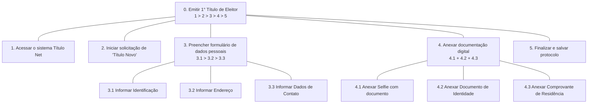
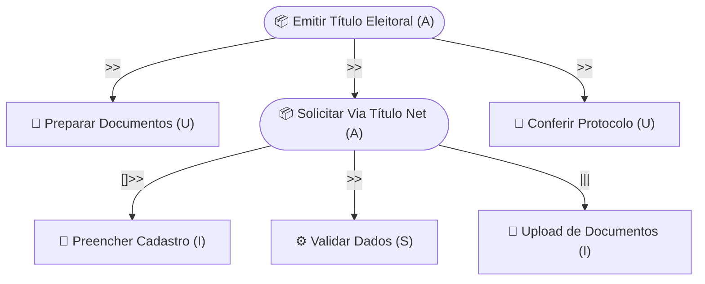

# Análise de Tarefas — Emissão de 1° Título de Eleitor

## Grupo 02

---

## Histórico de Versão

| Data | Versão | Descrição | Autor(es) | Revisor(es) |
|:----:|:------:|:----------|:---------:|:-----------:|
| 03/05/2026 | 1.0 | Documentação da análise de tarefas da emissão do 1° titulo | Maria Luana | ------- |

---

## Introdução

Este documento apresenta a **Análise de Tarefas** para o objetivo de emissão do primeiro título de eleitor por meio do sistema Título Net, mantido pelo Tribunal Superior Eleitoral (TSE). A análise de tarefas é fundamental para compreender os objetivos dos usuários e as relações entre as ações necessárias para atingi-los.

Foram aplicadas três técnicas complementares: a **Análise Hierárquica de Tarefas (HTA)**, o modelo **ConcurTaskTrees (CTT)** e o modelo **GOMS** na variante **CMN-GOMS**.

---

## 1. Análise Hierárquica de Tarefas (HTA)

A HTA decompõe o objetivo principal em subobjetivos e operações, organizados por planos que regem a ordem de execução. Conforme o padrão estabelecido, o plano de execução é indicado dentro do bloco do objetivo correspondente.

### 1.1 Diagrama HTA

### 1.2 Tabela HTA (Completa)

| Objetivos / Operações | Problemas e Recomendações |
| :--- | :--- |
| **0. Emitir 1° Título de Eleitor** | **Plano:** Sequencial (1 > 2 > 3 > 4 > 5). **Input:** Documentos biográficos e acesso à rede. **Feedback:** Geração do protocolo de acompanhamento. |
| **1. Acessar o sistema Título Net** | **Ação:** Navegar pelo portal do TSE. **Problema:** Excesso de informações na home dificulta localizar o "Autoatendimento". **Recomendação:** Criar atalho direto na página inicial. |
| **2. Iniciar solicitação de 'Título Novo'** | **Ação:** Selecionar UF e tipo de serviço. **Problema:** Terminologia técnica pode confundir cidadãos. **Recomendação:** Adicionar "Dicas de ajuda" ao passar o mouse sobre as opções. |
| **3. Preencher formulário de dados** | **Plano:** Sequencial (3.1 > 3.2 > 3.3). **Recomendação:** Exibir barra de progresso para reduzir a incerteza do usuário. |
| **3.1 Informar Identificação** | **Ação:** Digitar nome e filiação. **Problema:** Erros em campos de nomes longos. **Recomendação:** Implementar máscara de preenchimento e validação de caracteres. |
| **3.2 Informar Endereço** | **Ação:** Inserir CEP e logradouro. **Problema:** Base de CEPs pode estar desatualizada para áreas novas. **Recomendação:** Garantir que o campo de endereço seja editável após a busca. |
| **3.3 Informar Contato** | **Ação:** Digitar e-mail e telefone. **Problema:** Usuário pode digitar e-mail incorreto e não receber atualizações. **Recomendação:** Campo obrigatório de confirmação de e-mail. |
| **4. Anexar documentação digital** | **Plano:** Paralelo (4.1 + 4.2 + 4.3). As tarefas podem ocorrer em qualquer ordem. |
| **4.1 Anexar Selfie com documento** | **Ação:** Upload de foto de rosto. **Problema:** Enquadramento incorreto invalida o pedido. **Recomendação:** Fornecer um guia visual de silhueta para a foto. |
| **4.2 Anexar Identidade** | **Ação:** Upload de RG ou similar. **Problema:** Arquivos acima do limite de MB são rejeitados sem aviso prévio. **Recomendação:** Informar o limite claramente e oferecer ferramenta de compressão. |
| **4.3 Anexar Comprovante** | **Ação:** Upload de conta residencial. **Problema:** Documentos com mais de 3 meses são inválidos. **Recomendação:** Alerta textual fácil de notar sobre o prazo de validade do comprovante. |
| **5. Finalizar e salvar protocolo** | **Ação:** Confirmar dados e baixar PDF. **Feedback:** O sistema deve garantir que o PDF foi baixado antes de encerrar a sessão. |

---

## 2. ConcurTaskTrees (CTT)

O modelo CTT (ConcurTaskTrees) é uma técnica de modelagem que representa a estrutura hierárquica e as relações temporais entre as tarefas, classificando-as de acordo com sua natureza (usuário, sistema, interativa ou abstrata).

### 2.1 Diagrama CTT

> **Legenda Operadores:**
> *   `>>` **Ativação:** T2 inicia após o término de T1.
> *   `[]>>` **Ativação com passagem de informação:** Dados de T1 alimentam T2.
> *   `|||` **Concorrência:** As tarefas podem ocorrer simultaneamente.
>
> **Tipos de Tarefas:** (U) Usuário, (S) Sistema, (I) Interativa, (A) Abstrata.

---

## 3. GOMS (CMN-GOMS)

O modelo GOMS descreve o conhecimento procedimental de um usuário competente, estruturando suas ações em termos de objetivos, operadores, métodos e regras de seleção para atingir uma meta no sistema.

*   **GOAL 0: Emitir 1° Título de Eleitor**
    *   **GOAL 1: Acessar sistema**
        *   OP. 1.1: Digitar URL do Título Net
        *   OP. 1.2: Pressionar Enter
    *   **GOAL 2: Iniciar Cadastro**
        *   OP. 2.1: Clicar em "Autoatendimento"
        *   OP. 2.2: Clicar em "Tirar 1° título"
    *   **GOAL 3: Preencher Identidade**
        *   **METHOD 3.A: Entrada via teclado**
            *   OP. 3.A.1: Digitar Nome, Data de Nascimento e Endereço
            *   OP. 3.A.2: Pressionar Tab para avançar
    *   **GOAL 4: Anexar Documentos**
        *   OP. 4.1: Localizar arquivos no diretório
        *   OP. 4.2: Confirmar upload

---

## 4. Síntese e Problemas Identificados

A aplicação conjunta das técnicas permitiu identificar os seguintes pontos críticos no **Título Net**:

1.  **Dificuldade de Acesso:** O sistema de "Autoatendimento" exige várias camadas de cliques até chegar à emissão (HTA 1 / GOMS 2.1).
2.  **Barreiras Técnicas:** A falta de compressão automática de imagens impede a conclusão da tarefa por usuários com arquivos grandes (HTA 4.2).
3.  **Feedback de Validação:** Erros só são descobertos após o preenchimento total, aumentando o esforço de correção (CTT 2.2).

---

---

## Tabela de Contribuição

| Integrante | Contribuição |
|:----------:|:-------------|
| Maria Luana | Elaboração integral das análises HTA, CTT e GOMS da emissão do 1° Título |

---

## Referência Bibliográfica

> BARBOSA, S. D. J.; SILVA, B. S. da; SILVEIRA, M. S.; GASPARINI, I.; DARIN, T.; BARBOSA, G. D. J. **Interação Humano-Computador e Experiência do Usuário**. 1. ed. Rio de Janeiro: Autopublicação, 2021. ISBN: 978-65-00-19677-1.
>
> TRIBUNAL SUPERIOR ELEITORAL. **Autoatendimento do Eleitor – Título Net**. Disponível em: [tse.jus.br](https://www.tse.jus.br).

---

## Agradecimentos

Agradecemos à IA Generativa **Gemini** pelo suporte na elaboração deste documento. A ferramenta foi utilizada para Revisar a estrutura para o formato md. Todo o conteúdo técnico e as decisões de projeto foram definidos pelos integrantes da equipe; o Gemini atuou como assistente de formatação e redação, sem interferir nas escolhas metodológicas do grupo.

