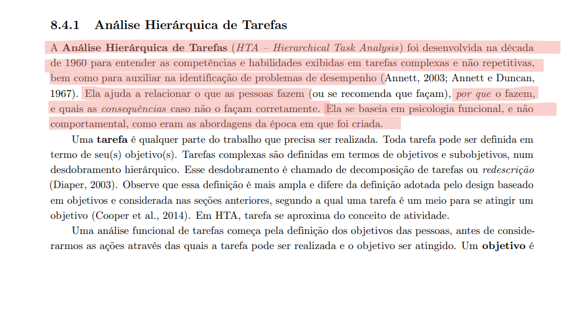
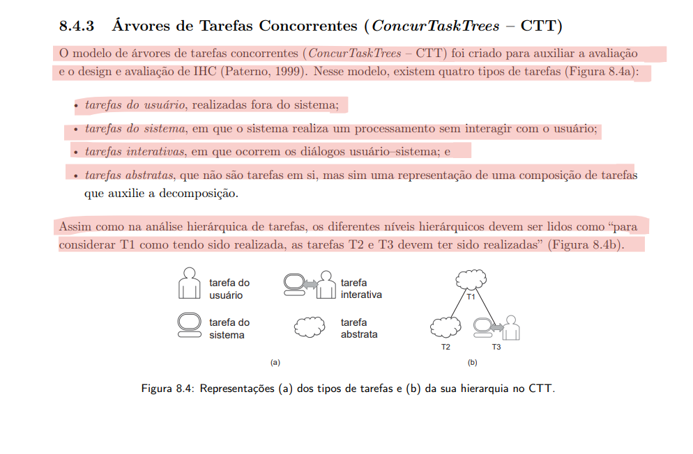
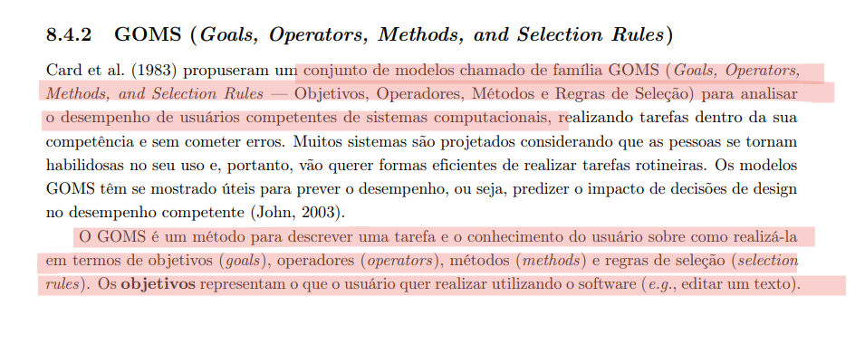

# Análise de Tarefas — Justificativa Eleitoral Online

## Grupo 02

---

## Tabela de Contribuição

| Integrante | Contribuição |
|:----------:|:-------------|
| Luan Ludry | Elaboração do documento integralmente |

<div style="text-align: left">
<p>Tabela 4: Tabela de contribuição (Fonte: autores, 2026).</p>
</div>

---

## Introdução

Este documento apresenta a **Análise de Tarefas** referente ao objetivo do usuário de realizar a **justificativa de ausência eleitoral online**, utilizando o portal do **Tribunal Superior Eleitoral (TSE)** e dos **Tribunais Regionais Eleitorais (TRE)**, disponível em [www.tse.jus.br](https://www.tse.jus.br).

A análise de tarefas é um instrumento fundamental em IHC para compreender **o que os usuários fazem, como fazem e por que fazem**, antes de qualquer intervenção de design ou avaliação de sistema (Barbosa et al., 2021). Ela permite mapear o trabalho real do usuário em termos de objetivos, ações e relações entre tarefas, revelando problemas de usabilidade e oportunidades de melhoria na interface.

O fluxo analisado compreende as seguintes etapas macro:

1. O usuário **acessa o portal** do TSE/TRE.
2. **Autentica-se** via GOV.BR.
3. **Preenche e envia** o formulário de justificativa.
4. **Obtém o comprovante** em PDF.

Foram aplicadas três técnicas complementares, conforme descritas em Barbosa et al. (2021): a **Análise Hierárquica de Tarefas (HTA)**, o modelo **ConcurTaskTrees (CTT)** e o modelo **GOMS** na variante **CMN-GOMS**.

---

## Análise de Tarefas

### 1. Análise Hierárquica de Tarefas (HTA)

A **Análise Hierárquica de Tarefas** (HTA — *Hierarchical Task Analysis*) foi desenvolvida na década de 1960 para entender competências exibidas em tarefas complexas e não repetitivas (Annett, 2003). Ela decompõe o objetivo principal em subobjetivos, organizados em **planos** que descrevem a relação entre eles: sequencial (`>`), paralelo (`+`) ou por seleção (`/`). No nível mais baixo da hierarquia, cada subobjetivo é alcançado por uma **operação**, a unidade fundamental da HTA. Segue abaixo a definição do livro de referência (Barbosa et al., 2021, p. 178).

<div align="center">

</div>
<div style="text-align: left">
<p>Imagem 1: Referência do livro (Fonte: Barbosa et al., 2021).</p>
</div>

#### 1.1 Diagrama HTA

```mermaid
graph TD
    0(["0. Justificar ausência eleitoral online<br/>Plano 0: 1 &gt; 2 &gt; 3 &gt; 4"])
    1(["1. Acessar o portal<br/>Plano 1: 1.1 &gt; 1.2"])
    2(["2. Autenticar-se no sistema<br/>Plano 2: 2.1 &gt; 2.2 &gt; 2.3"])
    3(["3. Preencher e enviar a justificativa<br/>Plano 3: 3.1 &gt; 3.2 &gt; 3.3 &gt; 3.4"])
    4(["4. Obter o comprovante<br/>Plano 4: 4.1 &gt; 4.2"])
    1_1["1.1 Acessar o site do TSE<br/>ou TRE pelo navegador"]
    1_2["1.2 Localizar a seção<br/>de Justificativa Eleitoral"]
    2_1["2.1 Clicar em<br/>'Realizar Justificativa'"]
    2_2["2.2 Fazer login<br/>pelo GOV.BR (CPF + senha)"]
    2_3["2.3 Aguardar validação<br/>automática dos dados eleitorais"]
    3_1["3.1 Selecionar o<br/>motivo da ausência"]
    3_2["3.2 Descrever<br/>a situação"]
    3_3["3.3 Anexar documento<br/>comprobatório (PDF ou JPG, até 2MB)"]
    3_4["3.4 Enviar o formulário"]
    4_1["4.1 Verificar mensagem de<br/>confirmação e número de protocolo"]
    4_2["4.2 Baixar e salvar<br/>o comprovante em PDF"]

    0 --> 1
    0 --> 2
    0 --> 3
    0 --> 4
    1 --> 1_1
    1 --> 1_2
    2 --> 2_1
    2 --> 2_2
    2 --> 2_3
    3 --> 3_1
    3 --> 3_2
    3 --> 3_3
    3 --> 3_4
    4 --> 4_1
    4 --> 4_2

    style 0 fill:#1a5296,color:#ffffff,stroke:#0d3a6e
    style 1 fill:#1a5296,color:#ffffff,stroke:#0d3a6e
    style 2 fill:#1a5296,color:#ffffff,stroke:#0d3a6e
    style 3 fill:#1a5296,color:#ffffff,stroke:#0d3a6e
    style 4 fill:#1a5296,color:#ffffff,stroke:#0d3a6e
    style 1_1 fill:#e0e0e0,color:#1a1a1a,stroke:#757575
    style 1_2 fill:#e0e0e0,color:#1a1a1a,stroke:#757575
    style 2_1 fill:#e0e0e0,color:#1a1a1a,stroke:#757575
    style 2_2 fill:#e0e0e0,color:#1a1a1a,stroke:#757575
    style 2_3 fill:#e0e0e0,color:#1a1a1a,stroke:#757575
    style 3_1 fill:#e0e0e0,color:#1a1a1a,stroke:#757575
    style 3_2 fill:#e0e0e0,color:#1a1a1a,stroke:#757575
    style 3_3 fill:#f5c400,color:#1a1a1a,stroke:#a08000
    style 3_4 fill:#e0e0e0,color:#1a1a1a,stroke:#757575
    style 4_1 fill:#e0e0e0,color:#1a1a1a,stroke:#757575
    style 4_2 fill:#e0e0e0,color:#1a1a1a,stroke:#757575
```



> **Legenda:** Nós arredondados (azuis) = subobjetivos com plano; nós retangulares (cinza) = operações; nó amarelo = etapa com obstáculo crítico identificado.
>
> **Plano 0:** Sequencial (`1 > 2 > 3 > 4`) — cada etapa deve ser concluída antes da seguinte.
> **Plano 3:** Sequencial (`3.1 > 3.2 > 3.3 > 3.4`) — o preenchimento segue ordem definida pelo formulário.

---

#### 1.2 Tabela HTA

| Objetivos / Operações | Problemas e Recomendações |
|---|---|
| **0. Justificar ausência eleitoral online** — _Plano 0: 1 > 2 > 3 > 4_ | **Input:** necessidade de justificar ausência eleitoral. **Feedback:** comprovante com número de protocolo gerado ao final. **Plano:** acessar o portal, autenticar-se, preencher o formulário e baixar o comprovante. |
| **1. Acessar o portal** — _Plano 1: 1.1 > 1.2_ | **Plano:** acessar o site e localizar a seção de justificativa. |
| **1.1 Acessar o site do TSE ou TRE pelo navegador** | **Ação:** abrir o navegador e digitar o endereço. **Problema:** a página inicial exibe notícias sem destaque à funcionalidade de justificativa. **Recomendação:** criar acesso direto à justificativa em períodos pós-eleição. |
| **1.2 Localizar a seção de Justificativa Eleitoral** | **Ação:** usar o campo de busca ou navegar pelos menus. **Problema:** navegação pouco intuitiva entre os portais TSE e TRE. **Recomendação:** padronizar a navegação entre os portais e destacar o serviço na página inicial. |
| **2. Autenticar-se no sistema** — _Plano 2: 2.1 > 2.2 > 2.3_ | **Plano:** clicar em "Realizar Justificativa", fazer login e aguardar validação. |
| **2.1 Clicar em "Realizar Justificativa"** | **Ação:** localizar e clicar no botão da funcionalidade. **Feedback:** redirecionamento para a página de autenticação. |
| **2.2 Fazer login pelo GOV.BR (CPF + senha)** | **Ação:** inserir CPF e senha na tela do GOV.BR. **Problema:** sistema fora do ar em dias de alto volume (pós-eleição). **Recomendação:** implementar fila de espera com estimativa de tempo. |
| **2.3 Aguardar validação automática dos dados eleitorais** | **Ação:** aguardar o sistema confirmar os dados. **Feedback:** dados validados e formulário exibido automaticamente. |
| **3. Preencher e enviar a justificativa** — _Plano 3: 3.1 > 3.2 > 3.3 > 3.4_ | **Plano:** selecionar motivo, descrever, anexar documento e enviar. |
| **3.1 Selecionar o motivo da ausência** | **Ação:** escolher a opção correspondente na lista de motivos. **Feedback:** motivo registrado no formulário. |
| **3.2 Descrever a situação** | **Ação:** digitar uma descrição da situação no campo de texto. **Problema:** pode ocorrer simultaneamente com 3.1 em alguns fluxos. |
| **3.3 Anexar documento comprobatório (PDF ou JPG, até 2MB)** | **Ação:** selecionar e fazer upload do arquivo. **Problema:** sistema aceita apenas PDF ou JPG até 2 MB; documentos em outros formatos (ex.: HTML) não são aceitos. **Recomendação:** informar os formatos aceitos antes do upload e oferecer conversor integrado. |
| **3.4 Enviar o formulário** | **Ação:** clicar em "Enviar". **Problema:** risco de perda de dados se a sessão expirar antes do envio. **Recomendação:** implementar salvamento automático do formulário em andamento. |
| **4. Obter o comprovante** — _Plano 4: 4.1 > 4.2_ | **Plano:** verificar confirmação e baixar o PDF. |
| **4.1 Verificar mensagem de confirmação e número de protocolo** | **Ação:** ler a mensagem de sucesso e anotar o protocolo. **Feedback:** mensagem "Justificativa recebida com sucesso. Número de protocolo: XXXX." |
| **4.2 Baixar e salvar o comprovante em PDF** | **Ação:** clicar em "Baixar comprovante". **Problema:** usuário pode fechar a página antes de baixar o arquivo. **Recomendação:** enviar o comprovante automaticamente por e-mail como fallback. |

<div style="text-align: left">
<p>Tabela 1: Representação da HTA em tabela (Fonte: autores, 2026).</p>
</div>

---

### 2. ConcurTaskTrees (CTT)

O modelo **ConcurTaskTrees (CTT)** foi criado para auxiliar a avaliação e o design de IHC (Paterno, 1999). Ele classifica as tarefas em quatro tipos e permite representar **relações temporais** entre elas, indo além da simples hierarquia da HTA. Segue abaixo a definição do livro de referência (Barbosa et al., 2021, p. 187).

<div align="center">

</div>
<div style="text-align: left">
<p>Imagem 2: Referência do livro (Fonte: Barbosa et al., 2021).</p>
</div>

#### Tipos de Tarefas Identificadas

| Tarefa | Tipo |
|--------|------|
| Acessar o portal pelo navegador | Tarefa do usuário |
| Localizar a seção de justificativa | Tarefa interativa |
| Fazer login pelo GOV.BR | Tarefa interativa |
| Validar dados eleitorais | Tarefa do sistema |
| Selecionar motivo da ausência | Tarefa interativa |
| Descrever a situação | Tarefa do usuário |
| Converter documento para PDF (se necessário) | Tarefa do usuário |
| Anexar documento comprobatório | Tarefa interativa |
| Enviar formulário | Tarefa interativa |
| Gerar número de protocolo | Tarefa do sistema |
| Baixar comprovante em PDF | Tarefa interativa |

<div style="text-align: left">
<p>Tabela 2: Tipos de tarefa no modelo CTT (Fonte: autores, 2026).</p>
</div>

#### Operadores CTT Utilizados

| Operador | Significado | Onde foi aplicado |
|:--------:|:------------|:------------------|
| `T1 >> T2` | Ativação — T2 só inicia após T1 terminar | Entre todas as etapas principais (acesso → login → preenchimento → comprovante) |
| `T1 \|\|\| T2` | Concorrência — podem ocorrer em qualquer ordem | Selecionar motivo (3.1) e descrever situação (3.2) podem ser feitos em qualquer ordem |
| `T1 []>> T2` | Ativação com passagem de informação | Login GOV.BR passa dados ao formulário; formulário enviado passa dados ao sistema |
| `T1 [] T2` | Escolha — iniciada uma, a outra é desabilitada | Converter o documento OU já tê-lo no formato correto (3.3) |

<div style="text-align: left">
<p>Tabela 3: Operadores de relação temporal no CTT (Fonte: autores, 2026).</p>
</div>

#### 2.1 Diagrama CTT

```mermaid
graph TD
    Root(["📦 Justificar ausência eleitoral online\n[ABSTRATA]"])
    A(["📦 1. Acessar e localizar a seção\n[ABSTRATA]"])
    B(["📦 2. Autenticar-se\n[ABSTRATA]"])
    C(["📦 3. Preencher e enviar\n[ABSTRATA]"])
    D(["📦 4. Obter comprovante\n[ABSTRATA]"])

    A1["🙋 1.1 Acessar o portal\n[USUÁRIO]"]
    A2["🔄 1.2 Localizar justificativa eleitoral\n[INTERATIVA]"]

    B1["🔄 2.1 Clicar em Realizar Justificativa\n[INTERATIVA]"]
    B2["🔄 2.2 Inserir CPF e senha GOV.BR\n[INTERATIVA]"]
    B3["⚙️ 2.3 Validar dados eleitorais\n[SISTEMA]"]

    C1["🔄 3.1 Selecionar motivo\n[INTERATIVA]"]
    C2["🙋 3.2 Descrever situação\n[USUÁRIO]"]
    C3["🙋 3.3 Converter documento SE necessário\n[USUÁRIO]"]
    C4["🔄 3.4 Anexar documento\n[INTERATIVA]"]
    C5["🔄 3.5 Enviar formulário\n[INTERATIVA]"]

    D1["⚙️ 4.1 Sistema gera protocolo\n[SISTEMA]"]
    D2["🔄 4.2 Baixar comprovante PDF\n[INTERATIVA]"]

    Root -- "1 >> 2 >> 3 >> 4" --> A
    Root -- "1 >> 2 >> 3 >> 4" --> B
    Root -- "1 >> 2 >> 3 >> 4" --> C
    Root -- "1 >> 2 >> 3 >> 4" --> D

    A -- "1 >> 2" --> A1
    A -- "1 >> 2" --> A2

    B -- "1 >> 2 []>> 3" --> B1
    B -- "1 >> 2 []>> 3" --> B2
    B -- "1 >> 2 []>> 3" --> B3

    C -- "1 ||| 2 >> []3 >> 4 >> 5" --> C1
    C -- "1 ||| 2 >> []3 >> 4 >> 5" --> C2
    C -- "1 ||| 2 >> []3 >> 4 >> 5" --> C3
    C -- "1 ||| 2 >> []3 >> 4 >> 5" --> C4
    C -- "1 ||| 2 >> []3 >> 4 >> 5" --> C5

    D -- "1 []>> 2" --> D1
    D -- "1 []>> 2" --> D2

    style Root fill:#5a1f6d,color:#ffffff,stroke:#3d1249
    style A fill:#1a5296,color:#ffffff,stroke:#0d3a6e
    style B fill:#1a5296,color:#ffffff,stroke:#0d3a6e
    style C fill:#1a5296,color:#ffffff,stroke:#0d3a6e
    style D fill:#1a5296,color:#ffffff,stroke:#0d3a6e
    style A1 fill:#1b5e20,color:#ffffff,stroke:#0a3d12
    style A2 fill:#0d3a6e,color:#ffffff,stroke:#061f40
    style B1 fill:#0d3a6e,color:#ffffff,stroke:#061f40
    style B2 fill:#0d3a6e,color:#ffffff,stroke:#061f40
    style B3 fill:#bf360c,color:#ffffff,stroke:#7f2107,stroke-dasharray: 5 5
    style C1 fill:#0d3a6e,color:#ffffff,stroke:#061f40
    style C2 fill:#1b5e20,color:#ffffff,stroke:#0a3d12
    style C3 fill:#1b5e20,color:#ffffff,stroke:#0a3d12
    style C4 fill:#0d3a6e,color:#ffffff,stroke:#061f40
    style C5 fill:#0d3a6e,color:#ffffff,stroke:#061f40
    style D1 fill:#bf360c,color:#ffffff,stroke:#7f2107,stroke-dasharray: 5 5
    style D2 fill:#0d3a6e,color:#ffffff,stroke:#061f40
```



> **Legenda de cores:**
> 🟣 Roxo = Tarefa Abstrata raiz | 🔵 Azul escuro = Tarefa Abstrata filha | 🟢 Verde = Tarefa do Usuário | 🔵 Azul claro = Tarefa Interativa | 🟠 Laranja tracejado = Tarefa do Sistema

#### 2.2 Descrição das Relações CTT

**Fluxo macro:**
```
[Acessar e localizar] >> [Autenticar-se] >> [Preencher e enviar] >> [Obter comprovante]
```
As quatro grandes etapas são **sequenciais** (`>>`): cada fase deve ser concluída antes da próxima iniciar.

**Acessar e localizar:**
```
[Acessar o portal] >> [Localizar justificativa eleitoral]
```
Sequência estrita — o usuário precisa acessar o portal antes de localizar a funcionalidade.

**Autenticar-se:**
```
[Clicar em Realizar Justificativa] >> [Inserir CPF e senha GOV.BR] []>> [Validar dados eleitorais]
```
O login passa as credenciais ao sistema (`[]>>`), que valida os dados automaticamente.

**Preencher e enviar:**
```
([Selecionar motivo] ||| [Descrever situação]) >> [Converter documento, SE necessário] >> [Anexar documento] >> [Enviar formulário]
```
Selecionar motivo e descrever situação são **concorrentes** (`|||`). A conversão do documento é uma **escolha** (`[]`) — o usuário converte OU já tem o arquivo no formato correto.

**Obter comprovante:**
```
[Sistema gera protocolo] []>> [Baixar comprovante PDF]
```
O sistema gera o protocolo e passa as informações para o usuário baixar o comprovante (`[]>>`).

---

### 3. GOMS (CMN-GOMS)

O modelo **GOMS** (*Goals, Operators, Methods, and Selection Rules*) descreve a tarefa e o conhecimento do usuário em termos de **objetivos**, **operadores**, **métodos** e **regras de seleção** (Card et al., 1983). A variante **CMN-GOMS** representa a hierarquia de objetivos em pseudocódigo com métodos alternativos e condicionais. O modelo pressupõe usuários competentes que já dominam a tarefa. Segue abaixo a definição do livro de referência (Barbosa et al., 2021, p. 185).

<div align="center">

</div>
<div style="text-align: left">
<p>Imagem 3: Referência do livro (Fonte: Barbosa et al., 2021).</p>
</div>

#### 3.1 Modelo CMN-GOMS

```
GOAL 0: Justificar ausência eleitoral online e obter comprovante

  GOAL 1: Acessar o portal TSE/TRE e localizar a justificativa

    METHOD 1.A: Acesso direto pela URL
    (SEL. RULE: usuário já conhece o endereço do TSE ou TRE-DF)
      OP. 1.A.1: Abrir o navegador
      OP. 1.A.2: Digitar a URL do portal
      OP. 1.A.3: Pressionar Enter e aguardar carregamento
      OP. 1.A.4: Localizar a seção de Justificativa Eleitoral no menu

    METHOD 1.B: Acesso via campo de busca
    (SEL. RULE: usuário não encontra a funcionalidade diretamente no menu)
      OP. 1.B.1: Abrir o navegador e acessar o portal TSE
      OP. 1.B.2: Localizar o campo de busca
      OP. 1.B.3: Digitar "justificativa de ausência"
      OP. 1.B.4: Pressionar Enter
      OP. 1.B.5: Identificar e clicar no link mais adequado nos resultados
      OP. 1.B.6: Ser redirecionado para o portal TRE-DF

  GOAL 2: Autenticar-se no sistema

    METHOD 2.A: Login com conta GOV.BR já existente
    (SEL. RULE: usuário já possui conta GOV.BR ativa)
      OP. 2.A.1: Clicar em "Realizar Justificativa"
      OP. 2.A.2: Ser redirecionado para a tela GOV.BR
      OP. 2.A.3: Inserir CPF no campo de identificação
      OP. 2.A.4: Inserir senha
      OP. 2.A.5: Clicar em "Entrar"
      OP. 2.A.6: Aguardar validação automática dos dados eleitorais
      OP. 2.A.7: Verificar que o formulário foi exibido com dados preenchidos

  GOAL 3: Preencher e enviar o formulário de justificativa

    GOAL 3.1: Preencher os campos do formulário

      METHOD 3.1.A: Preenchimento direto
      (SEL. RULE: usuário tem o documento comprobatório já em PDF ou JPG ≤ 2MB)
        OP. 3.1.A.1: Selecionar o motivo da ausência na lista disponível
        OP. 3.1.A.2: Digitar a descrição da situação no campo de texto
        OP. 3.1.A.3: Clicar em "Anexar documento"
        OP. 3.1.A.4: Selecionar o arquivo no gerenciador de arquivos
        OP. 3.1.A.5: Confirmar que o upload foi aceito pelo sistema

      METHOD 3.1.B: Preenchimento com conversão de documento
      (SEL. RULE: o documento comprobatório está em formato não aceito, ex.: HTML)
        OP. 3.1.B.1: Selecionar o motivo da ausência
        OP. 3.1.B.2: Digitar a descrição da situação
        OP. 3.1.B.3: Tentar anexar o documento — receber aviso de formato inválido
        OP. 3.1.B.4: Usar a função "Imprimir como PDF" do navegador para converter
        OP. 3.1.B.5: Salvar o arquivo PDF localmente
        OP. 3.1.B.6: Retornar ao formulário (dados mantidos)
        OP. 3.1.B.7: Anexar o arquivo PDF convertido
        OP. 3.1.B.8: Confirmar que o upload foi aceito

    GOAL 3.2: Enviar o formulário

      METHOD 3.2.A: Envio direto
      (SEL. RULE: todos os campos obrigatórios estão preenchidos)
        OP. 3.2.A.1: Clicar em "Enviar"
        OP. 3.2.A.2: Aguardar confirmação do sistema

  GOAL 4: Obter e salvar o comprovante

    METHOD 4.A: Download direto
    (SEL. RULE: comprovante exibido na tela após confirmação)
      OP. 4.A.1: Ler a mensagem de confirmação e o número de protocolo
      OP. 4.A.2: Clicar em "Baixar comprovante"
      OP. 4.A.3: Salvar o arquivo PDF no dispositivo
      OP. 4.A.4: Encaminhar o comprovante ao destinatário (ex.: RH da empresa)
```

---

### 4. Síntese e Problemas Identificados

Os principais problemas identificados nas três análises são:

1. **Baixa visibilidade da funcionalidade:** a página inicial do TSE exibe notícias e banners sem destacar a justificativa eleitoral, obrigando o usuário a usar o campo de busca (HTA 1.1 / GOMS Method 1.B).
2. **Instabilidade do GOV.BR em picos de acesso:** em dias pós-eleição, o sistema de autenticação pode ficar indisponível, impedindo completamente a justificativa online (HTA 2.2 / CTT — tarefa do sistema sem fallback).
3. **Restrição de formato de arquivo sem aviso prévio:** o sistema aceita apenas PDF ou JPG até 2 MB, mas essa informação não é exibida antes do upload, causando retrabalho (HTA 3.3 / GOMS Method 3.1.B).
4. **Risco de perda de dados por expiração de sessão:** o formulário pode ser perdido se o usuário demorar na conversão do documento (HTA 3.4).
5. **Ausência de envio automático do comprovante:** o usuário pode fechar a página antes de baixar o PDF, sem ter outra forma de recuperar o comprovante (HTA 4.2 / GOMS OP. 4.A.2).

---

## Bibliografia

> BARBOSA, S. D. J.; SILVA, B. S. da; SILVEIRA, M. S.; GASPARINI, I.; DARIN, T.; BARBOSA, G. D. J. **Interação Humano-Computador e Experiência do Usuário**. 1. ed. Rio de Janeiro: Autopublicação, 2021. ISBN: 978-65-00-19677-1.

> BARBOSA, S. D. J.; SILVA, B. S. **Interação Humano-Computador**. Rio de Janeiro: Elsevier, 2010. Cap. 6, pp. 192–205.

> TRIBUNAL SUPERIOR ELEITORAL. **Justificativa Eleitoral**. Disponível em: [https://www.tse.jus.br/eleitor/justificativa-eleitoral](https://www.tse.jus.br/eleitor/justificativa-eleitoral). Acesso em: 03 maio 2026.

---

## Histórico de Versão

| Data | Versão | Descrição | Autor(es) | Revisor(es) |
|:----:|:------:|:----------|:---------:|:-----------:|
| 03/05/2026 | 1.0 | Criação do documento de análise de tarefas para justificativa eleitoral online | Luan Ludry | — |
| 23/05/2026 | 1.1 | Padronização do artefato | Tiago | - |

---

## Agradecimentos

Agradecemos à IA Generativa **Claude** (Anthropic) pelo suporte na elaboração deste documento. A ferramenta foi utilizada para auxiliar na estruturação e redação das análises HTA, CTT e GOMS, na geração dos diagramas em Mermaid e na formatação das tabelas. Todo o conteúdo técnico e as decisões de projeto foram definidos pelos integrantes da equipe; o Claude atuou como assistente de formatação e redação, sem interferir nas escolhas metodológicas do grupo.
