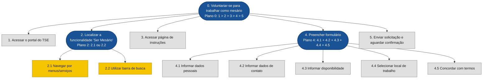

# Análise de Tarefas — Ser Mesário (TSE)

## Grupo 02

**Autor:** Bryan Smith

---

## Tabela de Contribuição

| Integrante | Contribuição |
|:-----------|:-------------|
| Bryan Smith | Elaboração do documento (HTA, CTT, GOMS, diagramas Mermaid) |

<div style="text-align: left">
<p>Tabela 6: Tabela de contribuição (Fonte: Bryan Smith, 2026).</p>
</div>

---

## Introdução

Este documento apresenta a **Análise de Tarefas** referente ao objetivo de usuário de **se voluntariar para trabalhar como mesário nas eleições**, utilizando o sistema do **Tribunal Superior Eleitoral (TSE)**, disponível no portal [www.tse.jus.br](https://www.tse.jus.br).

A análise de tarefas é um instrumento fundamental em IHC para compreender **o que os usuários fazem, como fazem e por que fazem**, antes de qualquer intervenção de design ou avaliação de sistema (Barbosa et al., 2021). Ela permite mapear o trabalho real do usuário em termos de objetivos, ações e relações entre tarefas, revelando problemas de usabilidade e oportunidades de melhoria na interface.

A funcionalidade "Ser Mesário" foi selecionada por apresentar **problemas de navegabilidade e visibilidade** — a opção não está claramente identificada na página inicial do TSE, sendo necessário ao usuário conhecimento prévio da existência do serviço ou navegação extensa por menus e submenus até encontrá-la.

O fluxo analisado compreende as seguintes etapas macro:

1. O usuário acessa o portal do TSE.
2. **Localiza** a opção "Ser Mesário" ou equivalente ("Trabalhe nas Eleições", "Voluntário Mesário").
3. **Lê as instruções** e requisitos para ser mesário.
4. **Preenche o formulário** de cadastro/candidatura.
5. **Envia a solicitação** e recebe a confirmação.

Foram aplicadas três técnicas complementares, conforme descritas em Barbosa et al. (2021): a **Análise Hierárquica de Tarefas (HTA)**, o modelo **ConcurTaskTrees (CTT)** e o modelo **GOMS** na variante **CMN-GOMS**.

---

## Análise de Tarefas

### 1. Análise Hierárquica de Tarefas (HTA)

A **Análise Hierárquica de Tarefas** (HTA — *Hierarchical Task Analysis*) foi desenvolvida na década de 1960 para entender competências exibidas em tarefas complexas e não repetitivas (Annett, 2003). Ela decompõe o objetivo principal em subobjetivos, organizados em **planos** que descrevem a relação entre eles: sequencial (`>`), paralelo (`+`) ou por seleção (`/`). No nível mais baixo da hierarquia, cada subobjetivo é alcançado por uma **operação**, a unidade fundamental da HTA (Barbosa et al., 2021, p. 178).

<div align="center">

</div>

<div style="text-align: left">
<p>Imagem 2: Referencia do livro (Fonte: Barbosa et AL, 2026).</p>
</div>

#### 1.1 Diagrama HTA



**Legenda:** Nós arredondados (azuis) = subobjetivos com plano; nós retangulares (cinza) = operações; nós amarelos = tarefas alternativas.

- **Plano 0:** Sequencial (1 > 2 > 3 > 4 > 5) — cada passo deve ser concluído antes do próximo.
- **Plano 2:** Seleção (2.1 ou 2.2) — usuário pode escolher navegar pelos menus ou usar a busca.
- **Plano 4:** Paralelo (4.1 + 4.2 + 4.3 + 4.4 + 4.5) — todos os campos devem ser preenchidos, mas a ordem pode variar.

#### 1.2 Tabela HTA

| Objetivos / Operações | Problemas e Recomendações |
|:----------------------|:--------------------------|
| **0. Voluntariar-se para trabalhar como mesário** — Plano 0: 1 > 2 > 3 > 4 > 5 | Input: acesso à internet e conhecimento da existência do serviço. Feedback: tela de confirmação ou e-mail do cartório eleitoral. Plano: acessar, localizar, ler, preencher e enviar. |
| **1. Acessar o portal do TSE** | Ação: digitar a URL www.tse.jus.br ou buscar no Google. Feedback: carregamento da página inicial. |
| **2. Localizar a funcionalidade 'Ser Mesário'** — Plano 2: 2.1 ou 2.2 | **Problema:** a opção não está facilmente visível na página inicial. Pode estar em "Serviços ao Eleitor", "Participe", "Trabalhe nas Eleições" ou "Cidadão". **Recomendação:** criar um botão/card destacado na página inicial chamado "Seja um Mesário Voluntário". |
| **2.1 Navegar por menus/serviços** | Ação: explorar menus e submenus do site (ex: "Serviços" → "Eleitor" → "Ser Mesário"). **Problema:** terminologia inconsistente; falta de padronização nos rótulos. |
| **2.2 Utilizar barra de busca** | Ação: digitar termos como "mesário", "ser mesário", "voluntário eleitoral". **Problema:** usuário precisa adivinhar o termo exato utilizado pelo sistema. **Recomendação:** implementar busca com autocomplete e sugestões. |
| **3. Acessar página de instruções** | Ação: clicar no link da funcionalidade encontrada. Feedback: exibição das instruções (requisitos, direitos, deveres do mesário). |
| **4. Preencher formulário** — Plano 4: 4.1 + 4.2 + 4.3 + 4.4 + 4.5 | **Problema:** formulário longo e com campos obrigatórios não sinalizados claramente. **Recomendação:** usar asteriscos e validação em tempo real. |
| **4.1 Informar dados pessoais** | Ação: preencher nome completo, CPF, data de nascimento, RG, título de eleitor. **Problema:** alguns campos podem não ser obrigatórios para o serviço (ex: RG). |
| **4.2 Informar dados de contato** | Ação: preencher e-mail, telefone, endereço. |
| **4.3 Informar disponibilidade** | Ação: selecionar turnos disponíveis (manhã/tarde), datas de impedimento. **Problema:** calendário interativo pode ser pouco intuitivo. |
| **4.4 Selecionar local de trabalho** | Ação: escolher zona eleitoral ou local de votação. **Problema:** usuário pode não saber sua zona eleitoral. **Recomendação:** integração com serviço de consulta de local de votação. |
| **4.5 Concordar com termos** | Ação: marcar checkbox de aceite dos termos e condições. |
| **5. Enviar solicitação e aguardar confirmação** | Ação: clicar em "Enviar" ou "Cadastrar". Feedback: mensagem de sucesso; posterior confirmação por e-mail. **Problema:** sistema não informa prazo estimado para retorno. |

<div style="text-align: left">
<p>Tabela 1: Representação da HTA em tabela (Fonte: Bryan Smith, 2026).</p>
</div>

---

### 2. ConcurTaskTrees (CTT)

O modelo **ConcurTaskTrees (CTT)** foi criado para auxiliar a avaliação e o design de IHC (Paterno, 1999). Ele classifica as tarefas em quatro tipos e permite representar relações temporais entre elas, indo além da simples hierarquia da HTA.

<div align="center">

</div>

<div style="text-align: left">
<p>Imagem 3: Referencia do livro (Fonte: Barbosa et AL, 2026).</p>
</div>

#### Tipos de tarefa

| Tipo | Significado |
|:-----|:------------|
| Usuário | Realizada pelo usuário fora do sistema (ex: decisão, leitura) |
| Sistema | Realizada pelo sistema sem interação direta com o usuário |
| Interativa | Envolve diálogo direto entre usuário e sistema |
| Abstrata | Agrupamento de subtarefas; não é uma tarefa em si |

<div style="text-align: left">
<p>Tabela 2: Tipos de tarefa no modelo CTT (Fonte: Barbosa et al., 2021, adaptado).</p>
</div>

#### Operadores CTT utilizados

| Operador | Notação | Significado |
|:---------|:--------|:------------|
| Ativação | T1 >> T2 | T2 só inicia após T1 terminar |
| Escolha | T1 [] T2 | Uma das duas; ao iniciar uma, a outra é desabilitada |
| Concorrência | T1 \|\|\| T2 | Tarefas realizáveis em qualquer ordem ou simultaneamente |
| Independência | T1 \|=\| T2 | Qualquer ordem, mas uma deve terminar antes da outra iniciar |

<div style="text-align: left">
<p>Tabela 3: Operadores de relação temporal no CTT (Fonte: Barbosa et al., 2021, adaptado).</p>
</div>

#### 2.1 Diagrama CTT

```mermaid
graph TD
    Root(["📦 Realizar cadastro como mesário voluntário\n[ABSTRATA]"])
    A(["📦 Acessar o portal TSE\n[ABSTRATA]"])
    B(["📦 Localizar serviço\n[ABSTRATA]"])
    C(["📦 Acessar instruções\n[ABSTRATA]"])
    D(["📦 Preencher formulário\n[ABSTRATA]"])
    E(["📦 Enviar e aguardar\n[ABSTRATA]"])

    A1["🙋 Abrir navegador\n[USUÁRIO]"]
    A2["🔄 Navegar até TSE\n[INTERATIVA]"]
    A3["⚙️ Carregar página inicial\n[SISTEMA]"]

    B1["🔄 Navegar menus/serviços\n[INTERATIVA]"]
    B2["🔄 Utilizar busca\n[INTERATIVA]"]

    C1["🙋 Ler instruções\n[USUÁRIO]"]
    C2["⚙️ Exibir requisitos\n[SISTEMA]"]

    D1["🔄 Informar dados pessoais\n[INTERATIVA]"]
    D2["🔄 Informar contato\n[INTERATIVA]"]
    D3["🔄 Informar disponibilidade\n[INTERATIVA]"]
    D4["🔄 Selecionar local\n[INTERATIVA]"]
    D5["🔄 Aceitar termos\n[INTERATIVA]"]
    D6["⚙️ Validar campos\n[SISTEMA]"]

    E1["⚙️ Processar envio\n[SISTEMA]"]
    E2["🙋 Aguardar confirmação\n[USUÁRIO]"]

    Root -- "1 >> 2 >> 3 >> 4 >> 5" --> A
    Root -- "1 >> 2 >> 3 >> 4 >> 5" --> B
    Root -- "1 >> 2 >> 3 >> 4 >> 5" --> C
    Root -- "1 >> 2 >> 3 >> 4 >> 5" --> D
    Root -- "1 >> 2 >> 3 >> 4 >> 5" --> E

    A -- "1 >> 2 >> 3" --> A1
    A -- "1 >> 2 >> 3" --> A2
    A -- "1 >> 2 >> 3" --> A3

    B -- "1 [] 2" --> B1
    B -- "1 [] 2" --> B2

    C -- "1 []>> 2" --> C1
    C -- "1 []>> 2" --> C2

    D -- "D1 ||| D2 ||| D3 ||| D4 ||| D5 >> D6" --> D1
    D -- "D1 ||| D2 ||| D3 ||| D4 ||| D5 >> D6" --> D2
    D -- "D1 ||| D2 ||| D3 ||| D4 ||| D5 >> D6" --> D3
    D -- "D1 ||| D2 ||| D3 ||| D4 ||| D5 >> D6" --> D4
    D -- "D1 ||| D2 ||| D3 ||| D4 ||| D5 >> D6" --> D5
    D -- "D1 ||| D2 ||| D3 ||| D4 ||| D5 >> D6" --> D6

    E -- "1 []>> 2" --> E1
    E -- "1 []>> 2" --> E2

    style Root fill:#5a1f6d,color:#ffffff,stroke:#3d1249
    style A fill:#1a5296,color:#ffffff,stroke:#0d3a6e
    style B fill:#1a5296,color:#ffffff,stroke:#0d3a6e
    style C fill:#1a5296,color:#ffffff,stroke:#0d3a6e
    style D fill:#1a5296,color:#ffffff,stroke:#0d3a6e
    style E fill:#1a5296,color:#ffffff,stroke:#0d3a6e
    style A1 fill:#1b5e20,color:#ffffff,stroke:#0a3d12
    style A2 fill:#0d3a6e,color:#ffffff,stroke:#061f40
    style A3 fill:#bf360c,color:#ffffff,stroke:#7f2107,stroke-dasharray: 5 5
    style B1 fill:#0d3a6e,color:#ffffff,stroke:#061f40
    style B2 fill:#0d3a6e,color:#ffffff,stroke:#061f40
    style C1 fill:#1b5e20,color:#ffffff,stroke:#0a3d12
    style C2 fill:#bf360c,color:#ffffff,stroke:#7f2107,stroke-dasharray: 5 5
    style D1 fill:#0d3a6e,color:#ffffff,stroke:#061f40
    style D2 fill:#0d3a6e,color:#ffffff,stroke:#061f40
    style D3 fill:#0d3a6e,color:#ffffff,stroke:#061f40
    style D4 fill:#0d3a6e,color:#ffffff,stroke:#061f40
    style D5 fill:#0d3a6e,color:#ffffff,stroke:#061f40
    style D6 fill:#bf360c,color:#ffffff,stroke:#7f2107,stroke-dasharray: 5 5
    style E1 fill:#bf360c,color:#ffffff,stroke:#7f2107,stroke-dasharray: 5 5
    style E2 fill:#1b5e20,color:#ffffff,stroke:#0a3d12
```



**Legenda de cores:**
🟣 Roxo = Tarefa Abstrata raiz | 🔵 Azul escuro = Tarefa Abstrata filha | 🟢 Verde = Tarefa do Usuário | 🔵 Azul claro = Tarefa Interativa | 🟠 Laranja tracejado = Tarefa do Sistema

#### 2.2 Descrição das relações CTT

**Fluxo macro:**

```
[Acessar portal] >> [Localizar serviço] >> [Acessar instruções] >> [Preencher formulário] >> [Enviar e aguardar]
```

As cinco grandes etapas são sequenciais (`>>`): cada uma depende da conclusão da anterior.

**Acessar o portal:**

```
[Abrir navegador] >> [Navegar até TSE] >> [Carregar página inicial]
```

Sequência estrita.

**Localizar serviço (PROBLEMA PRINCIPAL):**

```
[Navegar menus] [] [Utilizar busca]
```

O usuário pode escolher entre duas estratégias alternativas (`[]`). A dificuldade de encontrar a opção "Ser Mesário" é o principal problema de usabilidade identificado.

**Acessar instruções:**

```
[Ler instruções] []>> [Exibir requisitos]
```

A leitura do usuário é ativada após o sistema exibir o conteúdo (`[]>>`).

**Preencher formulário:**

```
[Informar dados pessoais] ||| [Informar contato] ||| [Informar disponibilidade] ||| [Selecionar local] ||| [Aceitar termos] >> [Validar campos]
```

Todos os campos podem ser preenchidos em concorrência (`|||`), mas a validação do sistema só ocorre após o preenchimento (`>>`).

**Enviar e aguardar:**

```
[Processar envio] []>> [Aguardar confirmação]
```

O usuário aguarda após o processamento do sistema.

---

### 3. GOMS (CMN-GOMS)

O modelo **GOMS** (*Goals, Operators, Methods, and Selection Rules*) descreve a tarefa e o conhecimento do usuário em termos de objetivos, operadores, métodos e regras de seleção (Card et al., 1983). A variante **CMN-GOMS** representa a hierarquia de objetivos em pseudocódigo com métodos alternativos e condicionais. O modelo pressupõe usuários competentes que já dominam a tarefa e sabem o que precisam fazer (Barbosa et al., 2021, p. 182).


<div style="text-align: left">
<p>Imagem 4: Referencia do livro (Fonte: Barbosa et AL, 2026).</p>
</div>

#### 3.1 Modelo CMN-GOMS

```
GOAL 0: Voluntariar-se para trabalhar como mesário

  GOAL 1: Acessar o portal do TSE

    METHOD 1.A: Acesso direto pela URL
    (SEL. RULE: usuário conhece a URL www.tse.jus.br)
      OP. 1.A.1: Abrir o navegador
      OP. 1.A.2: Clicar na barra de endereço
      OP. 1.A.3: Digitar "www.tse.jus.br"
      OP. 1.A.4: Pressionar Enter
      OP. 1.A.5: Aguardar carregamento da página inicial

    METHOD 1.B: Acesso via mecanismo de busca
    (SEL. RULE: usuário não lembra a URL exata)
      OP. 1.B.1: Abrir o navegador
      OP. 1.B.2: Acessar um buscador (Google, Bing etc.)
      OP. 1.B.3: Digitar "TSE" ou "Tribunal Superior Eleitoral"
      OP. 1.B.4: Pressionar Enter
      OP. 1.B.5: Identificar e clicar no link oficial do TSE
      OP. 1.B.6: Aguardar carregamento da página inicial

  GOAL 2: Localizar a funcionalidade "Ser Mesário"
  ⚠️ PONTO CRÍTICO: ESTA É A MAIOR DIFICULDADE DO FLUXO

    METHOD 2.A: Navegação por menus
    (SEL. RULE: usuário prefere explorar menus)
      OP. 2.A.1: Examinar a página inicial em busca de menus/serviços
      OP. 2.A.2: Identificar possível rótulo ("Serviços", "Cidadão", "Participe")
      OP. 2.A.3: Clicar no menu identificado
      OP. 2.A.4: Procurar visualmente por "mesário", "voluntário", "trabalhe"
      OP. 2.A.5: SE não encontrar, repetir OP. 2.A.1 a 2.A.3 para outro menu
      OP. 2.A.6: Clicar no link "Ser Mesário" ou similar

    METHOD 2.B: Utilização da barra de busca
    (SEL. RULE: usuário prefere usar busca interna)
      OP. 2.B.1: Localizar a barra de busca na página inicial
      OP. 2.B.2: Digitar termo (ex: "mesário", "ser mesário", "voluntário eleitoral")
      OP. 2.B.3: Pressionar Enter ou clicar no ícone de busca
      OP. 2.B.4: Analisar os resultados da busca
      OP. 2.B.5: Identificar o resultado correto entre as opções exibidas
      OP. 2.B.6: Clicar no link "Ser Mesário"

    METHOD 2.C: Acesso via link direto (se já souber)
    (SEL. RULE: usuário já conhece a URL específica do serviço)
      OP. 2.C.1: Digitar URL direta do serviço de mesário
      OP. 2.C.2: Pressionar Enter

  GOAL 3: Acessar página de instruções

    METHOD 3.A: Leitura das instruções
    (SEL. RULE: usuário quer entender requisitos antes de se cadastrar)
      OP. 3.A.1: Aguardar carregamento da página de instruções
      OP. 3.A.2: Ler requisitos para ser mesário
      OP. 3.A.3: Ler direitos e deveres do mesário
      OP. 3.A.4: SE concordar, prosseguir para GOAL 4
      OP. 3.A.5: SE não concordar, abandonar a tarefa

  GOAL 4: Preencher formulário de cadastro

    GOAL 4.1: Informar dados pessoais
      OP. 4.1.1: Localizar campo "Nome completo"
      OP. 4.1.2: Digitar nome completo
      OP. 4.1.3: Localizar campo "CPF"
      OP. 4.1.4: Digitar CPF
      OP. 4.1.5: Localizar campo "Data de nascimento"
      OP. 4.1.6: Digitar data no formato DD/MM/AAAA
      OP. 4.1.7: SE campo "RG" existir e for obrigatório, preencher

    GOAL 4.2: Informar dados de contato
      OP. 4.2.1: Localizar campo "E-mail"
      OP. 4.2.2: Digitar endereço de e-mail
      OP. 4.2.3: Confirmar e-mail (se houver campo de confirmação)
      OP. 4.2.4: Localizar campo "Telefone"
      OP. 4.2.5: Digitar número de telefone com DDD

    GOAL 4.3: Informar disponibilidade
      OP. 4.3.1: Localizar seção de disponibilidade
      OP. 4.3.2: Selecionar turnos do dia da eleição (manhã, tarde)
      OP. 4.3.3: SE houver necessidade de impedimento, informar datas

    GOAL 4.4: Selecionar local de trabalho
      OP. 4.4.1: SE usuário souber sua zona eleitoral, selecionar na lista
      OP. 4.4.2: SE usuário não souber, interromper para consultar local de votação

    GOAL 4.5: Concordar com termos
      OP. 4.5.1: Ler os termos e condições (ou acessar link)
      OP. 4.5.2: Marcar checkbox de aceite
      OP. 4.5.3: Verificar se o botão "Enviar" foi habilitado

  GOAL 5: Enviar solicitação e aguardar confirmação

    METHOD 5.A: Envio padrão
    (SEL. RULE: todos os campos obrigatórios foram preenchidos)
      OP. 5.A.1: Clicar no botão "Enviar" ou "Cadastrar"
      OP. 5.A.2: Aguardar processamento do sistema
      OP. 5.A.3: SE sucesso, ler mensagem de confirmação na tela
      OP. 5.A.4: SE falha, ler mensagem de erro e corrigir conforme orientação

    METHOD 5.B: Tratamento de erro
    (SEL. RULE: sistema detecta campos obrigatórios não preenchidos)
      OP. 5.B.1: O sistema exibe mensagem de erro "Campos obrigatórios não preenchidos"
      OP. 5.B.2: Campos com erro são destacados
      OP. 5.B.3: Usuário corrige os campos indicados
      OP. 5.B.4: Repetir GOAL 5

    METHOD 5.C: Aguardar confirmação externa
    (SEL. RULE: envio foi bem-sucedido)
      OP. 5.C.1: Usuário aguarda e-mail de confirmação do cartório eleitoral
      OP. 5.C.2: Usuário verifica caixa de entrada e spam
      OP. 5.C.3: SE receber confirmação, tarefa concluída com sucesso
```

---

### 4. Síntese e Problemas Identificados

As três técnicas, aplicadas em conjunto, revelam uma visão complementar sobre o fluxo de cadastro como mesário.

| Dimensão | HTA | CTT | GOMS (CMN) |
|:---------|:----|:----|:-----------|
| Foco | Hierarquia de objetivos e planos | Tipos de tarefa e relações temporais | Procedimentos, métodos e operadores |
| Representação | Diagrama hierárquico + tabela | Árvore com operadores concorrentes | Pseudocódigo estruturado |
| Concorrência | Parcialmente (plano paralelo) | Explícita (\|\|\|, \|=\|) | Não representada nativamente |
| Agentes | Foco no usuário | Distingue usuário, sistema, interativo e abstrato | Foco no usuário competente |
| Uso principal | Identificar problemas e estrutura da tarefa | Design e avaliação da interação | Predição de desempenho e design |

<div style="text-align: left">
<p>Tabela 5: Comparativo entre as técnicas de análise de tarefas aplicadas (Fonte: Bryan Smith, 2026).</p>
</div>

Os principais problemas identificados nas três análises são:

| ID | Problema | Técnica que Identificou | Descrição | Recomendação |
|:---|:---------|:------------------------|:----------|:-------------|
| P01 | Baixa visibilidade da funcionalidade | HTA, CTT, GOMS | A opção "Ser Mesário" não está claramente identificada na página inicial; usuário precisa explorar menus ou adivinhar termo de busca | Criar um botão/card destacado na página inicial chamado "Seja um Mesário Voluntário" |
| P02 | Terminologia inconsistente | HTA, CTT | A funcionalidade pode estar sob diferentes rótulos: "Serviços ao Eleitor", "Participe", "Trabalhe nas Eleições" | Padronizar o rótulo em todo o site e usar termos de fácil compreensão |
| P03 | Busca pouco eficiente | GOMS (Method 2.B) | Usuário precisa adivinhar o termo exato; busca não sugere termos relacionados | Implementar busca com autocomplete e sugestões baseadas em sinônimos |
| P04 | Falta de feedback de localização | CTT (B1/B2) | Usuário pode ficar perdido durante a navegação sem saber em qual seção está | Adicionar breadcrumbs e indicador de seção atual |
| P05 | Formulário extenso sem validação em tempo real | HTA, GOMS | Campos obrigatórios não são sinalizados claramente; validação só ocorre no envio | Usar asteriscos e validação em tempo real com feedback imediato |
| P06 | Integração ausente com consulta de zona eleitoral | HTA (4.4) | Usuário pode não saber qual zona eleitoral selecionar | Integrar formulário com serviço de consulta de local de votação por CPF |

---

### 5. Conclusão

A análise de tarefas da funcionalidade "Ser Mesário" do TSE revelou que o principal problema de usabilidade está na etapa de localização da funcionalidade no portal. A opção não está facilmente visível na página inicial, exigindo do usuário navegação extensa por menus ou uso da busca interna com termos que ele precisa adivinhar.

As três técnicas aplicadas (HTA, CTT e GOMS) foram complementares:

- A **HTA** permitiu visualizar a hierarquia completa da tarefa e identificar os pontos de decisão.
- O **CTT** trouxe à tona a diferenciação entre agentes (usuário vs. sistema) e a concorrência entre tarefas.
- O **GOMS (CMN-GOMS)** detalhou os métodos alternativos, especialmente na busca, evidenciando a dificuldade que o usuário enfrenta ao tentar encontrar o serviço.

As recomendações prioritárias incluem: (1) criar um botão/card destacado na página inicial com o chamariz "Seja um Mesário Voluntário", (2) padronizar a terminologia do serviço em todo o site, e (3) implementar busca com autocomplete e sugestões.

---

## Bibliografia

>BARBOSA, S. D. J.; SILVA, B. S. da; SILVEIRA, M. S.; GASPARINI, I.; DARIN, T.; BARBOSA, G. D. J. **Interação Humano-Computador e Experiência do Usuário.** 1. ed. Rio de Janeiro: Autopublicação, 2021. ISBN: 978-65-00-19677-1.

>TRIBUNAL SUPERIOR ELEITORAL. **Portal do TSE - Serviços ao Eleitor.** Disponível em: https://www.tse.jus.br. Acesso em: 02 maio 2026.

---

## Histórico de Versão

| Data | Versão | Descrição | Autor(es) | Revisor(es) |
|:----:|:------:|:----------|:---------:|:-----------:|
| 02/05/2026 | 1.0 | Criação do documento | Bryan Smith | — |
| 23/05/2026 | 1.1 | Padronização do artefato | Tiago | - |

---

## Agradecimentos

Agradecemos à IA Generativa Claude (Anthropic) pelo suporte na elaboração deste documento. A ferramenta foi utilizada para auxiliar na estruturação e redação das análises HTA, CTT e GOMS, na geração dos diagramas em Mermaid e na formatação das tabelas comparativas. Todo o conteúdo técnico e as decisões de projeto foram definidos pelo autor; o Claude atuou como assistente de formatação e redação, sem interferir nas escolhas metodológicas.
