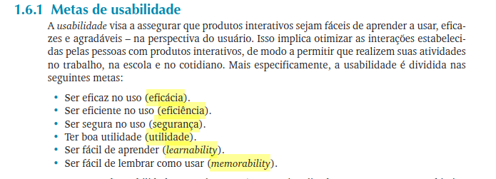
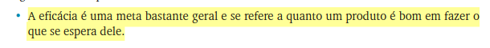
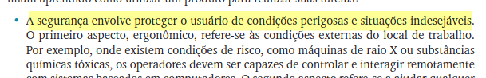
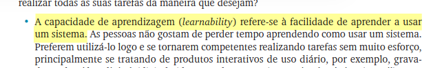

# Metas de Usabilidade
## Grupo 02

---

## Tabela de Contribuição

| Integrante | Contribuição |
|:----------:|:-------------|
| Lucas Fujimoto | Desenvolvimento das metas de usabilidade |

Tabela 1: Tabela de contribuição (Fonte: Lucas, 2026).

---

## Introdução

As metas de usabilidade funcionam como critérios para avaliar se um produto interativo permite que o usuário alcance seus objetivos com eficácia, eficiência, segurança, utilidade, facilidade de aprendizado e memorização. Na literatura de IHC, elas ajudam a transformar características abstratas da usabilidade em perguntas concretas de avaliação. A análise a seguir aplica esse olhar ao portal do TSE, observando sua organização pública, os serviços disponíveis e os recursos de acessibilidade divulgados no site.

---

## Metodologia

A metodologia escolhida foi separar em seis metas de usabilidade: eficácia, eficiência, segurança, utilidade, aprendizado e memorização. Também destaca que essas metas podem ser convertidas em perguntas de avaliação e em critérios observáveis no uso real. Segue abaixo a imagem 1 que falam sobre as metas a serem utilizadas do livro (ROGERS, Y.; SHARP, H.; PREECE, J., p. 18)

Imagem 1: Referencia do livro (Fonte: ROGERS, Y.; SHARP, H.; PREECE, J.).

---

## Análise das Metas de Usabilidade

A seguir, apresentamos uma análise detalhada das metas de usabilidade aplicadas ao portal do TSE, considerando os serviços existentes e as funcionalidades abordadas neste projeto.

### Eficácia

A eficácia avalia o quão bem os usuários conseguem atingir seus objetivos ao utilizar o sistema. O portal do TSE se mostra eficaz ao oferecer diversas funcionalidades ao cidadão, como a emissão de certidão de quitação eleitoral, o agendamento presencial e do local de votação. O site oferece caminhos que, embora difíceis de seguir, permitem ao usuário concluir suas metas. Assim, a alta disponibilidade de informações institucionais e de serviços centralizados confirma que o portal cumpre seu propósito principal. Segue abaixo a imagem 2 que fala sobre a meta de eficácia do livro (ROGERS, Y.; SHARP, H.; PREECE, J., p. 19)

Imagem 2: Referencia do livro (Fonte: ROGERS, Y.; SHARP, H.; PREECE, J.).

### Eficiência

A eficiência está relacionada ao esforço necessário para realizar uma tarefa. No portal do TSE, a página inicial oferece atalhos para serviços de "Autoatendimento Eleitoral", o que agiliza o acesso às funcionalidades mais procuradas. Entrentanto, a grande quantidade de informações e a sobreposição de menus podem torna a navegação confusa e difícil acesso a algumas funcionalidades. A busca interna funciona como planejado, mas poderia ser mais fácil, reduzindo o número de cliques para tarefas como a comparação entre candidatos ou o acesso a informações para mesários. Segue abaixo a imagem 3 que fala sobre a meta de eificiência do livro (ROGERS, Y.; SHARP, H.; PREECE, J., p. 19)

Imagem 3: Referencia do livro (Fonte: ROGERS, Y.; SHARP, H.; PREECE, J.).

### Segurança

A meta de segurança refere-se à proteção do usuário contra erros e à clareza sobre as consequências de suas ações. O portal do TSE transmite confiança por ser um site governamental, informando sobre políticas de privacidade e uso de cookies. Em áreas que exigem dados pessoais, como no autoatendimento, não há alertas e validações. Assim, a clareza das instruções e validações de informações poderiam ser aprimoradas. Além disso, mensagens de confirmação mais explícitas e um feedback claro sobre os próximos passos ajudariam a evitar que o usuário cometa erros ou se sinta inseguro sobre a conclusão da tarefa. Segue abaixo a imagem 4 que fala sobre a meta de segurança do livro (ROGERS, Y.; SHARP, H.; PREECE, J., p. 19)

Imagem 4: Referencia do livro (Fonte: ROGERS, Y.; SHARP, H.; PREECE, J.).

### Utilidade

A utilidade mede se a funcionalidade oferecida atende às necessidades do usuário. O portal do TSE possui uma utilidade muito alta, pois concentra serviços importantes para os cidadãos. Como por exemplo, a emissão de documentos, a obtenção de informações sobre o processo eleitoral, agendamento presencial, emissão do primeiro título, entre outros. Assim, o site serve como um ponto central para o eleitor. Segue abaixo a imagem 5 que fala sobre a meta de utilidade do livro (ROGERS, Y.; SHARP, H.; PREECE, J., p. 20)

Imagem 5: Referencia do livro (Fonte: ROGERS, Y.; SHARP, H.; PREECE, J.).

### Aprendizado
A facilidade de aprendizado indica a rapidez com que um novo usuário consegue utilizar o sistema. A organização do conteúdo em blocos temáticos e o uso de uma linguagem relativamente clara ajudam na familiarização com o portal. Um usuário iniciante consegue realizar tarefas básicas, entretanto, outras funcionalidades são de difícil acesso, sendo um obstáculo para o aprendizado. A simplificação da linguagem e a criação de guias passo a passo para tarefas como a alteração de dados cadastrais poderiam aprimorar significativamente essa meta. Segue abaixo a imagem 6 que fala sobre a meta de aprendizado do livro (ROGERS, Y.; SHARP, H.; PREECE, J., p. 20)

Imagem 6: Referencia do livro (Fonte: ROGERS, Y.; SHARP, H.; PREECE, J.).

### Memorização
A memorização avalia a capacidade de um usuário lembrar como se utiliza o sistema após um período de inatividade. Como muitos serviços eleitorais são utilizados esporadicamente (a cada dois anos, por exemplo), a memorização é um desafio. Dessa maneira, a estrutura do portal, com menus e submenus extensos, pode fazer com que o usuário precise reaprender o caminho para realizar uma tarefa. Segue abaixo a imagem 7 que fala sobre a meta de aprendizado do livro (ROGERS, Y.; SHARP, H.; PREECE, J., p. 21)

Imagem 7: Referencia do livro (Fonte: ROGERS, Y.; SHARP, H.; PREECE, J.).

### Conclusão
Com base nas metas de usabilidade, o site do TSE pode ser considerado funcional e socialmente relevante, pois concentra serviços públicos essenciais e apresenta recursos de apoio à navegação e à acessibilidade. Entretanto, a experiência poderia ser mais simples, com explicações mais diretas e maior padronização dos caminhos de acesso às tarefas mais frequentes.

---

## Bibliografia

> ROGERS, Y.; SHARP, H.; PREECE, J. Design de Interação. Capítulo 1 O Que é Design de Interação?

> TRIBUNAL SUPERIOR ELEITORAL. **Portal do TSE – Serviços ao Eleitor**. Disponível em: [https://www.tse.jus.br](https://www.tse.jus.br). Acesso em: 02 maio 2026.

---

## Histórico de Versão

| Data | Versão | Descrição | Autor(es) | Revisor(es) |
|:----:|:------:|:----------|:---------:|:-----------:|
| 11/05/2026 | 1.0 | Criação do documento | Lucas Fujimoto | Luan Ludry |
| 23/05/2026 | 1.1 | Padronização do artefato | Tiago | - |

---

## Agradecimentos

Agradecemos à IA Generativa **Gemini** pelo suporte na elaboração deste documento. A ferramenta foi utilizada para Revisar a estrutura para o formato md. Todo o conteúdo técnico e as decisões de projeto foram definidos pelos integrantes da equipe; o Gemini atuou como assistente de formatação e redação, sem interferir nas escolhas metodológicas do grupo.
