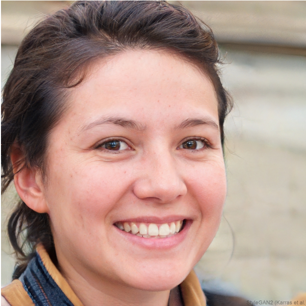
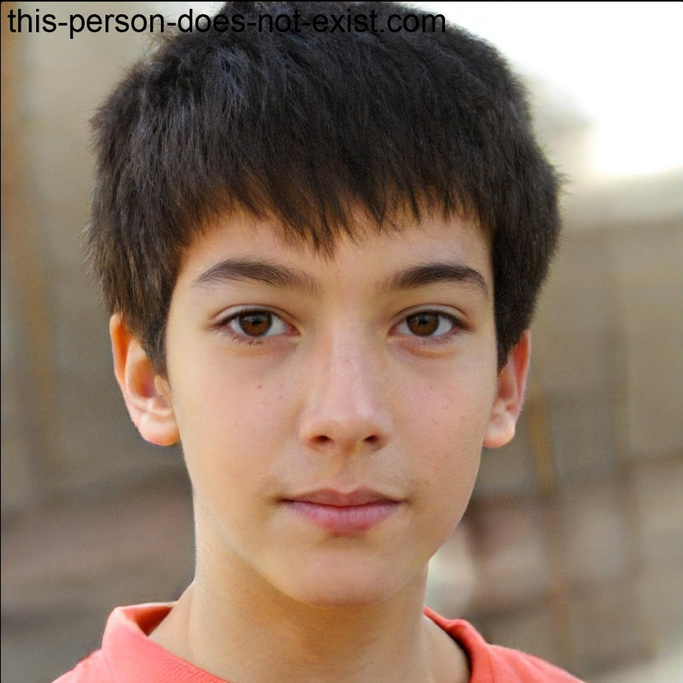

# Personas

## Grupo 02

---

## Tabela de Contribuição

| Integrante | Contribuição |
|:----------:|:-------------|
| Lucas Fujimoto | Desenvolvimento da [persona Karina Heeres](#karina-heeres) |
| Tiago Geovane | Desenvolvimento da [persona Lucas Ferreira](#lucas-ferreira) |
| Luan Ludry | Desenvolvimento da [persona Rafael Mendonça Alves](#rafael-mendonca-alves) |
| Bryan Smith | Desenvolvimento da [persona Lucas Mendes](#lucas-mendes) |
| Guilherme | Desenvolvimento da [persona Luiz Ribeiro](#luiz-ribeiro) e unificação das personas em um arquivo  |
| Samuel Felipe | Desenvolvimento das personas [Félix Ryan](#felix-ryan) e [Tamara Lais](#tamara-lais) |
| Maria Luana | Desenvolvimento da [persona Fernanda Ribeiro](#fernanda-ribeiro) e [anti-persona Pedro Almeida](#pedro-almeida) |

Tabela 1: Tabela de contribuição (Fonte: CARVALHO, Guilherme, 2026).</p|>

---

## Introdução

Este documento reúne as personas definidas pelo Grupo 02 a partir dos dados coletados nas entrevistas realizadas com usuários do sistema eleitoral. Cada persona é uma representação fictícia, porém fundamentada em dados reais, que sintetiza o perfil, os objetivos, os comportamentos e as dificuldades do público-alvo. Seu objetivo é guiar as decisões de design ao longo do projeto, garantindo que as soluções desenvolvidas sejam centradas nas necessidades reais dos usuários.

---

## Fernanda Ribeiro

Imagem 1: Imagem da Fernanda Ribeiro (Fonte: SOARES LOPES, Maria Luana, 2026).

**Dados demográficos**

| Atributo | Descrição |
|:--------:|:----------|
| Idade | 17 anos |
| Gênero | Feminino |
| Estado civil | Solteira |
| Localização | Brasília, DF |
| Ocupação | Estudante do 3° ano do Ensino Médio |
| Escolaridade | Ensino Médio incompleto |
| Afinidade com tecnologia | Alta |

**Status:** Persona Primária.

**Objetivos:**
* Obter o primeiro título de eleitor de forma totalmente remota e ágil.
* Sentir-se reconhecida como cidadã e participar ativamente do futuro do país através do voto.
* Conseguir resolver suas questões do dia a dia de maneira totalmente independente.

**Habilidades:**
* Nativa digital com alta proficiência em dispositivos móveis e redes sociais (TikTok, Instagram e outros).
* Realiza leitura por varredura, priorizando elementos visuais em vez de textos longos.
* Pouca experiência com interfaces governamentais, fluxos administrativos e termos burocráticos.

**Tarefas:**
* **Identificar serviço:** Localizar rapidamente a área de "Autoatendimento do Eleitor".
* **Solicitar emissão do título:** Acessar o sistema para realizar o cadastro inicial de eleitor.
* **Enviar documentação digital:** Realizar o upload de fotos e documentos de identificação via smartphone.
* **Acompanhar andamento:** Verificar periodicamente se o documento foi aprovado e está disponível para uso digital.

**Relacionamentos:** Pressionada pelos pais para regularizar o documento e influenciada por amigos que compartilham memes e informações sobre engajamento político.

**Requisitos:**
* "O sistema precisa ser intuitivo e funcionar bem no celular, com uma linguagem que eu consiga entender sem esforço."
* "Quero confirmações visuais imediatas de que minha foto ficou boa e meu pedido foi enviado."

**Expectativas:** Fernanda espera que o serviço seja tão simples quanto criar um perfil em uma rede social, sendo 100% online e visualmente claro.

---

## Karina Heeres

Imagem 2: Imagem da Karina Heeres (Fonte: FUJIMOTO, Lucas, 2026).

**Dados demográficos**

| Atributo | Descrição |
|:--------:|:----------|
| Idade | 27 anos |
| Gênero | Feminino |
| Estado civil | Solteira |
| Localização | Brasília, DF |
| Ocupação | Advogada em escritório particular |
| Escolaridade | Pós-graduação em Direito Tributário |
| Afinidade com tecnologia | Alta |

**Status:** Persona.

**Objetivos:**
* Crescer profissionalmente e tornar-se sócia do escritório de advocacia.
* Garantir que seus clientes empresariais estejam sempre em conformidade com todas as regulamentações, incluindo as eleitorais, para evitar riscos legais.
* Manter um bom equilíbrio entre a vida profissional e pessoal, encontrando tempo para viajar e para seus passatempos.

**Habilidades:**
* Fluente em tecnologia para fins profissionais (e-mail, softwares jurídicos, pesquisa de jurisprudência).
* Conhecimento jurídico aprofundado, mas seu foco não é a área eleitoral.
* Sabe como navegar em sites governamentais para encontrar informações oficiais.

**Tarefas:**
* **Consultar situação eleitoral de clientes:** Realiza essa tarefa pontualmente, quando um cliente precisa da certidão de quitação eleitoral para um processo.
* **Pesquisar legislação eleitoral:** Acessa o site para consultar leis e resoluções específicas quando surge uma dúvida em seu trabalho.
* **Verificar o próprio título:** Acessa o site a cada dois anos para confirmar seu local de votação.

**Relacionamentos:** Interage principalmente com seus clientes e outros advogados do escritório. Não costuma discutir dados do TSE em outros contextos.

**Requisitos:**
* "Preciso que o site seja extremamente eficiente, permitindo-me encontrar informações específicas de forma rápida e intuitiva para não comprometer os prazos dos meus clientes."
* "O site precisa ser claro sobre onde encontrar cada serviço."

**Expectativas:** Karina não espera uma experiência personalizada, mas sim eficiência. Ela acredita que deveria estar claro no site onde encontrar cada serviço necessário e que a navegação fosse bastante intuitiva.

---

## Lucas Ferreira

Imagem 3: Imagem de Lucas Ferreira (Fonte: SOUSA, Tiago, 2026).

**Dados demográficos**

| Atributo | Descrição |
|:--------:|:----------|
| Idade | 22 anos |
| Gênero | Masculino |
| Estado civil | Solteiro |
| Localização | Brasília, DF |
| Ocupação | Estudante de ensino superior (curso não concluído) |
| Escolaridade | Ensino superior incompleto |
| Afinidade com tecnologia | Alta |
| Experiência com o sistema | Iniciante a ocasional |

**Status:** Persona Primária.

**Frase representativa:**

> *"Só entro no sistema uma vez por ano e sempre fico perdido quando algo dá errado na hora de preencher."*

**Objetivos:**
* Emitir a primeira via do título de eleitor ou verificar se há pendências eleitorais em seu nome.

**Habilidades:**
* Alta afinidade com tecnologia; não apresenta resistência ao uso de sistemas digitais.
* Por acessar o sistema com pouca frequência, não desenvolveu familiaridade com sua interface ou fluxos de navegação.
* Quando encontra um erro, tende a tentar resolver sozinho, mas sente frustração quando a mensagem de retorno não é clara.

**Tarefas:**
* **Emitir título de eleitor:** Acessa o sistema esporadicamente para obter a primeira via do documento.
* **Verificar pendências eleitorais:** Consulta o sistema para checar se há irregularidades em seu cadastro.

**Relacionamentos:** Utiliza o sistema de forma individual, sem apoio de terceiros, e sente isolamento quando não encontra orientação clara durante erros.

**Requisitos:**
* "Quero mensagens de erro que me digam exatamente qual campo precisa ser corrigido e como fazer isso."
* "Não quero ter que reinserir todas as informações desde o início por causa de um erro."

**Expectativas:** Lucas espera um sistema com linguagem simples, fluxo direto e, principalmente, mensagens de erro objetivas que indiquem exatamente qual campo precisa ser corrigido e como fazê-lo.

---

## Lucas Mendes

Imagem 4: Imagem de Lucas Mendes (Fonte: SMITH, Bryan, 2026).

**Dados demográficos**

| Atributo | Descrição |
|:--------:|:----------|
| Idade | 24 anos |
| Gênero | Masculino |
| Estado civil | Solteiro |
| Localização | São Paulo, SP |
| Ocupação | Estudante de Direito (último ano) |
| Escolaridade | Superior incompleto (cursando Direito) |
| Afinidade com tecnologia | Alta |

**Status:** Persona Primária para a funcionalidade "Ser Mesário".

**Objetivos:**

| Tipo de Objetivo | Descrição |
|:----------------|:----------|
| Pessoal | Contribuir com a sociedade, aprender na prática sobre o processo eleitoral e evitar ficar entediado nos fins de semana. |
| Prático | Completar o cadastro como mesário voluntário sem dificuldades e receber confirmação em até 48 horas. |
| De vida | Tornar-se um cidadão mais engajado politicamente e, futuramente, trabalhar na Justiça Eleitoral. |

**Habilidades:**
* Alta afinidade tecnológica; utiliza computador diariamente, tem conta gov.br nível prata e está acostumado com formulários online.
* Domínio básico do TSE; já acessou o site para consultar local de votação, mas nunca utilizou o serviço de mesário.
* Concluiu curso rápido de noções de direito eleitoral online.

**Tarefas:**

| Tarefa | Frequência | Importância | Duração estimada |
|:-------|:----------:|:-----------:|:----------------:|
| Consultar local de votação | A cada eleição | Alta | 5 min |
| Regularizar título | Raramente | Média | 15 min |
| Buscar informações sobre mesário | Primeira vez | Alta | Variável |

**Relacionamentos:**

| Relacionamento | Papel |
|:--------------|:------|
| Cartório eleitoral da sua zona | Entidade responsável pela aprovação do cadastro |
| Coordenador da zona eleitoral | Supervisor dos mesários |
| Outros mesários voluntários | Colegas de trabalho no dia da eleição |

**Requisitos:**
* **Transparência:** Saber exatamente quais são os direitos e deveres antes de se inscrever.
* **Facilidade de localização:** Encontrar o serviço "Ser Mesário" sem ter que procurar muito.
* **Feedback claro:** Receber confirmação do cadastro e instruções sobre o treinamento.
* **Integração:** Poder usar a mesma conta gov.br para todo o processo.

**Expectativas:** Lucas acredita que o portal do TSE deve ser intuitivo e organizado. Ele espera encontrar o voluntariado para mesário em uma seção de destaque, o formulário com poucos campos obrigatórios e o sistema informando o prazo para resposta.

**Citações da persona:**

> *"Eu quero ajudar nas eleições, mas não quero perder meia hora tentando achar onde me inscrever. Deveria ser algo óbvio na página inicial."*

> *"Se o site me pedir CPF, título e um e-mail, já está bom. Não precisa de três telas de explicação antes do formulário."*

---

## Luiz Ribeiro

Imagem 5: Imagem do Luiz Ribeiro (Fonte: CARVALHO, Guilherme, 2026).

**Dados demográficos**

| Atributo | Descrição |
|:--------:|:----------|
| Idade | 23 anos |
| Gênero | Masculino |
| Estado civil | Solteiro |
| Localização | Cidade de médio porte no interior do Brasil |
| Ocupação | Estudante universitário de Ciência da Computação (5° semestre) |
| Escolaridade | Superior incompleto |
| Afinidade com tecnologia | Alta |

**Status:** Persona.

**Objetivos:**
* Resolver rapidamente pendências eleitorais pelo celular ou computador, sem precisar ir pessoalmente ao cartório.
* Sentir-se no controle durante a navegação, sem se perder em menus aninhados ou sentir-se incompetente.
* Ser um cidadão informado e ter autonomia para resolver questões públicas digitalmente sem depender de intermediários.

**Habilidades:**
* Fluência digital elevada; utiliza computador e smartphone diariamente para fins acadêmicos e pessoais.
* Desenvoltura em plataformas digitais e uso frequente de ferramentas de busca para resolver problemas.
* Não possui experiência profissional com temas eleitorais; contato restrito às obrigações cívicas.

**Tarefas:**
* **Consultar situação eleitoral:** Realizada com frequência, geralmente em períodos que antecedem as eleições.
* **Verificar local de votação:** Consulta para confirmar sua seção eleitoral.
* **Transferência e justificativa:** Tarefas secundárias realizadas em situações específicas.

**Relacionamentos:** Interage com o site de forma individual, mas compartilha experiências e tira dúvidas em grupos de amigos e colegas de faculdade.

**Requisitos:**
* "Preciso de acesso direto a serviços essenciais logo na página inicial, sem navegar por submenus profundos."
* "A linguagem deve ser clara, sem jargão jurídico, com ícones informativos que expliquem o serviço antes do clique."
* "O site deve oferecer uma barra de busca eficiente e confirmações visíveis de conclusão de tarefas."

**Expectativas:** Luiz espera que o site funcione como um serviço online moderno: poucos cliques, confirmação imediata e foco em serviços em vez de notícias em destaque na página inicial.

---

## Rafael Mendonca Alves

Imagem 6: Imagem de Rafael Mendonça Alves (Fonte: This Person Does Not Exist, 2026).

**Dados demográficos**

| Atributo | Descrição |
|:--------:|:----------|
| Idade | 34 anos |
| Gênero | Masculino |
| Estado civil | Casado, pai de um filho |
| Localização | Brasília, DF |
| Ocupação | Analista de Sistemas |
| Escolaridade | Superior completo em Ciência da Computação |
| Renda familiar | R$ 6.500/mês |
| Afinidade com tecnologia | Alta |

**Status:** Persona Primária para a funcionalidade de Justificativa Eleitoral Online.

**Objetivos:**

| Tipo de Objetivo | Descrição |
|:----------------|:----------|
| Pessoal | Resolver obrigações eleitorais de forma rápida e sem deslocamento ao cartório eleitoral. |
| Prático | Manter a situação eleitoral regularizada para concursos públicos e viagens internacionais. |
| De vida | Encontrar informações claras e objetivas sem precisar ligar para nenhum órgão público. |

**Habilidades:**
* Alto letramento digital; usa computador e smartphone com desenvoltura.
* Acostumado a portais governamentais como GOV.BR, Receita Federal e INSS.
* Pouca paciência com sistemas lentos, confusos ou que exijam etapas desnecessárias.

**Tarefas:**

| Tarefa | Frequência | Importância | Duração estimada |
|:-------|:----------:|:-----------:|:----------------:|
| Verificar situação eleitoral | Anual | Alta | 5 min |
| Emitir certidão de quitação | Ocasional | Alta | 10 min |
| Transferência de domicílio | Rara | Alta | 20 a 40 min |
| Justificar ausência eleitoral | Ocasional | Média | 15 min |

**Relacionamentos:**

| Relacionamento | Papel |
|:--------------|:------|
| Esposa | Pede ajuda a Rafael para resolver questões eleitorais |
| Colegas de trabalho | Consultam Rafael sobre o portal do TSE |
| Filho menor | Em breve precisará tirar o título eleitoral pela primeira vez |

**Requisitos:**
* **Agilidade:** "Eu sei o que preciso fazer, só quero que o sistema me deixe fazer rápido. Não preciso de tutorial, preciso de um caminho direto."
* **Clareza de navegação:** "Quando abro o site do TRE e não consigo achar o que preciso em menos de dois cliques, já fico frustrado."
* **Feedback imediato:** Confirmação visual clara após concluir cada etapa.
* **Exportação simplificada:** Possibilidade de salvar comprovantes em PDF sem burocracia adicional.
* **Responsividade:** Sistema que funcione bem no celular.

**Expectativas:** Rafael acredita que um portal governamental deve funcionar como qualquer outro serviço digital moderno: rápido, direto e sem exigir deslocamento presencial. Quando algo dá errado, espera mensagens de erro claras que expliquem o que fazer, e não apenas códigos de sistema.

---

## Felix Ryan

Imagem 7: Imagem do Félix Ryan (Fonte: This Person Doesn't Exist).

**Dados demográficos**

| Atributo | Descrição |
|:--------:|:----------|
| Idade | 35 anos |
| Gênero | Masculino |
| Estado civil | Casado |
| Localização | Brasília, DF |
| Ocupação | Servidor público no TCU |
| Escolaridade | Graduação em Matemática |
| Afinidade com tecnologia | Alta |

**Status:** Persona Secundária.

**Objetivos:**
* Procurar outros cursos para diversificar suas expectativas de trabalho.
* Garantir que seu título está em dia, conferindo se precisa atualizar algo ou recorrer a alguma quitação ou justificativa.

**Habilidades:**
* Experiência de 8 anos como professor em escolas públicas e privadas.
* Sabe navegar em sites governamentais para encontrar informações de seu interesse.

**Tarefas:**
* **Verificar situação eleitoral:** Confirma se seu título de eleitor está regular e se há quitações pendentes.
* **Consultar dados demográficos:** Acessa estatísticas eleitorais disponibilizadas pelo TSE para uso em materiais acadêmicos.

**Relacionamentos:** Utiliza o sistema de forma individual, com foco em obrigações cívicas e coleta de dados para uso profissional.

**Requisitos:**
* "Espero que o site tenha os dados atualizados para não ter problemas se meus dados não foram enviados ou processados corretamente."
* "A interface do sistema deve ser bem direcionada para que eu não cometa algum erro."

**Expectativas:**
* Espera que o site tenha os dados atualizados para não ter dor de cabeça caso seus dados não tenham sido enviados ou processados corretamente pelo sistema.
* Que a interface do sistema seja bem direcionada para ele não cometer algum erro.
* Espera que as estatísticas eleitorais disponibilizadas pelo TSE sejam fáceis de coletar e comparar com anos anteriores.

---

## Tamara Lais

Imagem 8: Imagem da Tamara Lais (Fonte: This Person Doesn't Exist).

**Dados demográficos**

| Atributo | Descrição |
|:--------:|:----------|
| Idade | 42 anos |
| Gênero | Feminino |
| Estado civil | Casada |
| Localização | Brasília, DF |
| Ocupação | Professora em escola pública |
| Escolaridade | Graduação em Português |
| Afinidade com tecnologia | Média |

**Status:** Persona Secundária.

**Objetivos:**
* Procurar outros cursos e materiais para diversificar o conteúdo de suas aulas.
* Verificar pesquisas eleitorais para ter noção das previsões de votos e dos principais interesses de discussão entre a população.

**Habilidades:**
* Experiência de 15 anos como professora em escolas públicas.
* Sabe navegar em sites governamentais para encontrar informações de seu interesse.

**Tarefas:**
* **Consultar dados eleitorais:** Acessa informações sobre pesquisas e estatísticas publicadas pelo TSE para uso em materiais didáticos.

**Relacionamentos:** Utiliza o sistema de forma individual, com foco na busca de dados para enriquecimento de suas aulas.

**Requisitos:**
* "Espero que o site tenha os dados atualizados e atuais para ter maior precisão sobre o que procuro."
* "A interface do sistema deve ser bem direcionada para que eu não cometa algum erro."

**Expectativas:**
* Espera que o site tenha os dados atualizados e atuais para ter maior precisão sobre o que procura.
* Que a interface do sistema seja bem direcionada para que não cometa algum erro durante a navegação.

---

## Pedro Almeida

Imagem 9: Imagem do Pedro Almeida (Fonte: SOARES LOPES, Maria Luana, 2026).

**Dados demográficos**

| Atributo | Descrição |
|:--------:|:----------|
| Idade | 12 anos |
| Gênero | Masculino |
| Estado civil | Solteiro |
| Localização | Brasília, DF |
| Ocupação | Estudante do 6° ano do Ensino Fundamental |
| Escolaridade | Ensino Fundamental incompleto |
| Afinidade com tecnologia | Média (uso recreativo e supervisionado) |

**Status:** Anti-Persona.

**Objetivos:**
* Não possui interesse ou necessidade real de acessar serviços do TSE, já que não possui capacidade eleitoral.
* Busca apenas conteúdos de entretenimento, como jogos, desenhos e vídeos curtos.
* Eventualmente acessa o site por curiosidade ao acompanhar os pais ou por acidente ao clicar em links.

**Habilidades:**
* Possui familiaridade básica com telas touch e aplicativos infantis, mas pouquíssima capacidade de leitura de textos longos ou técnicos.
* Não compreende termos jurídicos, eleitorais ou administrativos (ex: "título de eleitor", "zona eleitoral", "domicílio eleitoral").
* Depende totalmente de um adulto para preencher formulários, enviar documentos ou tomar decisões que envolvam dados pessoais.

**Tarefas:**
* Não realiza tarefas do fluxo de autoatendimento do eleitor, pois não é público apto a solicitar título de eleitor, alistamento ou justificativa de ausência.
* Pode, no máximo, clicar aleatoriamente em botões, imagens ou links por curiosidade, sem entender o propósito da página.
* Não possui documentos, e-mail próprio ou CPF utilizável para autenticação nos sistemas.

**Relacionamentos:** Depende inteiramente dos pais ou responsáveis para qualquer interação com sites institucionais; não possui autonomia legal nem cognitiva para tomar decisões nesse contexto.

**Requisitos:**
* Não há requisitos de usabilidade a serem atendidos para esse público, pois o serviço não deve ser direcionado, adaptado ou incentivado para crianças.
* O sistema deve, pelo contrário, evitar coletar ou processar dados de menores sem consentimento e supervisão adequados dos responsáveis.

**Expectativas:** Pedrinho não possui expectativas reais em relação ao serviço, pois não é o público-alvo. Sua eventual interação com o site é acidental ou motivada por curiosidade infantil, nunca por necessidade legítima de uso.

**Motivo da Exclusão:** O público infantil foi definido como anti-persona por não possuir capacidade civil e eleitoral para utilizar os serviços oferecidos pelo site do TSE. Crianças não podem se alistar como eleitoras, não possuem título de eleitor e não têm maturidade cognitiva para compreender processos eleitorais, termos jurídicos ou o impacto do voto. Além disso, o design do serviço não deve ser pensado para atrair, engajar ou facilitar o uso por menores de idade, uma vez que isso foge completamente do propósito institucional da plataforma.

---

## Bibliografia

> BARBOSA, S. D. J.; SILVA, B. S. da; SILVEIRA, M. S.; GASPARINI, I.; DARIN, T.; BARBOSA, G. D. J. **Interação Humano-Computador e Experiência do Usuário**. 1. ed. Rio de Janeiro: Autopublicação, 2021. ISBN: 978-65-00-19677-1.

> BARBOSA, Simone; SILVA, Bruno. **Interação Humano-Computador**. Rio de Janeiro: Elsevier, 2010.

> TRIBUNAL SUPERIOR ELEITORAL. **Portal do TSE: Serviços ao Eleitor**. Disponível em: https://www.tse.jus.br. Acesso em: 02 maio 2026.

> This Person Doesn't Exist. Disponível em: https://this-person-does-not-exist.com/pt. Acesso em: 01 maio 2026.

---

## Histórico de Versão

| Data | Versão | Descrição | Autor(es) | Revisor(es) |
|:----:|:------:|:----------|:---------:|:-----------:|
| 01/05/2026 | 1.0 | Criação do documento| Guilherme | Maria Luana |
| 23/05/2026 | 1.1 | Padronização do artefato | Tiago | - |
| 01/07/2026 | 1.2 | Padronização do artefato | Maria Luana | Guilherme |

---

## Agradecimentos

Agradecemos às IAs Generativas **Claude** (Anthropic) pelo suporte na elaboração deste documento. As ferramentas foram utilizadas para revisar e formatar a estrutura docdocumento. Todo o conteúdo técnico e as decisões de projeto foram definidos pelos integrantes da equipe; as IAs atuaram como assistentes de formatação e redação, sem interferir nas escolhas metodológicas do grupo.

