# Lista de Verificação — Entrega 3
## Grupo 02

---

## Tabela de Contribuição

| Integrante | Contribuição |
|:----------:|:-------------|
| Tiago | Elaboração dos itens de verificação E7, E8 (Guia de Estilo) e E18, E19 (Princípios Gerais do Projeto). |
| Guilherme | Elaboração dos itens de verificação E5 e E6 (Metas de Usabilidade). |
| Luan | Elaboração dos itens de verificação E10 e E11 (Guia de Estilo).  |
| Maria Luana | Elaboração dos itens de verificação E12 e E13 (Princípios Gerais do Projeto). |
| Lucas Fujimoto | Elaboração dos itens de verificação E1, E2, E3, E4 (Metas de Usabilidade) e E9 (Guia de Estilo). Revisão da lista. |
| Bryan | Elaboração dos itens de verificação E14 e E15 (Princípios Gerais do Projeto). |
| Samuel | Elaboração dos itens de verificação E16 e E17 (Princípios Gerais do Projeto).  |

Tabela 1: Tabela de contribuição (Fonte: autor, 2026).

---

## Introdução

Este documento apresenta a lista de verificação referente à **Entrega 3** da disciplina de Interação Humano-Computador (IHC), cujo tema central é: *Princípios Gerais do Projeto, Metas de Usabilidade, Guia de Estilo*.

A lista reúne os critérios de avaliação organizados em três grupos: (1) itens do desenvolvimento do projeto, comuns a todas as entregas; (2) itens de conteúdo da disciplina, extraídos do plano de ensino; e (3) itens extras elaborados com base no livro *Interação Humano-Computador* (Barbosa e Silva, 2010), que aprofundam a qualidade dos artefatos produzidos.

Os artefatos avaliados nesta entrega são: Características da plataforma, princípios gerais, metas de usabilidade, guia de estilo.

---

## Lista de Verificação

### Seção 1 — Itens do Desenvolvimento do Projeto

> Critérios padrão exigidos em todas as entregas do projeto. Avaliar: o próprio grupo e o Grupo +1.

| Nº | Questão | Resposta (Sim / Não / Incompleto) | Versão |
|:--:|:--------|:---------------------------------:|:--------------------------------:|
| 1 | O histórico de versão está padronizado? | | |
| 2 | O(s) autor(es) e o(s) revisor(es) estão indicados em cada artefato? | | |
| 3 | Todos os artefatos possuem referências bibliográficas e/ou bibliografia? | | |
| 4 | As tabelas e imagens possuem legenda e fonte, e são referenciadas dentro do texto? | | |
| 5 | Há um texto de introdução em todos os artefatos? | | |
| 6 | O cronograma executado indica quem realizou cada artefato/atividade com as datas de início e fim? | | |
| 7 | As atas de reunião contêm data, horário de início e fim, participantes, objetivo e atividades definidas? | | |
| 8 | A gravação da reunião do grupo está disponível e acessível? | | |
| 9 | O vídeo de apresentação está publicado como "não listado" no YouTube? | | |
| 10 | A tabela de contribuição está no início do artefato com o nome de todos os integrantes, a contribuição individual e hiperligação para a atividade e gravação? | | |
| 11 | A seção de agradecimentos registra o uso de IA generativa com a descrição específica do uso realizado no artefato? | | |

Tabela 2: Itens do desenvolvimento do projeto (Fonte: Plano de Ensino da Disciplina, 2026).

---

### Seção 2 — Itens de Conteúdo da Disciplina

> Critérios específicos da Entrega 2, extraídos do plano de ensino. Avaliar: o próprio grupo e o Grupo +1.

| Nº | Artefato | Questão | Resposta (Sim / Não / Incompleto) | Versão  |
|:--:|:--------:|:--------|:---------------------------------:|:--------------------------------:|
| C1 | Característica do projeto | As características da plataforma para o projeto estão definidas? | | |
| C2 | Princípios Gerais | Os Princípios Gerais do Projeto que serão utilizados no projeto? | | |
| C3 | Princípios Gerais | Os Princípios Gerais do Projeto contém os tópicos de correspondência com as expectativas dos usuários, simplicidade nas estruturas das tarefas, equilíbrio entre controle e liberdade do usuário, consistência e padronização; promoção da eficiência do usuário, antecipação das necessidades do usuário, visibilidade e reconhecimento, conteúdo relevante e expressão adequada e projeto para erros? | | |
| C4 | Metas de Usabilidade | As metas de usabilidade que devem ser alcançadas no projeto ou os objetivos de uma avaliação de IHC | | |
| C5 | Metas de Usabilidade | A razão da seleção das metas de usabilidade? | | |
| C6 | Guia de Estilo | O guia de Estilo do Projeto? | | |
| C7 | Guia de Estilo | O guia de Estilo possui a estrutura de intodução, resultados de análise, elementos de interface, elementos de interação, elementos de ação, vocabulários e padrões | | |
| C8 | Guia de Estilo | O Guia de Estilo corresponde ao site avaliado? | | |

Tabela 3: Itens de conteúdo da disciplina — Entrega 2 (Fonte: autores, 2026).

---

### Seção 3 — Itens Extras com Base no Livro

> Dez critérios adicionais elaborados com base no Capítulo 5 de Barbosa e Silva (2010), visando aprofundar a qualidade dos artefatos entregues.

| Nº | Artefato | Questão | Referência | Resposta (Sim / Não / Incompleto) | Versão | Autor do item |
|:--:|:--------:|:--------|:----------------------------------:|:---------------------------------:|:--------------------------------:| :---------: |
| E1 | Metas de Usabilidade | O artefato possui a meta de eficácia? | [p. 18 (ROGERS, Y.; SHARP, H.; PREECE, J.)](#lista3-1) | | | Lucas |
| E2 | Metas de Usabilidade | O artefato possui a meta de eficiência? | [p. 18 (ROGERS, Y.; SHARP, H.; PREECE, J.)](#lista3-2) | | | Lucas |
| E3 | Metas de Usabilidade | O artefato possui a meta de segurança? | [p. 18 (ROGERS, Y.; SHARP, H.; PREECE, J.)](#lista3-3) | | | Lucas |
| E4 | Metas de Usabilidade | O artefato possui a meta de utilidade? | [p. 18 (ROGERS, Y.; SHARP, H.; PREECE, J.)](#lista3-4) | | | Lucas |
| E5 | Metas de Usabilidade | O artefato possui a meta de aprendizado? | [p. 18 (ROGERS, Y.; SHARP, H.; PREECE, J.)](#lista3-5) | | | Guilherme |
| E6 | Metas de Usabilidade | O artefato possui a meta de memorável? | [p. 18 (ROGERS, Y.; SHARP, H.; PREECE, J.)](#lista3-6) | | | Guilherme |
| E7 | Guia de Estilo | O Guia de Estilo possui descrição do ambiente de trabalho do usuário? | [p. 258 ( Barbosa e Silva, 2010)](#lista3-7) | | | Tiago |
| E8 | Guia de Estilo | O Guia de Estilo possui público-alvo? | [p. 258 ( Barbosa e Silva, 2010)](#lista3-8) | | | Tiago |
| E9 | Guia de Estilo | O Guia de Estilo possui objetivo? | [p. 258 ( Barbosa e Silva, 2010)](#lista3-9) | | | Lucas |
| E10 | Guia de Estilo | O Guia de Estilo possui estilos de interação? | [p. 258 ( Barbosa e Silva, 2010)](#lista3-10) | | | Luan |
| E11 | Guia de Estilo | O Guia de Estilo possui tipos de tela (para tarefas comuns)? | [p. 258 ( Barbosa e Silva, 2010)](#lista3-11) | | | Luan |
| E12 | Princípios Gerais do Projeto | O documento fala sobre o principio de Correspondência com as Expectativas dos Usuários?  | [p.238 (Barbosa e Silva, 2010)](#lista3-12) | | | Maria Luana |
| E13 | Princípios Gerais do Projeto| O documento fala sobre o principio de Simplicidade nas Estruturas das Tarefas?  | [p.239 (Barbosa e Silva, 2010)](#lista3-13) | | | Maria Luana |
| E14 | Princípios Gerais do Projeto | O documento fala sobre o principio de Equilíbrio entre Controle e Liberdade do Usuário?  | [p.238-p.239 (Barbosa e Silva, 2010)](#lista3-14) | | | Bryan |
| E15 | Princípios Gerais do Projeto | O documento fala sobre o principio de Consistência e Padronização?  | [p.241 (Barbosa e Silva, 2010)](#lista3-15) | | | Bryan |
| E16 | Princípios Gerais do Projeto | O documento fala sobre o principio de Antecipação das Necessidades do Usuário?  | [p.243 (Barbosa e Silva, 2010)](#lista3-16) | | | Samuel |
| E17 | Princípios Gerais do Projeto | O documento fala sobre o principio de Visibilidade e Reconhecimento?  | [p.243 (Barbosa e Silva, 2010)](#lista3-17) | | | Samuel |
| E18 | Princípios Gerais do Projeto | O documento fala sobre o principio de Conteúdo Relevante e Expressão Adequada?  | [p.246 (Barbosa e Silva, 2010)](#lista3-18) | | | Tiago |
| E19 | Princípios Gerais do Projeto | O documento fala sobre o principio de Projeto para Erros?  | [(p.247 Barbosa e Silva, 2010)](#lista3-19) | | | Tiago |

Tabela 4: Itens extras de verificação (Fonte: autor, 2026).

---
## Referências
Item 1

Item 2
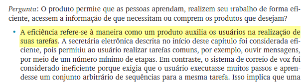

Item 3

Item 4
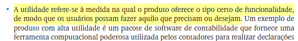

Item 5

Item 6
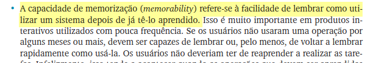

Item 7
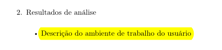

Item 8
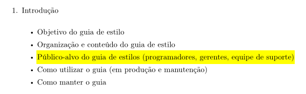

Item 9
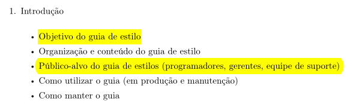

Item 10
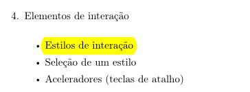

Item 11
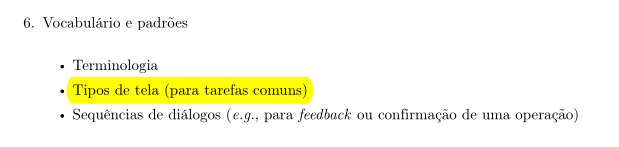

Item 12
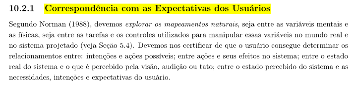

Item 13
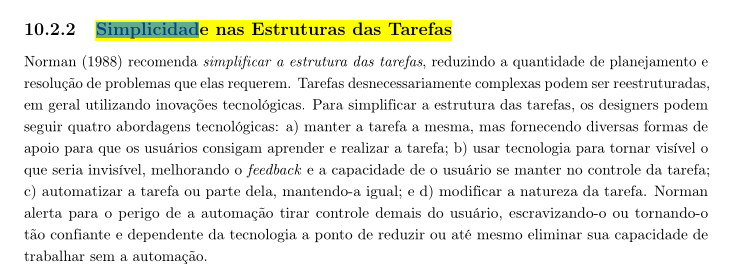

Item 14
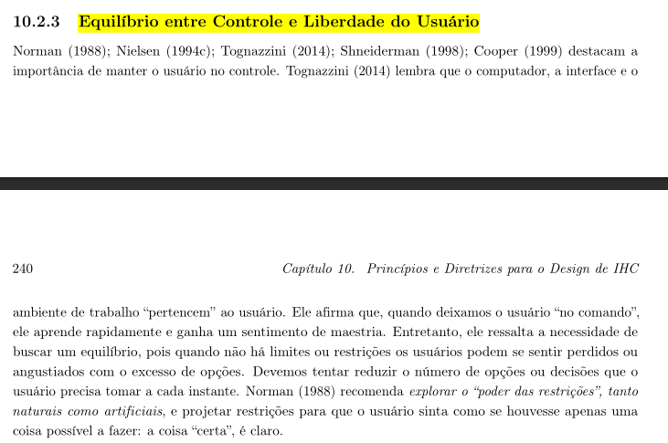

Item 15
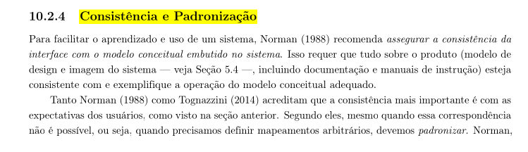

Item 16
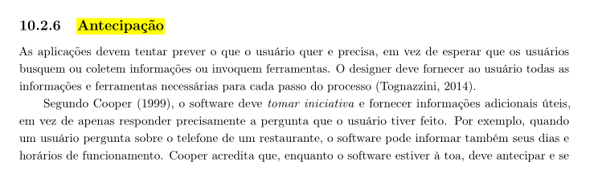

Item 17
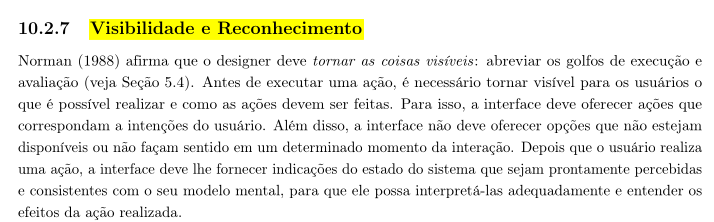

Item 18
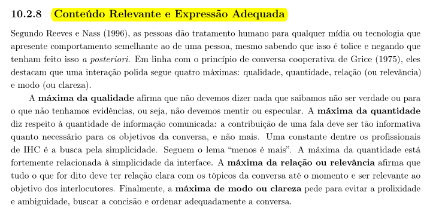

Item 19
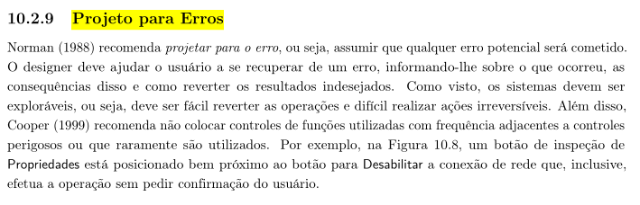

---

## Bibliografia

> BARBOSA, Simone; SILVA, Bruno. **Interação Humano-Computador**. 1. ed. Rio de Janeiro: Elsevier, 2010.

> ROGERS, Y.; SHARP, H.; PREECE, J. **Design de Interação**. Capítulo 1 O Que é Design de Interação?

> UNIVERSIDADE DE BRASÍLIA. **Plano de Ensino — Interação Humano-Computador**. Faculdade UnB Gama, 2026.

---

## Histórico de Versão

| Data | Versão | Descrição | Autor(es) | Revisor(es) |
|:----:|:------:|:----------|:---------:|:-----------:|
| 12/05/2026 | 1.0 | Criação do documento | Lucas | Luan Ludry |
| 14/05/2026 | 1.1 | Adição de items de verificação do grupo | Tiago | Lucas |
| 23/06/2026 | 1.2 | Adição das imagens e pequenas correções da lista | Lucas | Luan |

[Lista de verificação 3 antiga](Lista_de_Verificacao_Entrega3.md)
---

## Agradecimentos

Agradecemos à IA Generativa **Claude** (Anthropic) pelo suporte na elaboração deste documento. A ferramenta foi utilizada para auxiliar na estruturação e redação da lista de verificação, na organização das tabelas e na formatação geral do artefato. Todo o conteúdo técnico e as decisões de projeto foram definidos pelos integrantes da equipe; o Claude atuou como assistente de formatação e redação, sem interferir nas escolhas metodológicas do grupo.
