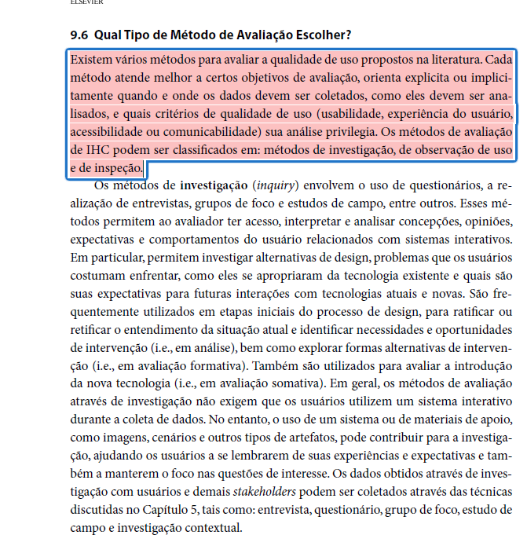
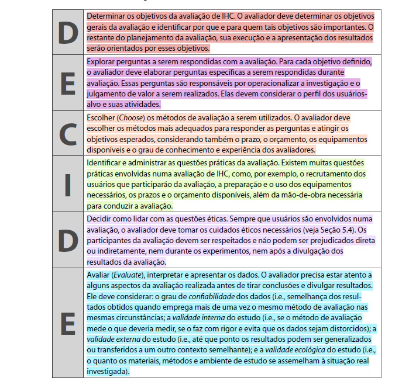
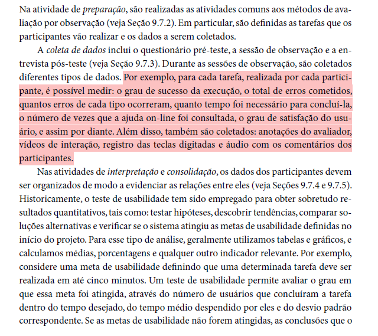
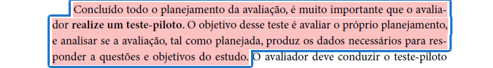
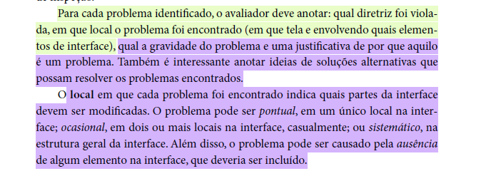
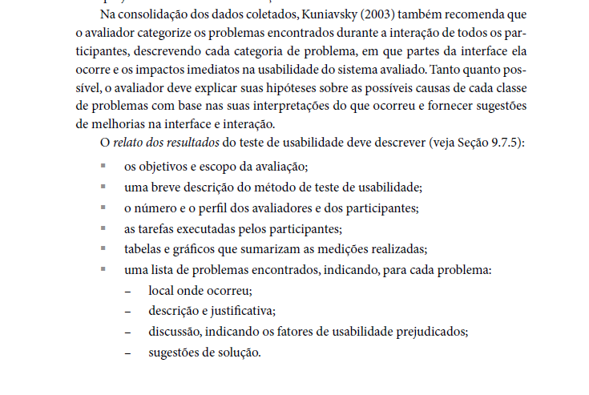
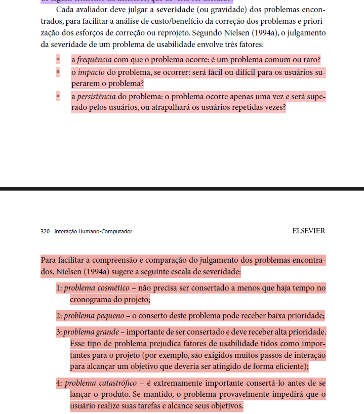

# Lista de Verificação — Entrega 6
## Grupo 02

---

## Tabela de Contribuição

| Integrante | Contribuição |
|:----------:|:-------------|
| Bryan | Elaboração dos itens de verificação E1, E2, E3, E4, E5, E6 (Relato do Protótipo de Papel). E21, E22, E23, E24, E25, E26, E27, E28, E29 Planejamento do Relato (Alta Fidelidade) |
| Guilherme | Elaboração dos itens de verificação E9, E10 (Planejamento da Avaliação do Protótipo de Alta Fidelidade). |
| Luan | Elaboração dos itens de verificação  E11, E12, E13, E14 (Planejamento da Avaliação do Protótipo de Alta Fidelidade). |
| Maria Luana | Elaboração dos itens de verificação E15, E16 (Planejamento do Relato do Protótipo de Alta Fidelidade). |
| Lucas Fujimoto | Elaboração dos itens de verificação E7, E8 (Planejamento do Relato do Protótipo de Alta Fidelidade). Revisão da lista. |
| Tiago | Elaboração dos itens de verificação E17, E18 (Planejamento do Relato do Protótipo de Alta Fidelidade). |
| Samuel | Elaboração dos itens de verificação E19, E20 (Planejamento do Relato do Protótipo de Alta Fidelidade). |

Tabela 1: Tabela de contribuição (Fonte: autor, 2026).

---

## Introdução

Este documento apresenta a lista de verificação referente à **Entrega 6** da disciplina de Interação Humano-Computador (IHC), cujo tema central abrange: *Relato dos Resultados do Protótipo de Papel, Planejamento da Avaliação do Protótipo de Alta Fidelidade e Planejamento do Relato dos Resultados da Avaliação do Protótipo de Alta Fidelidade*.

A lista reúne os critérios de avaliação organizados em três grupos: (1) itens do desenvolvimento do projeto, comuns a todas as entregas; (2) itens de conteúdo da disciplina, extraídos do plano de ensino; e (3) itens extras elaborados com base no livro *Interação Humano-Computador* (Barbosa e Silva, 2010), que aprofundam a qualidade dos artefatos produzidos.

Os artefatos avaliados nesta entrega são: Relato dos Resultados do Protótipo de Papel, Planejamento da Avaliação do Protótipo de Alta Fidelidade e Planejamento do Relato dos Resultados da Avaliação do Protótipo de Alta Fidelidade.

---

## Lista de Verificação

### Seção 1 — Itens do Desenvolvimento do Projeto

> Critérios padrão exigidos em todas as entregas do projeto. Avaliar: o próprio grupo e o Grupo +1.

| Nº | Questão | Resposta (Sim / Não / Incompleto) | Versão |
|:--:|:--------|:---------------------------------:|:--------------------------------:|
| 1 | O histórico de versão está padronizado? | | |
| 2 | O(s) autor(es) e o(s) revisor(es) estão indicados em cada artefato? | | |
| 3 | Todos os artefatos possuem referências bibliográficas e/ou bibliografia? | | |
| 4 | As tabelas e imagens possuem legenda e fonte, e são referenciadas dentro do texto? | | |
| 5 | Há um texto de introdução em todos os artefatos? | | |
| 6 | O cronograma executado indica quem realizou cada artefato/atividade com as datas de início e fim? | | |
| 7 | As atas de reunião contêm data, horário de início e fim, participantes, objetivo e atividades definidas? | | |
| 8 | A gravação da reunião do grupo está disponível e acessível? | | |
| 9 | O vídeo de apresentação está publicado como "não listado" no YouTube? | | |
| 10 | A tabela de contribuição está no início do artefato com o nome de todos os integrantes, a contribuição individual e hiperligação para a atividade e gravação? | | |
| 11 | A seção de agradecimentos registra o uso de IA generativa com a descrição específica do uso realizado no artefato? | | |

Tabela 2: Itens do desenvolvimento do projeto (Fonte: Plano de Ensino da Disciplina, 2026).

---

### Seção 2 — Itens de Conteúdo da Disciplina

> Critérios específicos da Entrega 6, extraídos do plano de ensino. Avaliar: o próprio grupo e o Grupo +1.

| Nº | Artefato | Questão | Resposta (Sim / Não / Incompleto) | Versão  |
|:--:|:--------:|:--------|:---------------------------------:|:--------------------------------:|
| C1 | Relato (Protótipo de Papel) | O relato dos resultados da avaliação do protótipo de papel está disponível? | | |
| C2 | Planejamento (Alta Fidelidade) | O planejamento da avaliação do protótipo de alta fidelidade está disponível? | | |
| C3 | Planejamento do Relato (Alta Fidelidade) | O planejamento do relato dos resultados da avaliação do protótipo de alta fidelidade está disponível? | | |

Tabela 3: Itens de conteúdo da disciplina — Entrega 6 (Fonte: Plano de Ensino da Disciplina, 2026).

---

### Seção 3.1 — Itens Extras: Relato dos Resultados (Protótipo de Papel)

> Critérios elaborados com base no Capítulo 9 e 10 de Barbosa e Silva (2010). Avaliar: o próprio grupo e o Grupo +1.

| Nº | Artefato | Questão | Referência (Barbosa & Silva, 2010) | Resposta (Sim / Não / Incompleto) | Versão | Autor |
|:--:|:--------:|:--------|:----------------------------------:|:---------------------------------:|:--------------------------------:|:-----:|
| E1 | Relato (Protótipo de Papel) | O relato descreve os **objetivos e o escopo** da avaliação do protótipo de papel? | [**p. 312:**](#lista6-1) | | | Bryan |
| E2 | Relato (Protótipo de Papel) | O relato especifica a **forma como a avaliação foi realizada**, incluindo o método de avaliação empregado (ex: prototipação em papel)? | [**p. 312:**](#lista6-2)  | | | Bryan |
| E3 | Relato (Protótipo de Papel) | O relato apresenta o **número e o perfil dos participantes e avaliadores** que participaram da avaliação? | [**p. 312:**](#lista6-3)  | | | Bryan |
| E4 | Relato (Protótipo de Papel) | O relato contém uma **lista detalhada dos problemas encontrados** durante a avaliação, com descrição e localização? | [**p. 312:**](#lista6-4) | | | Bryan |
| E5 | Relato (Protótipo de Papel) | O relato apresenta um **sumário dos dados coletados**, incluindo tabelas e/ou gráficos? | [**p. 312:**](#lista6-5)  | | | Bryan |
| E6 | Relato (Protótipo de Papel) | O relato contém **recomendações de melhoria** e um **planejamento para o reprojeto** com base nos resultados? | [**p. 312:**](#lista6-6)  | | | Bryan |

---

### Seção 3.2 — Itens Extras: Planejamento da Avaliação (Protótipo de Alta Fidelidade)

> Critérios elaborados com base no Capítulo 9 e 10 de Barbosa e Silva (2010). Avaliar: o próprio grupo e o Grupo +1.

| Nº | Artefato | Questão | Referência (Barbosa & Silva, 2010) | Resposta (Sim / Não / Incompleto) | Versão | Autor |
|:--:|:--------:|:--------|:----------------------------------:|:---------------------------------:|:--------------------------------:|:-----:|
| E7 | Planejamento (Alta Fidelidade) | O planejamento segue o **Framework DECIDE**, contemplando as etapas D-E-C-I-D-E? | [**p. 312-313:**](#lista6-7)  | | | Lucas |
| E8 | Planejamento (Alta Fidelidade) | O planejamento define o **método de avaliação** a ser utilizado (ex: teste de usabilidade em laboratório, avaliação heurística)? | [**p. 301:**](#lista6-8) | | | Lucas |
| E9 | Planejamento (Alta Fidelidade) | O planejamento descreve as **questões práticas**: recrutamento, perfil e quantidade de participantes, local, equipamentos, prazos e mão-de-obra? | [**p. 313 (DECIDE - I):**](#lista6-9)  | | | Guilherme |
| E10 | Planejamento (Alta Fidelidade) | O planejamento aborda as **questões éticas** (consentimento dos participantes, confidencialidade, anonimato, direito de desistência)? | [**p. 313 (DECIDE - D):**](#lista6-10)  | | | Guilherme |
| E11 | Planejamento (Alta Fidelidade) | O planejamento define as **perguntas específicas** que a avaliação pretende responder (passo E do DECIDE)? | [**p. 313 (DECIDE - E):**](#lista6-11)  | | | Luan |
| E12 | Planejamento (Alta Fidelidade) | O planejamento descreve os **objetivos da avaliação** (passo D do DECIDE)? | [**p. 313 (DECIDE - D):**](#lista6-12)  | | | Luan |
| E13 | Planejamento (Alta Fidelidade) | O planejamento prevê a realização de um **teste piloto** antes das sessões principais? | [**p. 307:**](#lista6-13)  | | | Luan |
| E14 | Planejamento (Alta Fidelidade) | O planejamento define os **critérios de avaliação** (ex: tempo de execução, taxa de sucesso, número de erros)? | [**p. 342:**](#lista6-14)  | | | Luan |

---

### Seção 3.3 — Itens Extras: Planejamento do Relato dos Resultados (Protótipo de Alta Fidelidade)

> Critérios elaborados com base no Capítulo 9 e 10 de Barbosa e Silva (2010). Avaliar: o próprio grupo e o Grupo +1.

| Nº | Artefato | Questão | Referência (Barbosa & Silva, 2010) | Resposta (Sim / Não / Incompleto) | Versão | Autor |
|:--:|:--------:|:--------|:----------------------------------:|:---------------------------------:|:--------------------------------:|:-----:|
| E15 | Planejamento do Relato (Alta Fidelidade) | O planejamento do relato prevê a inclusão de um **sumário dos dados coletados**, com tabelas e gráficos? | [**p. 312:**](#lista6-15)  | | | Maria Luana |
| E16 | Planejamento do Relato (Alta Fidelidade) | O planejamento do relato prevê a inclusão de **recomendações de melhoria e um planejamento para o reprojeto** do sistema com base nos resultados? | [**p. 312:**](#lista6-16)  | | | Maria Luana |
| E17 | Planejamento do Relato (Alta Fidelidade) | O planejamento do relato prevê a descrição dos **objetivos da avaliação** e a contextualização do estudo? | [**p. 312:**](#lista6-17)  | | | Tiago |
| E18 | Planejamento do Relato (Alta Fidelidade) | O planejamento do relato prevê a descrição do **número e perfil de avaliadores e participantes** envolvidos? | [**p. 312:**](#lista6-18)  | | | Tiago |
| E19 | Planejamento do Relato (Alta Fidelidade) | O planejamento do relato prevê a inclusão de um **relato da interpretação e análise dos dados** coletados? | [**p. 312:**](#lista6-19)  | | | Samuel |
| E20 | Planejamento do Relato (Alta Fidelidade) | O planejamento do relato prevê a inclusão de uma **lista de problemas encontrados** com suas respectivas severidades? | [**p. 319-320:** escala de severidade (1 a 4)](#lista6-20) | | | Samuel |
| E21 | Planejamento do Relato (Alta Fidelidade) | O planejamento do relato prevê a inclusão de **sugestões de solução** para os problemas identificados? | [**p. 319:**](#lista6-21)  | | | Bryan |
| E22 | Planejamento do Relato (Alta Fidelidade) | O planejamento do relato prevê a estruturação do documento conforme recomendado no livro (objetivos, método, resultados, recomendações)? | [**p. 312:**](#lista6-22)  | | | Bryan |
| E23 | Planejamento do Relato (Alta Fidelidade) | O planejamento do relato prevê a descrição da **metodologia** empregada na avaliação? | [**p. 312:**](#lista6-23)  | | | Bryan |
| E24 | Planejamento do Relato (Alta Fidelidade) | O planejamento do relato prevê a inclusão das **tarefas executadas pelos participantes**? | [**p. 343:**](#lista6-24) | | | Bryan |
| E25 | Planejamento do Relato (Alta Fidelidade) | O planejamento do relato prevê a indicação do **local da avaliação** (laboratório ou contexto real)? | [**p. 295-296:**](#lista6-25) | | | Bryan |
| E26 | Planejamento do Relato (Alta Fidelidade) | O planejamento do relato prevê a inclusão de **gráficos ou visualizações** para facilitar a compreensão dos resultados? | [**p. 312:**](#lista6-26)  | | | Bryan |
| E27 | Planejamento do Relato (Alta Fidelidade) | O planejamento do relato prevê a **discussão dos resultados** à luz dos objetivos da avaliação? | [**p. 312:**](#lista6-27)  | | | Bryan |
| E28 | Planejamento do Relato (Alta Fidelidade) | O planejamento do relato prevê a **priorização dos problemas** encontrados com base na severidade? | [**p. 319-320:**](#lista6-28)  | | | Bryan |
| E29 | Planejamento do Relato (Alta Fidelidade) | O planejamento do relato prevê a **identificação das causas raiz** dos problemas encontrados? | [**p. 343:**](#lista6-29)  | | | Bryan |

---

## Referências

> Item 1
.png)

Item 2
.png)

Item 3
.png)

Item 4
.png)

Item 5
.png)

Item 6
.png)

Item 7
.png)

Item 8

Item 9

Item 10

Item 11

Item 12

Item 13

Item 14

Item 15
.png)

Item 16
.png)

Item 17
.png)

Item 18
.png)

Item 19
.png)

Item 20
.png)

> Item 21

Item 22
.png)

Item 23
.png)

Item 24

Item 25

Item 26
.png)

Item 27
.png)

Item 28

Item 29

---

## Bibliografia

> BARBOSA, Simone Diniz Junqueira; SILVA, Bruno Santana da. **Interação Humano-Computador**. 1. ed. Rio de Janeiro: Editora Campus, 2010. 384 p.

> UNIVERSIDADE DE BRASÍLIA. **Plano de Ensino — Interação Humano-Computador**. Faculdade UnB Gama, 2026.

---

## Histórico de Versão

| Data | Versão | Descrição | Autor(es) | Revisor(es) |
|:----:|:------:|:----------|:---------:|:-----------:|
| 07/06/2026 | 1.0 | Criação do documento | Bryan | Lucas |
| 23/06/2026 | 1.1 | Revisão geral e ajustes | Lucas | — |
| 23/06/2026 | 2.0 | Criação do documento | Bryan | Lucas |

---

## Agradecimentos

Agradecemos à IA Generativa **Claude** pelo suporte na elaboração deste documento. A ferramenta foi utilizada para auxiliar na estruturação e redação da lista de verificação, na organização das tabelas e na formatação geral do artefato. Todo o conteúdo técnico e as decisões de projeto foram definidos pelos integrantes da equipe; o Claude atuou como assistente de formatação e redação, sem interferir nas escolhas metodológicas do grupo.
