# Lista de Verificação — Entrega 7
## Grupo 02

---

## Tabela de Contribuição

| Integrante | Contribuição |
|:----------:|:-------------|
| Bryan | Elaboração dos itens L1, L2, L3, L4 |
| Guilherme | Elaboração do item L5 |
| Luan | Elaboração do item L6 |
| Maria Luana | Elaboração do item L7 |
| Lucas Fujimoto | Elaboração do item L8 |
| Tiago | Elaboração do item L9 |
| Samuel | Elaboração do item L10 |

Tabela 1: Tabela de contribuição (Fonte: autor, 2026).

---

## Introdução

Este documento apresenta a lista de verificação referente à Entrega 7 da disciplina de Interação Humano-Computador (IHC), cujo tema central abrange o Relato dos Resultados do Protótipo de alta fidelidade.

## Lista de Verificação

### Seção 1 — Itens do Desenvolvimento do Projeto

> Critérios padrão exigidos em todas as entregas do projeto. Avaliação estrutural dos artefatos entregues.

| Nº | Questão | Resposta (Sim / Não / Incompleto) | Versão, Data e Hora da Avaliação |
|:--:|:--------|:---------------------------------:|:--------------------------------:|
| 1 | O histórico de versão está padronizado? | | |
| 2 | O(s) autor(es) e o(s) revisor(es) estão indicados em cada artefato? | | |
| 3 | Todos os artefatos possuem referências bibliográficas e/ou bibliografia? | | |
| 4 | As tabelas e imagens possuem legenda e fonte, e são referenciadas dentro do texto? | | |
| 5 | Há um texto de introdução em todos os artefatos? | | |
| 6 | O cronograma planejado e executado relacionado a essa etapa está disponvel? | | |
| 7 | O cronograma executado indica quem realizou cada artefato/atividade com as datas de início e fim? | | |
| 8 | A ata de reunião relacionada a apresentação dessa entrega está disponivel no Github Pages? | | |
| 9 | A ata de reunião contêm data, horário de início e fim, participantes, objetivo e atividades definidas? | | |
| 10 | A gravação da reunião do grupo está disponível e acessível? | | |
| 11 | O vídeo de apresentação está publicado como "não listado" no YouTube? | | |
| 12 | A tabela de contribuição está no início do artefato com o nome de todos os integrantes com a contribuição individual? | | |
| 13 | A seção de agradecimentos registra o uso de IA generativa com a descrição específica do uso realizado no artefato? | | |

Tabela 2: Itens do desenvolvimento do projeto (Fonte: Plano de Ensino da Disciplina, 2026).

### Seção 2 — Itens com Base no Livro

> Critérios elaborados com base em Barbosa e Silva (2010), visando aprofundar a qualidade dos artefatos entregues. Os artefatos analisados são os relatos dos resultados da avaliação do protótipo de alta fidelidade.

| Nº | Artefato | Questão | Referência (Barbosa & Silva, 2010) | Resposta (Sim/Não/Incompleto/Não se aplica) | Versão, Data e Hora | Autor |
|:--:|:--------:|:--------|:----------------------------------:|:-----------------------------:|:-------------------:|:-----:|
| **L1** | Relato dos Resultados (Protótipo de Alta Fidelidade) | O relato descreve os **objetivos e o escopo** da avaliação do protótipo de alta fidelidade? | [p. 312 (Barbosa & Silva, 2010)](#lista7-1) | | | Bryan |
| **L2** | Relato dos Resultados (Protótipo de Alta Fidelidade) | O relato especifica a **forma como a avaliação foi realizada**, incluindo o método de avaliação empregado (ex: prototipação em alta fidelidade)? | [p. 312 (Barbosa & Silva, 2010)](#lista7-2) | | | Bryan |
| **L3** | Relato dos Resultados (Protótipo de Alta Fidelidade) | O relato apresenta o **número e o perfil dos participantes e avaliadores** que participaram da avaliação do protótipo de alta fidelidade? | [p. 312 (Barbosa & Silva, 2010)](#lista7-3) | | | Bryan |
| **L4** | Relato dos Resultados (Protótipo de Alta Fidelidade) | O relato contém uma **lista detalhada dos problemas encontrados** durante a avaliação, com descrição e localização? | [p. 312 (Barbosa & Silva, 2010)](#lista7-4) / [p. 319 (Barbosa & Silva, 2010)](#lista7-4b) | | | Bryan |
| **L5** | Relato dos Resultados (Protótipo de Alta Fidelidade) | O relato apresenta um **sumário dos dados coletados**, incluindo tabelas e gráficos que sintetizem os resultados da avaliação? | [p. 312 (Barbosa & Silva, 2010)](#lista7-5) | | | Guilherme |
| **L6** | Relato dos Resultados (Protótipo de Alta Fidelidade) | O relato apresenta a **interpretação e análise consolidada dos dados** (análise intersujeito/interparticipante), identificando recorrências que distingam as características representativas do grupo das idiossincrasias de participantes individuais? | [p. 312 (Barbosa & Silva, 2010)](#lista7-6) | | | Luan |
| **L7** | Relato dos Resultados (Protótipo de Alta Fidelidade) | O relato retoma as **questões a serem analisadas no estudo da avaliação**, respondendo a cada uma delas ou justificando por que alguma resposta não foi encontrada? | [p. 312 (Barbosa & Silva, 2010)](#lista7-7) | | | Maria Luana |
| **L8** | Relato dos Resultados (Protótipo de Alta Fidelidade) | O relato evidencia **cautela na generalização dos resultados**, reconhecendo a influência do ambiente de avaliação e das características, preferências, interesses e necessidades dos participantes individuais? | [p. 312 (Barbosa & Silva, 2010)](#lista7-8) | | | Lucas Fujimoto |
| **L9** | Relato dos Resultados (Protótipo de Alta Fidelidade) | O relato apresenta um **planejamento para o reprojeto do sistema** com base nos problemas identificados durante a avaliação? | [p. 312 (Barbosa & Silva, 2010)](#lista7-9) | | | Tiago |
| **L10** | Relato dos Resultados (Protótipo de Alta Fidelidade) | O relato deixa claro que os resultados indicam **tendências de problemas** (e não certeza de que ocorrerão durante o uso) e evita afirmar categoricamente que a ausência de problemas encontrados significa alta qualidade de uso do sistema? | [p. 312 (Barbosa & Silva, 2010)](#lista7-10) | | | Samuel |

Tabela 3: Itens com base na literatura (Fonte: autores, 2026).

---

## Referências

Item L1
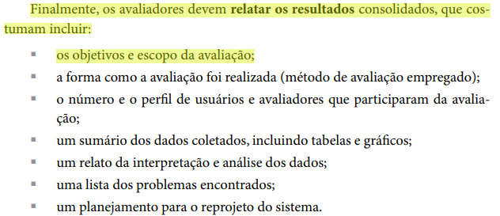

Item L2
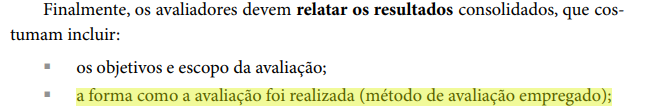

Item L3
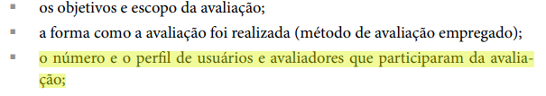

Item L4
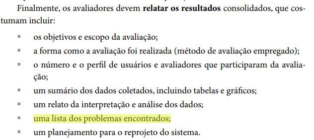

Item L4b
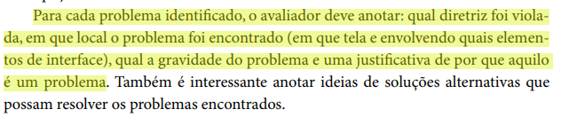

Item L5
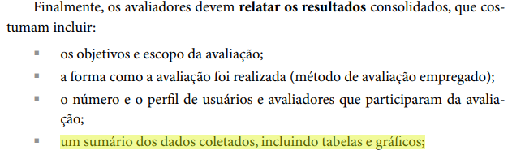

Item L6
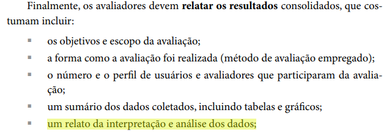

Item L7
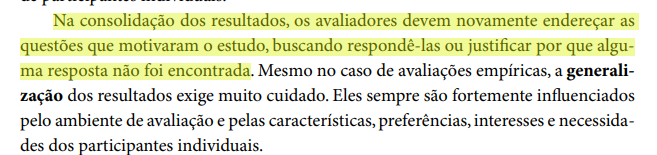

Item L8
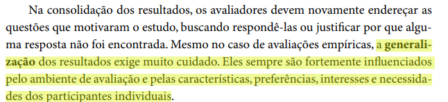

Item L9
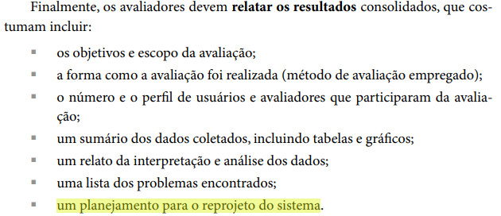

Item L10
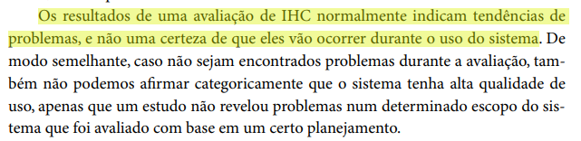

---

## Bibliografia (Formato ABNT)

BARBOSA, Simone Diniz Junqueira; SILVA, Bruno Santana da. **Interação Humano-Computador**. 1. ed. Rio de Janeiro: Editora Campus, 2010.

---

## Histórico de Versão

| Data | Versão | Descrição | Autor(es) | Revisor(es) |
|:----:|:------:|:----------|:---------:|:-----------:|
| 16/06/2026 | 1.0 | Criação do documento complementar  | Guilherme | Maria Luana |
| 23/06/2026 | 1.1 | Adição de links para as imagens contendo as referencias no livro  | Maria Luana | Samuel |

[Lista de verificação 7 antiga](Lista_de_Verificacao_Entrega7.md)

---

## Agradecimentos

Agradecemos à IA Generativa **Claude** pelo suporte na elaboração deste documento. A ferramenta foi utilizada para auxiliar na estruturação e redação dos itens da lista de verificação, na organização das tabelas e na formatação geral do artefato. Todo o conteúdo técnico e as decisões metodológicas foram definidos pelos integrantes da equipe;

