# Lista de Verificação — Entrega 2
## Grupo 02

---

## Tabela de Contribuição

| Integrante | Contribuição |
|:----------:|:-------------|
| Tiago | Criação do Documento e Elaboração dos itens E1, E2 (Entrevista). |
| Guilherme | Elaboração dos itens C17, C18, C19, C20 (Personas). |
| Luan | Elaboração dos itens E3, E4 (Questionário e Análise de Documentos). |
| Maria Luana | Elaboração dos itens E5, E6 (Coleta de Dados). |
| Lucas Fujimoto | Elaboração dos itens E7, E8 (Perfil do Usuário e TCLE). Revisão da lista. |
| Bryan | Elaboração dos itens E9 (Personas). |
| Samuel | Elaboração dos itens C21, C22 (Personas). |

Tabela 1: Tabela de contribuição (Fonte: CARVALHO, Guilherme, 2026).

---

## Introdução

Este documento apresenta a lista de verificação referente à **Entrega 2** da disciplina de Interação Humano-Computador (IHC), cujo tema central é: *Perfil do usuário, Aspectos Éticos de Pesquisas Envolvendo Pessoas e Análise de tarefas*.

A lista reúne os critérios de avaliação organizados em três grupos: (1) itens do desenvolvimento do projeto, comuns a todas as entregas; (2) itens de conteúdo da disciplina, extraídos do plano de ensino; e (3) itens extras elaborados com base no Capítulo 5 do livro *Interação Humano-Computador* (Barbosa e Silva, 2010), que aprofundam a qualidade dos artefatos produzidos.

Os artefatos avaliados nesta entrega são: coleta de dados (entrevista, questionário e análise de documentos), perfil de usuário, cenários, personas, análise de tarefas (ao menos dois métodos) e Termo de Consentimento Livre e Esclarecido (TCLE).

---

## Lista de Verificação

### Seção 1 — Itens do Desenvolvimento do Projeto

> Critérios padrão exigidos em todas as entregas do projeto. Avaliar: o próprio grupo e o Grupo +1.

| Nº | Questão | Resposta (Sim / Não / Incompleto) | Versão |
|:--:|:--------|:---------------------------------:|:------:|
| 1 | O histórico de versão está padronizado? | | |
| 2 | O(s) autor(es) e o(s) revisor(es) estão indicados em cada artefato? | | |
| 3 | Todos os artefatos possuem referências bibliográficas e/ou bibliografia? | | |
| 4 | As tabelas e imagens possuem legenda e fonte, e são referenciadas dentro do texto? | | |
| 5 | Há um texto de introdução em todos os artefatos? | | |
| 6 | O cronograma executado indica quem realizou cada artefato/atividade com as datas de início e fim? | | |
| 7 | As atas de reunião contêm data, horário de início e fim, participantes, objetivo e atividades definidas? | | |
| 8 | A gravação da reunião do grupo está disponível e acessível? | | |
| 9 | O vídeo de apresentação está publicado como "não listado" no YouTube? | | |
| 10 | A tabela de contribuição está no início do artefato com o nome de todos os integrantes, a contribuição individual e hiperligação para a atividade e gravação? | | |
| 11 | A seção de agradecimentos registra o uso de IA generativa com a descrição específica do uso realizado no artefato? | | |

Tabela 2: Itens do desenvolvimento do projeto (Fonte: Plano de Ensino da Disciplina, 2026).

---

### Seção 2 — Itens de Conteúdo da Disciplina

> Critérios específicos da Entrega 2, extraídos do plano de ensino. Avaliar: o próprio grupo e o Grupo +1.

| Nº | Artefato | Questão | Resposta (Sim / Não / Incompleto) | Versão |
|:--:|:--------:|:--------|:---------------------------------:|:------:|
| C1 | Perfil do Usuário | O perfil do usuário foi definido por mais de uma técnica de elicitação e/ou ferramenta? | | |
| C2 | Perfil do Usuário | O perfil do usuário possui todos os atributos (dados demográficos, experiência no cargo, educação, tecnologia disponível, motivação, tarefas, idiomas etc.), com referência bibliográfica da fonte? | | |
| C3 | Perfil do Usuário | O perfil do usuário define os 4 grupos de atributos (idade, experiência, atitudes, tarefas primárias), com referência bibliográfica da fonte? | | |
| C4 | Aspectos Éticos | O artefato considera os aspectos éticos de pesquisas envolvendo pessoas, com referência bibliográfica da fonte? | | |
| C5 | Aspectos Éticos | Os 4 princípios éticos estão presentes (autonomia, beneficência, não maleficência, justiça e equidade), com referência bibliográfica da fonte? | | |
| C6 | TCLE | Há solicitação explícita de permissão para gravar voz ou imagem de qualquer participante antes do início da gravação? | | |
| C7 | TCLE | O Termo de Consentimento Livre e Esclarecido (TCLE) está elaborado, com referência bibliográfica da fonte? | | |
| C8 | Coleta de Dados | Foram utilizadas no mínimo duas técnicas para coletar dados e levantar requisitos dos usuários, com referência bibliográfica da fonte? | | |
| C9 | Cenários | Os cenários estão elaborados com referência bibliográfica explicando o conceito? | | |
| C10 | Cenários | Foram elaborados cenários como narrativas detalhadas para ilustrar o uso da aplicação em contextos específicos? | | |
| C11 | Cenários | Os cenários descrevem o comportamento dos atores de forma a evidenciar como seus objetivos direcionam a execução das tarefas? | | |
| C12 | Cenários | O enredo do cenário detalha as sequências de ações e eventos, considerando seu impacto no alcance dos objetivos? | | |
| C13 | Cenários | O cenário apresenta um ator e um objetivo principal, detalhando o planejamento mental quando relevante para a atividade? | | |
| C14 | Análise de Tarefas | A análise de tarefas está elaborada com referência bibliográfica explicando o(s) método(s) utilizados? | | |
| C15 | Análise de Tarefas | Cada integrante elaborou ao menos uma atividade modelada em duas técnicas — HTA (com diagrama, legenda e tabela) e GOMS (KLM, CMN-GOMS, CPM-GOMS ou CTT) —, com referência bibliográfica da fonte? | | |
| C16 | Análise de Tarefas | Alguma técnica formal foi utilizada para especificar as tarefas (além da descrição textual)? | | |
| C17 | Personas | O elenco de personas foi composto por uma quantidade variada de perfis para articular a diversidade da população de usuários? | | |
| C18 | Personas | O elenco de personas foi mantido em um número reduzido para garantir que cada perfil permaneça memorável para a equipe? | | |
| C19 | Personas | As personas foram criadas como arquétipos hipotéticos para representar grupos de usuários reais? | | |
| C20 | Personas | A persona recebeu uma identidade completa com nome, sobrenome e dados demográficos representativos? | | |
| C21 | Personas | Foram estabelecidos os objetivos da persona de forma abrangente, extrapolando a interação direta com o produto? | | |
| C22 | Personas | Foram detalhadas as habilidades e competências da persona, abrangendo sua formação e especialidade técnica? | | |

Tabela 3: Itens de conteúdo da disciplina — Entrega 2 (Fonte: CARVALHO, Guilherme, 2026).

---

### Seção 3 — Itens Extras com Base no Livro

> Critérios adicionais elaborados com base no Capítulo 5 de Barbosa e Silva (2010), visando aprofundar a qualidade dos artefatos entregues.

| Nº | Artefato | Questão | Referência | Resposta (Sim / Não / Incompleto) | Versão | Autor do item |
|:--:|:--------:|:--------|:----------:|:---------------------------------:|:------:|:-------------:|
| E1 | Entrevista | O roteiro de entrevista segue a estrutura em 5 etapas: apresentação, aquecimento, parte principal, desaquecimento e conclusão? | [p. 146 (Barbosa e Silva, 2010)](#lista2-1) | | | Tiago |
| E2 | Entrevista | As perguntas da entrevista evitam induzir respostas (ausência de perguntas com sim/não como objetivo principal e de pressuposições sobre a opinião do entrevistado)? | [p. 147 (Barbosa e Silva, 2010)](#lista2-2) | | | Tiago |
| E3 | Questionário | O questionário contém instruções claras sobre como responder cada pergunta e utiliza escalas (Likert ou diferenciais semânticos) quando adequado ao objetivo? | [pp. 150–152 (Barbosa e Silva, 2010)](#lista2-3) | | | Luan |
| E4 | Análise de Documentos | A análise de documentos utilizou fontes secundárias disponíveis (normas, processos, documentação existente do sistema, arquivos de log) como dados complementares à coleta primária? | [p. 138 (Barbosa e Silva, 2010)](#lista2-4) | | | Luan |
| E5 | Coleta de Dados | Foi conduzido um estudo-piloto antes da coleta principal para validar o roteiro, o questionário e/ou o procedimento de coleta? | [pp. 133–134 (Barbosa e Silva, 2010)](#lista2-5) | | | Maria Luana |
| E6 | Coleta de Dados | Os dados foram coletados por triangulação — combinação de ao menos duas técnicas — para confirmar as descobertas e obter resultados mais válidos? | [p. 133 (Barbosa e Silva, 2010)](#lista2-6) | | | Maria Luana |
| E7 | Perfil do Usuário | O perfil de usuário inclui informações sobre idiomas, jargões profissionais e vocabulário específico do domínio que o usuário conhece e utiliza? | [p. 135 (Barbosa e Silva, 2010)](#lista2-7) | | | Lucas Fujimoto |
| E8 | TCLE | O TCLE informa claramente: objetivo do estudo, procedimentos, uso dos dados, direitos do participante (inclusive o direito de retirada sem penalização) e riscos, e contém espaço para assinatura de ambas as partes? | [p. 141, Exemplo 5.1 (Barbosa e Silva, 2010)](#lista2-8) | | | Lucas Fujimoto |
| E9 | Personas | As personas foram construídas a partir de dados reais coletados com usuários, e não com base em suposições da equipe de design? | [p. 177 (Barbosa e Silva, 2010)](#lista2-9) | | | Bryan |

Tabela 4: Itens extras de verificação (Fonte: CARVALHO, Guilherme, 2026).

---

## Anexos

Item 1
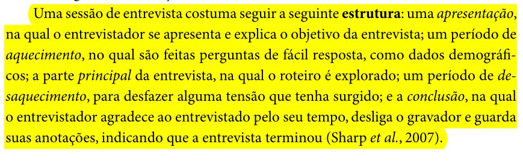

Item 2
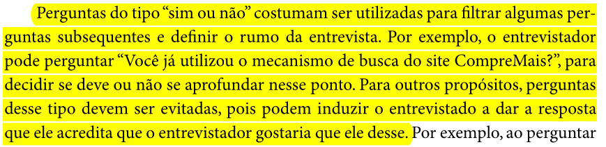

Item 3
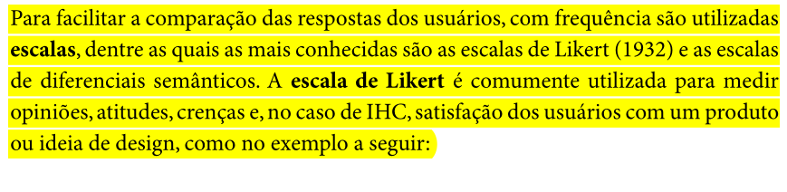
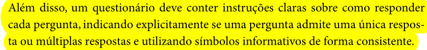

Item 4
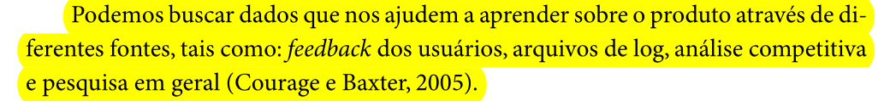
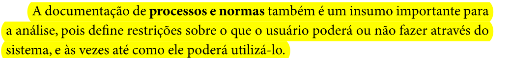

Item 5
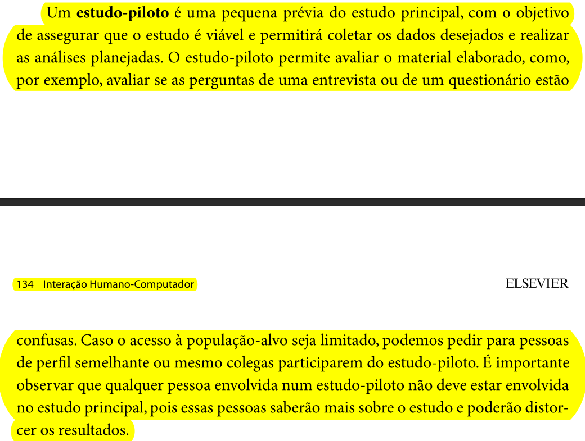

Item 6
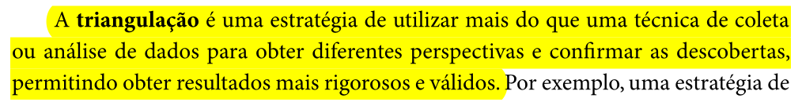

Item 7
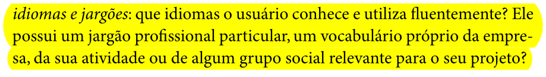

Item 8
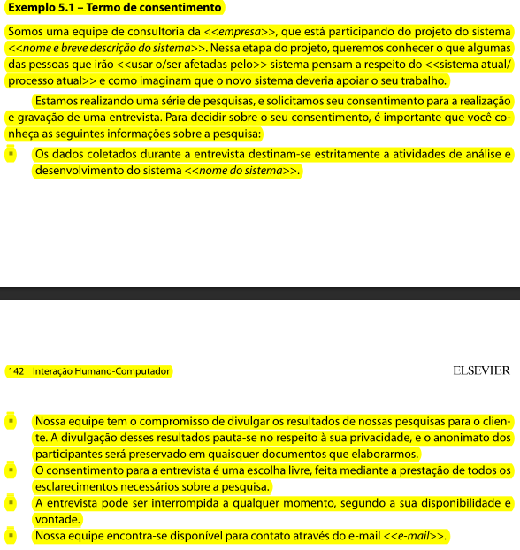

Item 9
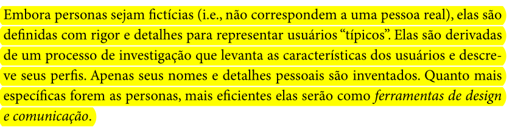

---

## Bibliografia

> BARBOSA, Simone; SILVA, Bruno. **Interação Humano-Computador**. 1. ed. Rio de Janeiro: Elsevier, 2010.

> UNIVERSIDADE DE BRASÍLIA. **Plano de Ensino — Interação Humano-Computador**. Faculdade UnB Gama, 2026.

---

## Histórico de Versão

| Data | Versão | Descrição | Autor(es) | Revisor(es) |
|:----:|:------:|:----------|:---------:|:-----------:|
| 03/05/2026 | 1.0 | Criação do documento | Tiago | Luan |
| 03/05/2026 | 1.1 | Adição de novos itens na lista | Guilherme | Maria Luana |
| 23/06/2026 | 2.0 | Adição das imagens e pequenas correções da lista |  Guilherme | Maria Luana |

[Lista de verificação 2 antiga](Lista_de_Verificação_Entrega2.md)

---

## Agradecimentos

Agradecemos à IA Generativa **Claude** (Anthropic) pelo suporte na elaboração deste documento. A ferramenta foi utilizada para auxiliar na estruturação e redação da lista de verificação, na organização das tabelas e na formatação geral do artefato. Todo o conteúdo técnico e as decisões de projeto foram definidos pelos integrantes da equipe; o Claude atuou como assistente de formatação e redação, sem interferir nas escolhas metodológicas do grupo.