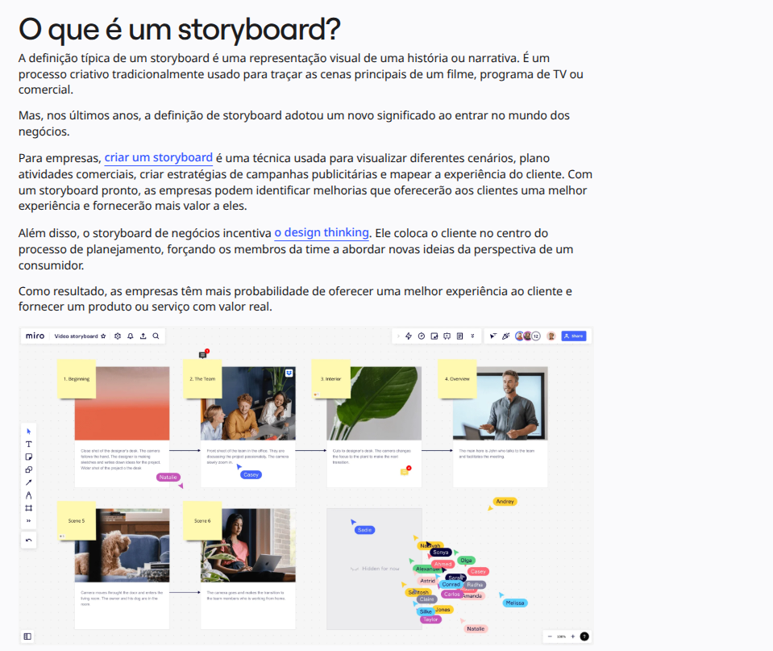
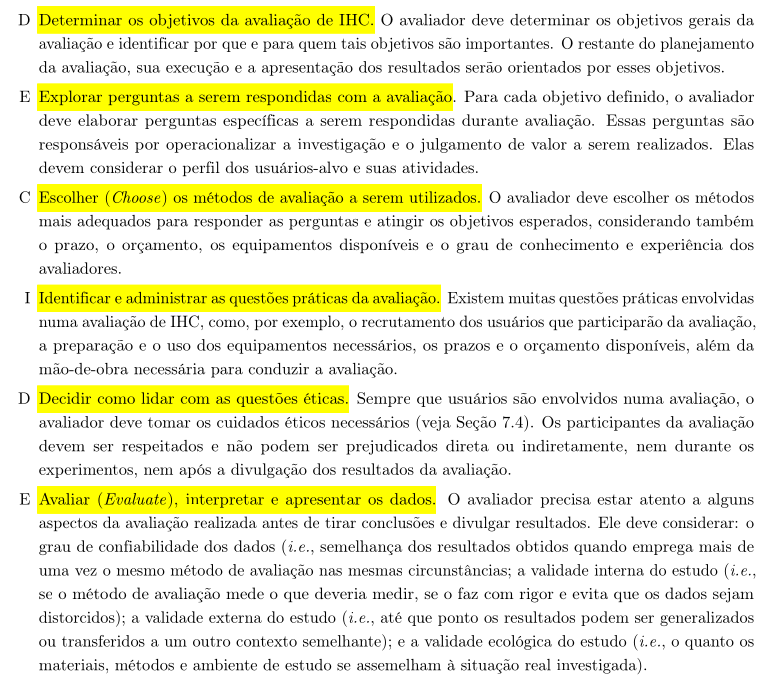
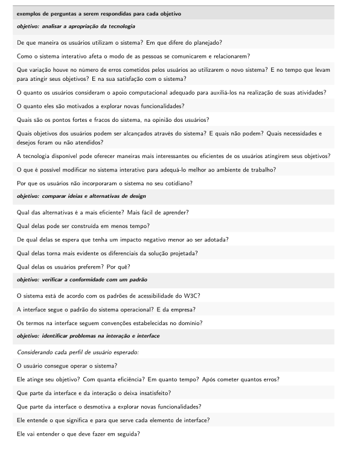
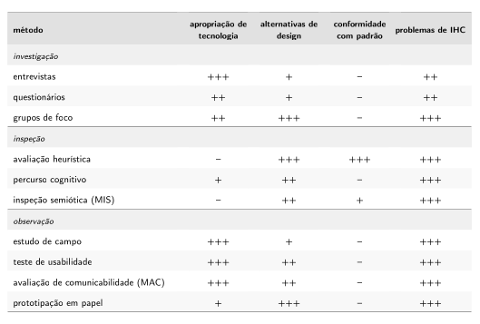
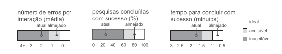
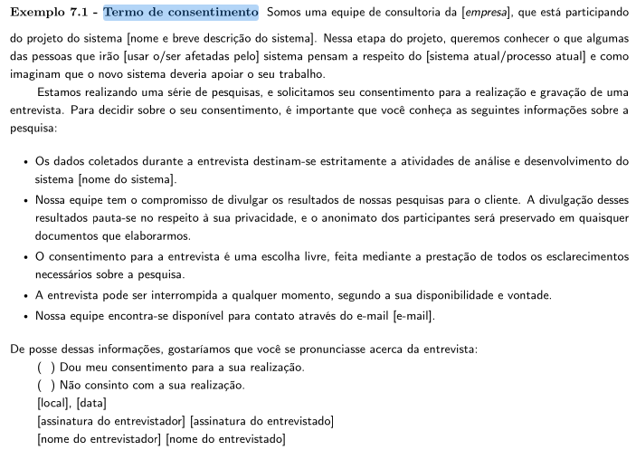
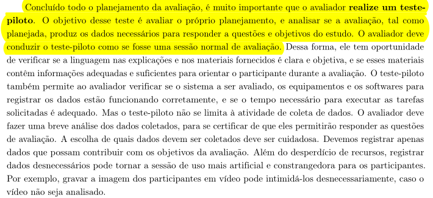

# Planejamento da Avaliação do Storyboard

## Grupo 02

---

## Tabela de Contribuição

| Integrante | Contribuição |
|:----------:|:-------------|
| Tiago | Criação inicial do artefato |

Tabela 1: Tabela de contribuição (Fonte: SOUSA, Tiago).

## Introdução

O planejamento de uma avaliação de Interação Humano-Computador (IHC) constitui etapa fundamental para garantir a qualidade e a eficácia dos artefatos produzidos ao longo do processo de design. Entre esses artefatos, o storyboard ocupa papel central na comunicação visual das ideias e fluxos de interação propostos pela equipe, representando, por meio de quadros sequenciais, como o usuário interage com o sistema em diferentes situações de uso.[¹](#imagem1)

Este documento tem por objetivo planejar a avaliação do storyboard desenvolvido pelo Grupo 02, detalhando os objetivos da avaliação, as perguntas norteadoras, o método adotado, os critérios de seleção de participantes, o cronograma, os aspectos éticos envolvidos e o teste piloto. Para orientar esse planejamento de forma estruturada, adota-se o **Framework DECIDE**, proposto por Preece et al. (2002), amplamente utilizado em avaliações de IHC por sua capacidade de articular de forma iterativa todas as dimensões do planejamento avaliativo.

---

## Planejamento da Avaliação

### O Framework DECIDE

O Framework DECIDE foi proposto por Preece et al. (2002) para orientar o planejamento, a execução e a análise de avaliações de IHC. As atividades do framework são interligadas e executadas de forma iterativa, à medida que o avaliador articula os objetivos da avaliação, os dados e os recursos disponíveis. Quando o avaliador identifica a necessidade de modificar os rumos da avaliação, as demais atividades são afetadas em cadeia (BARBOSA et al., 2021, p. 279–280).[²](#imagem2)

A tabela a seguir apresenta as etapas do framework e sua aplicação neste planejamento:

| **Letra** | **Etapa** | **Descrição** |
|:---------:|:----------|:--------------|
| **D** | Determinar os objetivos | Definir os objetivos gerais da avaliação e identificar por que e para quem tais objetivos são importantes. |
| **E** | Explorar as perguntas | Elaborar perguntas específicas a serem respondidas durante a avaliação, operacionalizando a investigação. |
| **C** | Escolher os métodos | Selecionar os métodos mais adequados para responder às perguntas e atingir os objetivos, considerando prazo, orçamento e recursos disponíveis. |
| **I** | Identificar questões práticas | Administrar aspectos práticos como recrutamento de participantes, equipamentos, prazos e orçamento. |
| **D** | Decidir sobre questões éticas | Garantir que os participantes sejam respeitados e não sejam prejudicados, direta ou indiretamente. |
| **E** | Avaliar os dados | Interpretar e apresentar os dados com atenção à confiabilidade, validade interna, validade externa e validade ecológica. |

Tabela 2: Etapas do Framework DECIDE (Fonte: adaptado de BARBOSA et al., 2021, p. 280).

---

### D — Determinar os Objetivos da Avaliação

A avaliação do storyboard tem como objetivos gerais:

1. **Verificar a apropriação da tecnologia** — avaliar se o storyboard representa adequadamente o contexto de uso e os objetivos do projeto, identificando se a narrativa visual comunica de forma eficaz a proposta de solução.
2. **Identificar problemas de interação e interface** — detectar inconsistências, ambiguidades ou falhas na sequência narrativa do storyboard que possam comprometer a compreensão do fluxo de interação pelo usuário.

Esses objetivos são importantes para a equipe de design, pois permitem validar as decisões tomadas até o momento antes de avançar para etapas de maior custo e esforço, como a prototipação de média ou alta fidelidade.[³](#imagem3)

---

### E — Explorar as Perguntas a Serem Respondidas

Para cada objetivo definido, foram elaboradas perguntas específicas que operacionalizam a investigação durante a avaliação com os participantes (BARBOSA et al., 2021, p. 280):

| **Objetivo** | **Pergunta** | **Tipo de Resposta** |
|:-------------|:-------------|:--------------------:|
| Identificação de Problemas de Interação e Interface | O storyboard é claro e fácil de entender? | Sim / Não |
| Identificação de Problemas de Interação e Interface | Os elementos visuais do storyboard ajudam a transmitir a mensagem da interação? | Sim / Não |
| Identificação de Problemas de Interação e Interface | As transições entre os quadros estão coerentes e seguem uma lógica narrativa? | Sim / Não |
| Identificação de Problemas de Interação e Interface | O storyboard apresenta alguma falha grave na narrativa ou no design dos quadros? | Sim / Não |
| Apropriação da Tecnologia | O storyboard reflete bem os objetivos do projeto e o contexto de uso? | Sim / Não |
| Apropriação da Tecnologia | Cada quadro contribui de forma clara para alcançar os objetivos definidos no projeto? | Sim / Não |

Tabela 3: Roteiro de perguntas da avaliação (Fonte: SOUSA, Tiago).

---

### C — Escolher os Métodos de Avaliação

O método de avaliação selecionado é a **entrevista**, por sua capacidade de extrair percepções aprofundadas diretamente dos participantes. Segundo Barbosa et al. (2021), o avaliador deve escolher os métodos mais adequados para responder às perguntas e atingir os objetivos esperados, considerando também o prazo, o orçamento, os equipamentos disponíveis e o grau de conhecimento dos avaliadores (p. 280).

A entrevista é especialmente adequada para a avaliação de storyboards, pois permite compreender não apenas a performance técnica do material, mas também as percepções, as emoções e as expectativas do público envolvido no projeto. As entrevistas serão conduzidas de forma **semiestruturada**, com base no roteiro de perguntas apresentado na seção anterior, permitindo ao entrevistador aprofundar tópicos relevantes que surjam durante a conversa.[⁴](#imagem4)

---

### I — Identificar e Administrar as Questões Práticas da Avaliação

Existem diversas questões práticas envolvidas na condução de uma avaliação de IHC, como o recrutamento dos participantes, a preparação dos equipamentos necessários, os prazos e o orçamento disponíveis (BARBOSA et al., 2021, p. 280).

#### Metas de Usabilidade

A definição das metas de usabilidade envolve determinar os fatores de qualidade de uso que devem ser priorizados no projeto, como serão avaliados ao longo do processo de design e quais faixas de valores são inaceitáveis, aceitáveis e ideais para cada indicador de interesse (BARBOSA et al., 2021, p. 573–574).

Para esta avaliação do storyboard, as metas de usabilidade priorizadas são:

- **Facilidade de aprendizado:** o storyboard deve comunicar o fluxo de interação de forma que qualquer participante compreenda a proposta sem necessidade de explicação prévia detalhada.
- **Eficiência:** a narrativa visual deve permitir que o avaliador e o participante identifiquem rapidamente os pontos centrais da interação proposta.

A razão da seleção dessas metas está diretamente relacionada ao estágio atual do projeto: como o storyboard é um artefato de baixa fidelidade voltado à comunicação de ideias, a facilidade de compreensão e a clareza da narrativa são os indicadores mais críticos a serem validados antes de avançar para etapas seguintes do design.[⁵](#imagem5)

#### Recrutamento e Perfil dos Participantes

Os participantes serão selecionados com base no [Perfil de Usuario](<../Analise de Requisitos/PerfilDeUsuario.md>) definido durante a análise de requisitos do projeto, priorizando indivíduos que representem o público-alvo do sistema. Serão recrutados **3 participantes** para as sessões de avaliação. Segundo Krug (apud BARBOSA et al., 2021), é possível identificar a maior parte dos problemas de usabilidade com três ou quatro participantes.

Os critérios de seleção consideram: faixa etária compatível com o [Perfil de Usuario](<../Analise de Requisitos/PerfilDeUsuario.md>) levantado, familiaridade com o contexto de uso representado no storyboard e disponibilidade de tempo para a entrevista. Sempre que possível, o avaliador deve evitar selecionar conhecidos próximos ou pessoas com quem possua relação que possa influenciar os dados coletados (BARBOSA et al., 2021, p. 277).

#### Equipamentos Necessários

- Dispositivo para gravação de áudio (com consentimento do participante);
- Storyboard impresso ou exibido em tela para apresentação ao participante;
- Roteiro de perguntas impresso para o entrevistador;
- Termo de Consentimento Livre e Esclarecido (TCLE) em duas vias.

#### Cronograma Planejado

| **Entrevistador(es)** | **Entrevistado(s)** | **Horário de Início** | **Horário de Fim** | **Data** | **Local** |
|:---------------------:|:-------------------:|:---------------------:|:------------------:|:--------:|:---------:|
| Tiago, Lucas e Samuel | a definir | 12:00 | 12:20 | 21/05/2026 | Presencial |
| Guilherme, Maria Luana | a definir | 12:20 | 12:40 | 21/05/2026 | Presencial |
| Luan e Bryan | a definir | 12:40 | 13:00 | 21/05/2026 | Presencial |

Tabela 4: Cronograma das entrevistas (Fonte: SOUSA, Tiago).

---

### D — Decidir como Lidar com as Questões Éticas

Sempre que usuários são envolvidos numa avaliação, o avaliador deve tomar os cuidados éticos necessários. Os participantes da avaliação devem ser respeitados e não podem ser prejudicados direta ou indiretamente, nem durante os experimentos, nem após a divulgação dos resultados (BARBOSA et al., 2021, p. 280).

Com base nos princípios éticos estabelecidos pela Resolução Nº 466/2012 do Conselho Nacional de Saúde e nas diretrizes de IHC descritas em Barbosa et al. (2021, p. 140–142), esta avaliação adotará as seguintes medidas:

- **Princípio da autonomia:** a participação será voluntária e condicionada à assinatura do **Termo de Consentimento Livre e Esclarecido (TCLE)**, que deverá ser assinado em duas vias — uma para o participante e uma para o pesquisador responsável.
- **Princípio da beneficência e não maleficência:** serão apresentados aos participantes os objetivos da avaliação, os procedimentos a serem realizados, o tempo estimado e o uso que será feito das informações coletadas. Qualquer dúvida será prontamente esclarecida.
- **Confidencialidade e anonimato:** os dados brutos coletados serão compartilhados apenas entre os membros da equipe de avaliação. Os resultados divulgados não conterão informações que identifiquem os participantes.
- **Direito de retirada:** os participantes têm o direito de retirar seu consentimento e abandonar o estudo em qualquer fase, sem qualquer penalização.
- **Gravação:** qualquer gravação de voz ou imagem será realizada somente com autorização explícita do participante, registrada no TCLE.[⁶](#imagem6)

---

### E — Avaliar, Interpretar e Apresentar os Dados

Após a realização das entrevistas, os dados coletados serão analisados considerando os seguintes aspectos (BARBOSA et al., 2021, p. 280):

- **Confiabilidade:** verificar a consistência dos resultados obtidos entre os diferentes participantes, distinguindo características representativas do grupo das idiossincrasias individuais.
- **Validade interna:** assegurar que o método avalie efetivamente o que se propõe a medir, evitando distorções nos dados.
- **Validade externa:** considerar em que medida os resultados podem ser transferidos a outros contextos semelhantes.
- **Validade ecológica:** avaliar o quanto os materiais, métodos e ambiente de estudo se assemelham à situação real de uso.

Os resultados serão consolidados por meio de análise interparticipante, buscando recorrências nos dados. O relato final incluirá: os objetivos e escopo da avaliação; o método empregado; o perfil dos participantes; um sumário dos dados coletados; uma interpretação dos dados; e uma lista de problemas identificados com sugestões de melhoria para o storyboard.

---

## Teste Piloto

Antes da realização das entrevistas principais, será conduzido um **teste piloto**. O objetivo desse teste é avaliar o próprio planejamento e verificar se a avaliação, tal como planejada, produzirá os dados necessários para responder às questões e aos objetivos do estudo (BARBOSA et al., 2021, p. 276).[⁷](#imagem7)

Durante o teste piloto, o avaliador conduzirá a sessão como se fosse uma entrevista normal, verificando:

- Se a linguagem utilizada nas explicações e no roteiro é clara e objetiva;
- Se o storyboard está apresentável e compreensível ao participante;
- Se o tempo estimado para a sessão é adequado;
- Se o equipamento de gravação está funcionando corretamente.

Os dados coletados no teste piloto serão **descartados**, pois podem estar contaminados por problemas identificados durante o próprio piloto. Caso problemas sejam detectados, o planejamento e os materiais de apoio serão corrigidos antes das entrevistas definitivas.

### Cronograma do Teste Piloto

| **Avaliador(es)** | **Participante** | **Horário de Início** | **Horário de Fim** | **Data** | **Local** |
|:-----------------:|:----------------:|:---------------------:|:------------------:|:--------:|:---------:|
| Guilherme | Luan | 11:30 | 11:50 | 21/05/2026 | Presencial |

Tabela 5: Cronograma do teste piloto (Fonte: SOUSA, Tiago).

### Gravação do Teste Piloto

> 🎥 **[Inserir aqui o link para o vídeo de gravação do teste piloto]**

---

## Bibliografia

> BARBOSA, Simone et al. **Interação Humano-Computador e Experiência do Usuário**. Autopublicação — Leanpub, 2021.

> BRASIL. Conselho Nacional de Saúde. **Resolução Nº 466, de 12 de dezembro de 2012**. Disponível em: [https://conselho.saude.gov.br/resolucoes/2012/Reso466.pdf](https://conselho.saude.gov.br/resolucoes/2012/Reso466.pdf). Acesso em: DD mês 2026.

> MIRO. **O que é um storyboard?**. Miro, [s.d.]. Disponível em: [https://miro.com/pt/storyboard/o-que-e-storyboard/](https://miro.com/pt/storyboard/o-que-e-storyboard/). Acesso em: 23 maio 2026.

---

## Histórico de Versão

| Data | Versão | Descrição | Autor(es) | Revisor(es) |
|:----:|:------:|:----------|:---------:|:-----------:|
| 18/05/2026 | 1.0 | Criação do documento | Tiago | Lucas |
| 19/05/2026 | 1.1 | Padronização do artefato | Tiago | Lucas |
| 23/05/2026 | 1.2 | Criando anexo para imagens| Guilherme | Maria Luana |

Tabela 6: Histórico de Versão (Fonte: SOUSA, Tiago).

---

## Agradecimentos

Agradecemos à IA Generativa **Claude** (Anthropic) pelo suporte na elaboração deste documento. A ferramenta foi utilizada para auxiliar na estruturação do conteúdo, formatação das tabelas, organização das seções segundo o Framework DECIDE e revisão da redação. Todo o conteúdo técnico e as decisões de projeto foram definidos pelos integrantes da equipe; o Claude atuou como assistente de formatação e redação, sem interferir nas escolhas metodológicas do grupo.

---

## Anexos

### Figura 1 — Definição de um Storyboard
  
Fonte: Miro.

### Figura 2 — Framework DECIDE
  
Fonte: BARBOSA et al. (2021, p. 280).

### Figura 3 — Exemplos de perguntas em avaliações de IHC
  
Fonte: BARBOSA et al. (2021, p. 266).

### Figura 4 — Comparação dos métodos de avaliação
  
Fonte: BARBOSA et al. (2021, p. 320).

### Figura 5 — Faixas de valores para indicadores de usabilidade
  
Fonte: BARBOSA et al. (2021, p. 117).

### Figura 6 — Exemplo de Termo de Consentimento Livre e Esclarecido
  
Fonte: BARBOSA et al. (2021, p. 142).

### Figura 7 — Exemplo de Teste Piloto
  
Fonte: BARBOSA et al. (2021, p. 276).