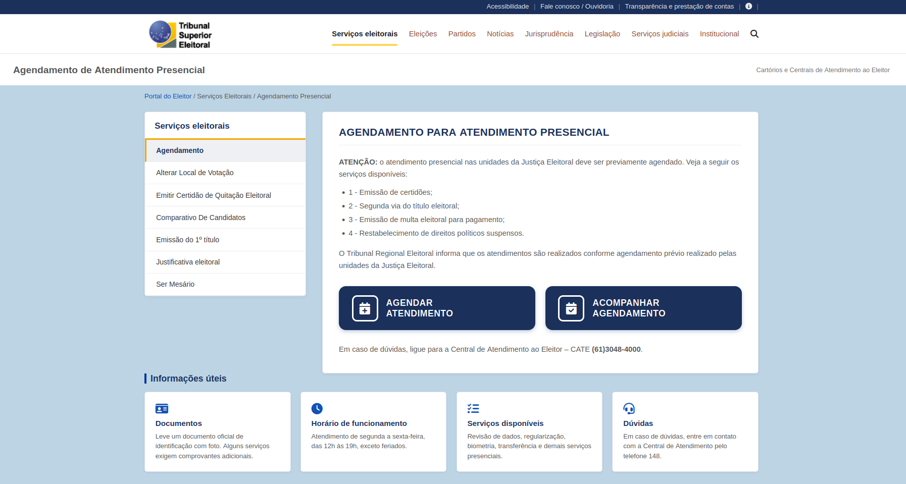
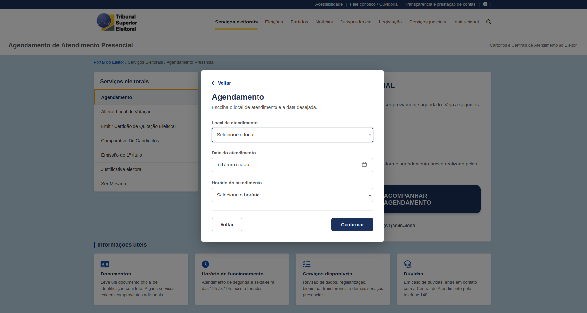
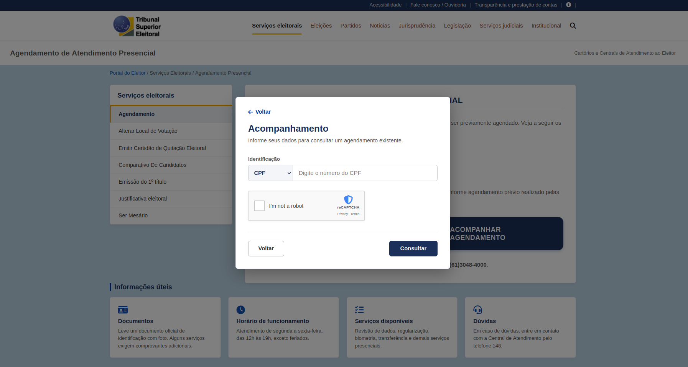
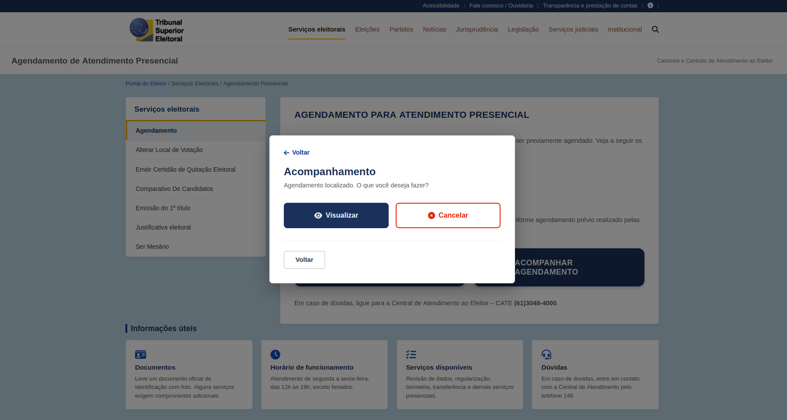
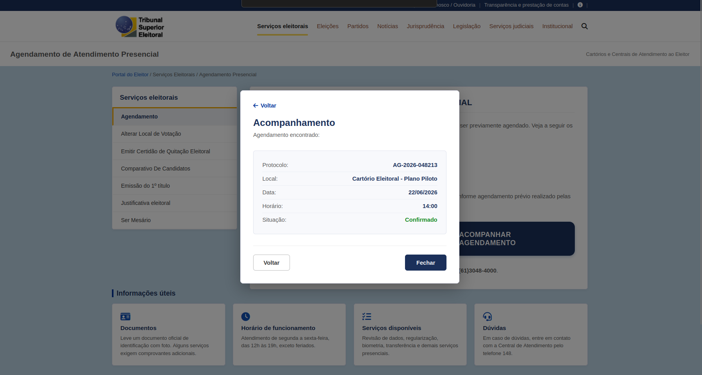
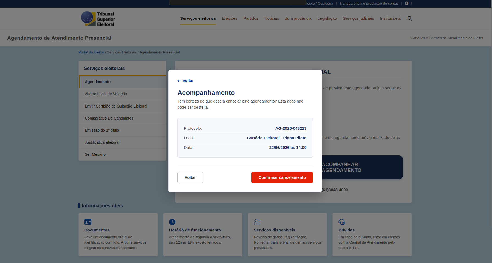

# Protótipo de Alta Fidelidade — Agendamento Presencial Online

## Grupo 02

---

## Tabela de Contribuição

| Integrante | Contribuição |
|:----------:|:-------------|
| Lucas Fujimoto | Criação do protótipo de alta fidelidade |

Tabela 1: Tabela de contribuição (Fonte: FUJIMOTO, Lucas, 2026).

---

## Introdução

Este artefato apresenta o **protótipo de alta fidelidade** da funcionalidade de **Agendamento Presencial Online** do portal do Tribunal Superior Eleitoral (TSE), desenvolvido no âmbito da disciplina de Interação Humano-Computador da Universidade de Brasília.

O protótipo simula o fluxo completo que o eleitor percorre ao tentar agendar ou acompanhar uma consulta presencial de maneira online. Ele foi implementado em HTML, CSS e JavaScript, servido localmente por meio do servidor FastAPI compartilhado pelo grupo.

---

## Objetivo

O protótipo de alta fidelidade tem por objetivo:

- Representar com maior fidelidade visual e interativa o fluxo real da funcionalidade;
- Permitir testes de usabilidade mais próximos da experiência real do usuário;
- Identificar problemas de navegação, clareza do fluxo e satisfação do usuário antes de uma implementação definitiva.

---

## Funcionalidade: Agendamento Presencial Online

O agendamento presencial online permite que o usuário realize um agendamento de maneira online, além disso, é possível também visualizar o protocolo ou cancelar o agendamento. O fluxo modelado no protótipo contempla as seguintes etapas:

| Etapa | Descrição |
|:-----:|:----------|
| 1 | Acesso ao Portal do Eleitor (TSE) |
| 2 | Clicar para agendar |
| 3 | Autenticar com CPF ou Título |
| 4 | Escolher Local, Data e Horário |
| 5 | Clicar para acompanhar |
| 6 | Autenticar com CPF, Título ou Protocolo |
| 7 | Clicar em visualizar ou cancelar agendamento |

---

## Como Executar o Protótipo

O protótipo é executado localmente junto ao servidor FastAPI do grupo. Siga as instruções no [README do FastAPI](FastAPI/README.md) para configurar o ambiente.

Após iniciar o servidor, acesse:

- **Protótipo:** [http://127.0.0.1:8000/agendamento](http://127.0.0.1:8000/agendamento)

---

## Protótipo de Alta Fidelidade

Nas imagens a seguir, apresenta-se o protótipo de papel no qual o usuario usuário escolhido para a avaliação irá simular uma navegação da página até o objetivo determinado.

Imagem 1: Protótipo de Alta Fidelidade: [Agendamento Presencial] (Fonte: FUJIMOTO, Lucas).

Imagem 2: Protótipo de Alta Fidelidade: [Agendamento Presencial] (Fonte: FUJIMOTO, Lucas).

Imagem 3: Protótipo de Alta Fidelidade: [Agendamento Presencial] (Fonte: FUJIMOTO, Lucas).

Imagem 4: Protótipo de Alta Fidelidade: [Agendamento Presencial] (Fonte: FUJIMOTO, Lucas).

Imagem 5: Protótipo de Alta Fidelidade: [Agendamento Presencial] (Fonte: FUJIMOTO, Lucas).

Imagem 6: Protótipo de Alta Fidelidade: [Agendamento Presencial] (Fonte: FUJIMOTO, Lucas).

Imagem 7: Protótipo de Alta Fidelidade: [Agendamento Presencial] (Fonte: FUJIMOTO, Lucas).

---

## Tarefa Modelada

> *O usuário precisou agendar uma consulta presencial, assim, decidiu olhar o site do tse para realizar essa tarefa. Ao entrar no sítio online, Clicou no botão de agendar, preencheu o local, data, horário que queria, e clicou para confirmar.*

---

## Bibliografia

> <a id="REF1" href="#anchor_1">1.</a> BARBOSA, Simone D. J.; SILVA, Bruno S. da; SILVEIRA, Milene S.; GASPARINI, Isabela; DARIN, Ticianne; BARBOSA, Gabriel D. J. **Interação Humano-Computador e Experiência do Usuário**. Rio de Janeiro: Autopublicação, 2021.

---

## Histórico de Versão

| Data | Versão | Descrição | Autor(es) | Revisor(es) |
|:----:|:------:|:----------|:---------:|:-----------:|
| 16/06/2026 | 1.0 | Criação do documento e do protótipo | Lucas Fujimoto | Samuel |

Tabela 2: Histórico de Versão (Fonte: FUJIMOTO, Lucas, 2026).

---

## Agradecimentos

Agradecemos à IA Generativa **Claude** (Anthropic) pelo suporte na elaboração deste documento e do protótipo. A ferramenta foi utilizada para auxiliar na estruturação do documento, na codificação do HTML/CSS/JS e na formatação das tabelas e seções, seguindo o modelo de artefato do Grupo 02. Todo o conteúdo técnico, incluindo a definição do fluxo de tarefas, as decisões de design e a escolha dos elementos de interface, foram realizados pelos integrantes da equipe; o Claude atuou como assistente de formatação e codificação, sem interferir nas escolhas metodológicas do grupo.
