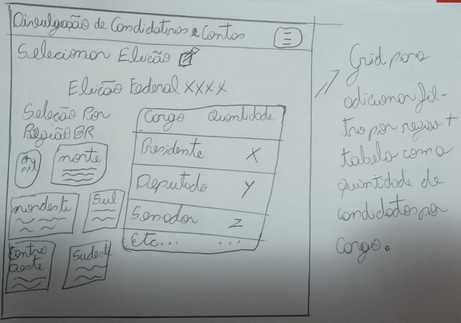
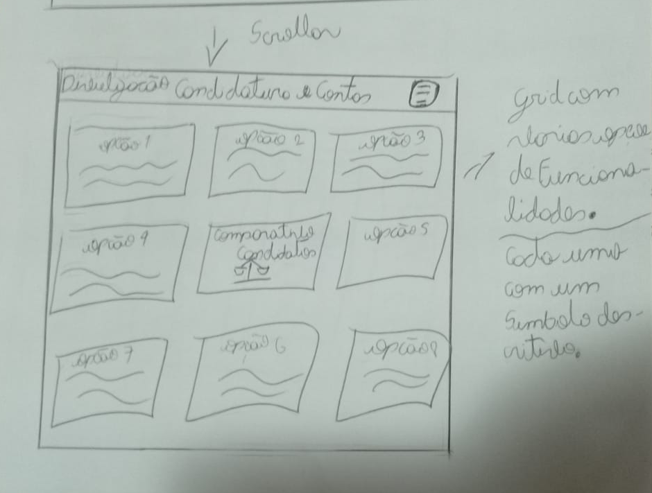
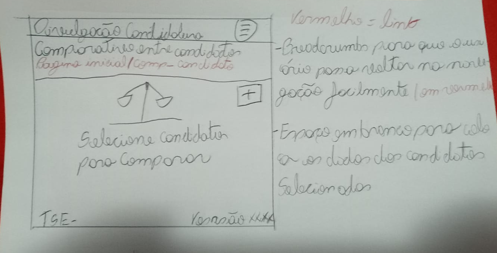
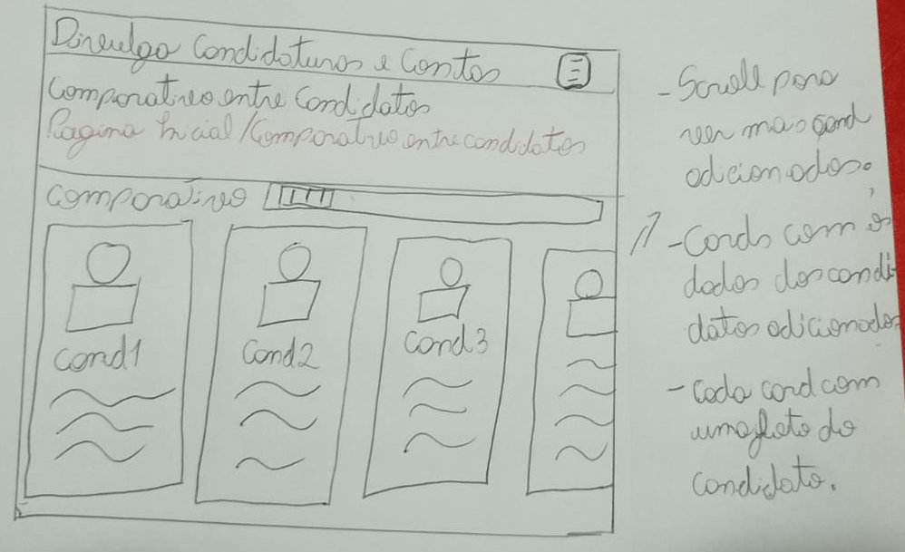

# Protótipo de Papel — Grupo 02

---

## Tabela de Contribuição

| Integrante | Contribuição |
|:----------:|:-------------|
| Tiago Geovane | Criação e padronização do documento de protótipo de papel |

Tabela 1: Tabela de contribuição (Fonte: SOUSA, Tiago Geovane, 2026).

---

## Introdução

Este documento exibe o protótipo de papel criado pelo Grupo 02 focado na funcionalidade de comparar candidatos e visualizar dados na plataforma. A finalidade deste artefato é demonstrar visualmente e de maneira palpável como o usuário final interage com a interface para avaliar e contrastar informações eleitorais, validando a usabilidade e a clareza da disposição dos dados antes da etapa de implementação digital em software.

As imagens do protótipo delineiam a jornada do usuário passo a passo, ilustrando os painéis de navegação, a seleção dos perfis e as opções de interação para comparação direta, disponíveis na interface desenhada à mão.

---

## Protótipo de papel

### Tarefa: Comparar Candidatos (DivulgaCandContas)

Abaixo, apresentam-se as imagens do protótipo de papel nas quais o usuário poderá simular a navegação da página até o objetivo determinado de comparar as propostas e contas dos candidatos.

Imagem 1: Protótipo de Papel: [Comparar Candidatos] (Fonte: SOUSA, Tiago Geovane, 2026).

---

## Bibliografia

> <a id="REF1" href="#anchor_1">1.</a> BARBOSA, Simone D. J.; SILVA, Bruno S. da; SILVEIRA, Milene S.; GASPARINI, Isabela; DARIN, Ticianne; BARBOSA, Gabriel D. J. **Interação Humano-Computador e Experiência do Usuário**. Rio de Janeiro: Autopublicação, 2021.

---

## Histórico de Versão

| Data | Versão | Descrição | Autor(es) | Revisor(es) |
|:----:|:------:|:----------|:---------:|:-----------:|
| 06/06/2026 | 1.0 | Criação do documento de protótipo de papel | Tiago Geovane | Samuel |

Tabela 2: Histórico de Versão (Fonte: SOUSA, Tiago Geovane, 2026).

---

---

## Agradecimentos

Agradecemos à IA Generativa **Claude** (Anthropic) pelo suporte na elaboração deste documento. A ferramenta foi utilizada para auxiliar na estruturação do documento, na redação da introdução e na formatação das tabelas e seções, seguindo o modelo de artefato do Grupo 02. Todo o conteúdo técnico — incluindo a definição da tarefa, o desenvolvimento do protótipo e as decisões de design — foram realizados pelos integrantes da equipe; o Claude atuou como assistente de formatação e redação, sem interferir nas escolhas metodológicas do grupo.
