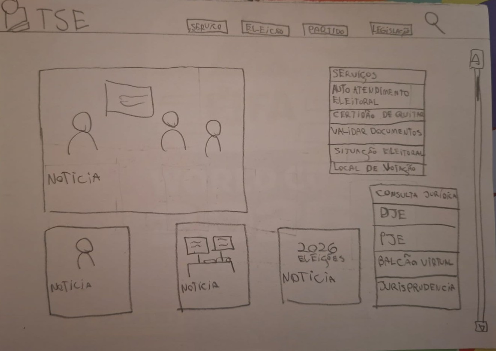
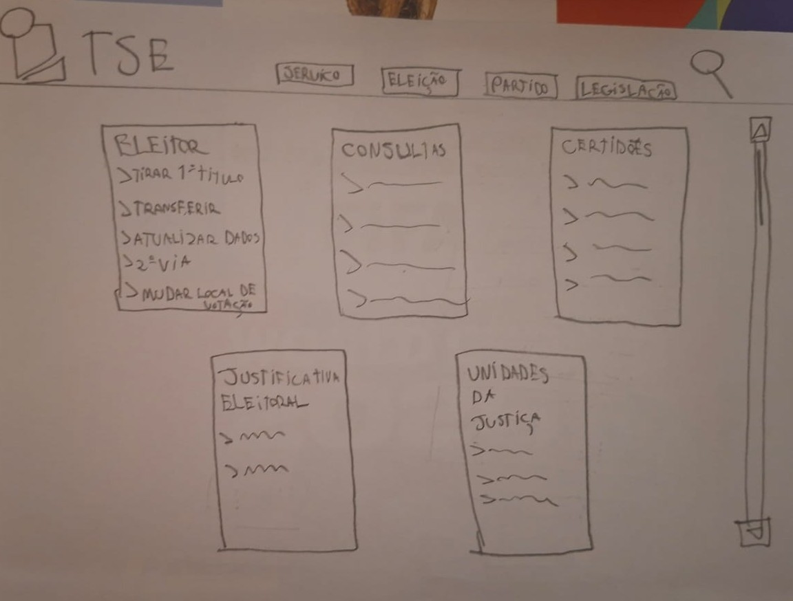
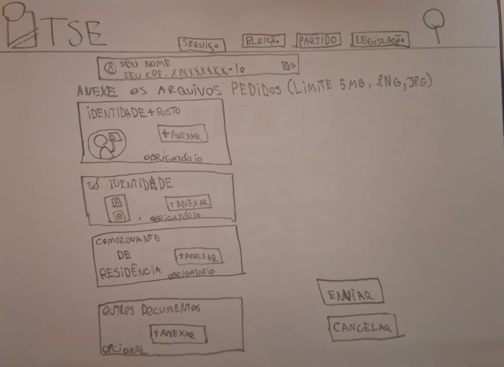
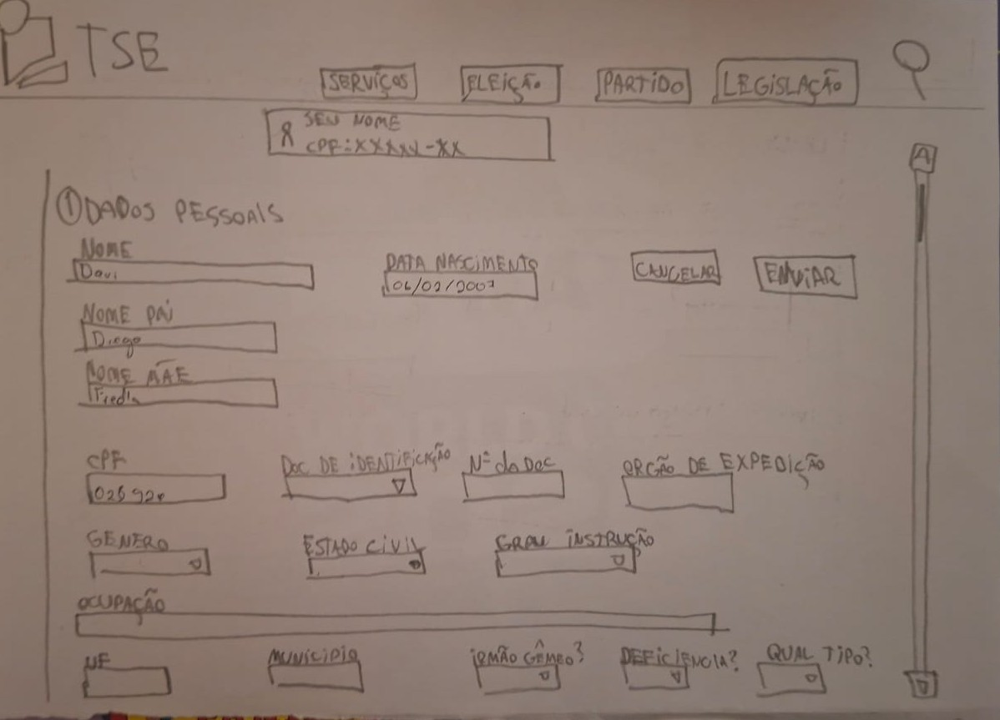
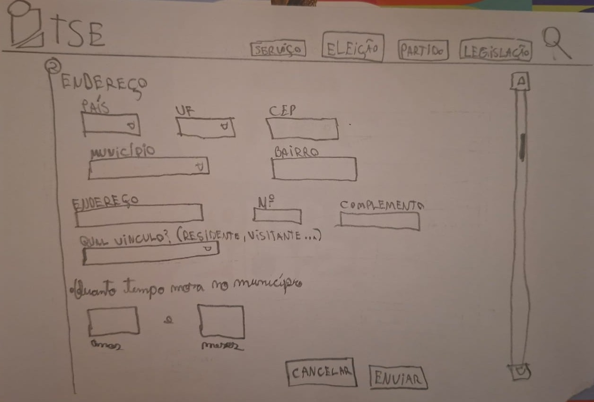
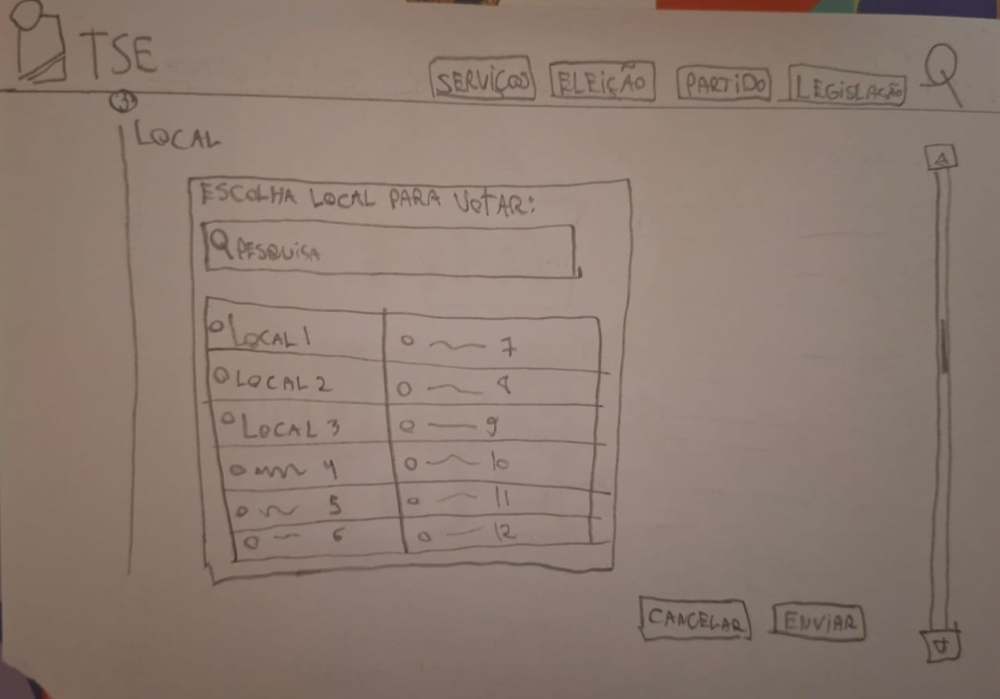
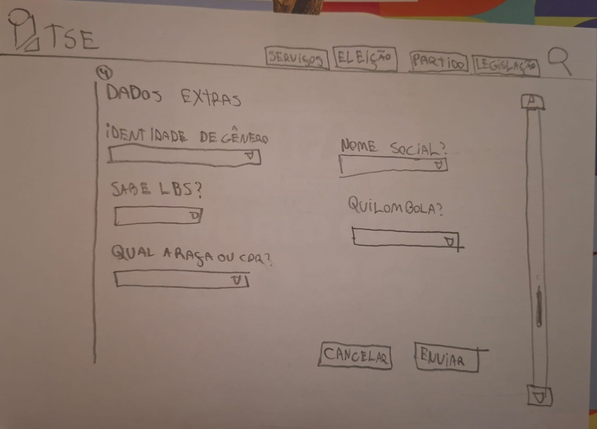
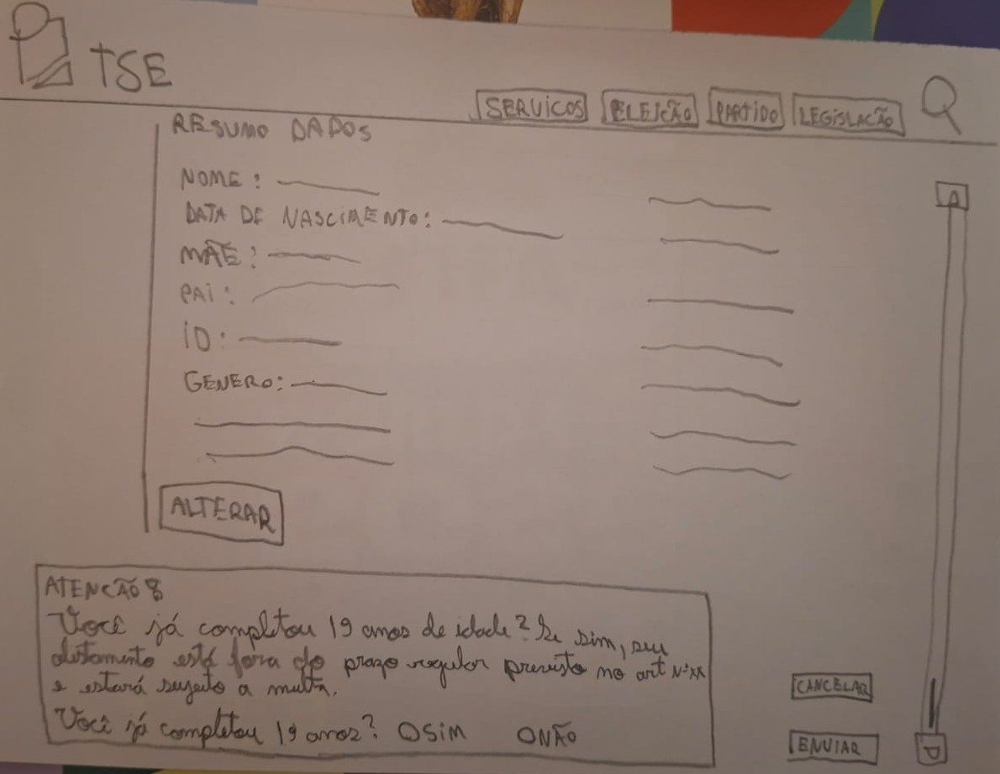
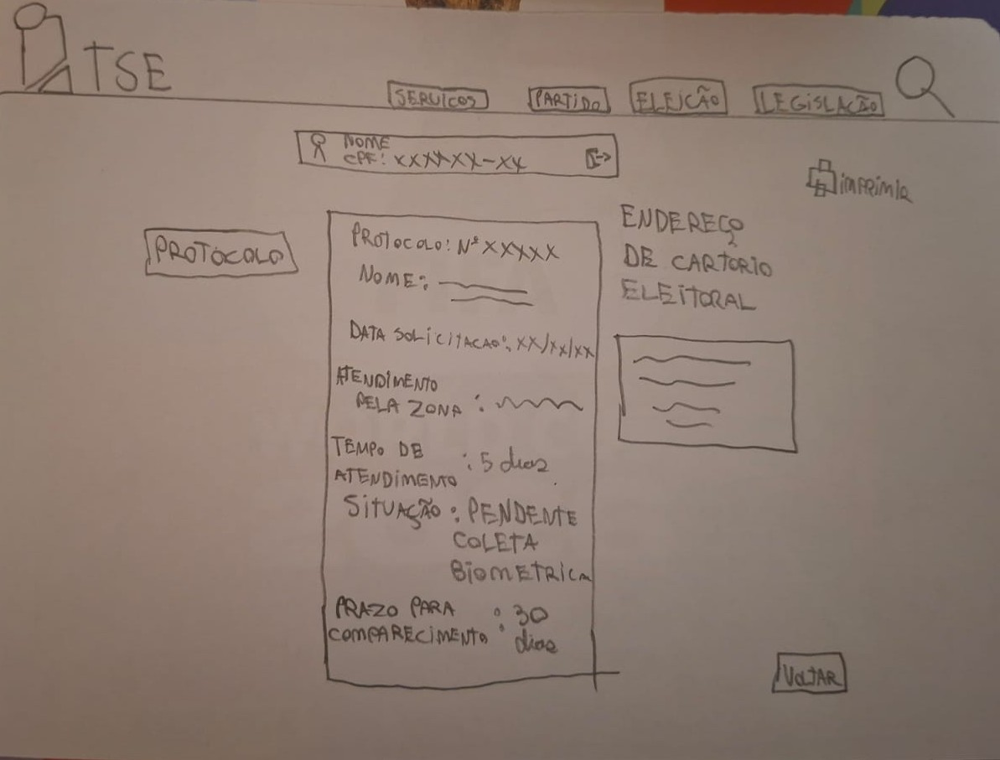

# Protótipo de Papel — Grupo 02

---

## Tabela de Contribuição

| Integrante | Contribuição |
|:----------:|:-------------|
| Maria Luana | Criação do documento de protótipo de papel |

Tabela 1: Tabela de contribuição (Fonte: SOARES LOPES, Maria Luana).

---

## Introdução

Este artefato apresenta um protótipo de papel desenvolvido pelo Grupo 02, referente a uma das tarefas identificadas nos cenários do projeto. O objetivo é ilustrar, de forma clara e contextualizada, a sequência de interações do usuário com o sistema, evidenciando a motivação, os passos executados e a satisfação ao final da tarefa.

Cada protótipo de papel contempla os seguintes elementos:

- As pessoas envolvidas;
- Ambiente/contexto;
- Tarefas;
- Passos envolvidos;
- A motivação para usar o sistema;
- O que as pessoas precisam fazer para completar a tarefa;
- A satisfação da pessoa ao completar a tarefa.

---

## Protótipo de papel

### Tarefa 1: Emitir 1° Titulo de Eleitor

Nas imagens a seguir, apresenta-se o protótipo de papel no qual o usuario usuário escolhido para a avaliação irá simular uma navegação da página até o objetivo determinado.

Imagem 1: Protótipo de Papel: [Emitir 1° Titulo de Eleitor] (Fonte: SOARES LOPES, Maria Luana).

Imagem 2: Protótipo de Papel: [Emitir 1° Titulo de Eleitor] (Fonte: SOARES LOPES, Maria Luana).

Imagem 3: Protótipo de Papel: [Emitir 1° Titulo de Eleitor] (Fonte: SOARES LOPES, Maria Luana).

Imagem 4: Protótipo de Papel: [Emitir 1° Titulo de Eleitor] (Fonte: SOARES LOPES, Maria Luana).

Imagem 5: Protótipo de Papel: [Emitir 1° Titulo de Eleitor] (Fonte: SOARES LOPES, Maria Luana).

Imagem 6: Protótipo de Papel: [Emitir 1° Titulo de Eleitor] (Fonte: SOARES LOPES, Maria Luana).

Imagem 7: Protótipo de Papel: [Emitir 1° Titulo de Eleitor] (Fonte: SOARES LOPES, Maria Luana).

Imagem 8: Protótipo de Papel: [Emitir 1° Titulo de Eleitor] (Fonte: SOARES LOPES, Maria Luana).

Imagem 9: Protótipo de Papel: [Emitir 1° Titulo de Eleitor] (Fonte: SOARES LOPES, Maria Luana).

---

## Bibliografia

> <a id="REF1" href="#anchor_1">1.</a> BARBOSA, Simone D. J.; SILVA, Bruno S. da; SILVEIRA, Milene S.; GASPARINI, Isabela; DARIN, Ticianne; BARBOSA, Gabriel D. J. **Interação Humano-Computador e Experiência do Usuário**. Rio de Janeiro: Autopublicação, 2021.

---

## Histórico de Versão

| Data | Versão | Descrição | Autor(es) | Revisor(es) |
|:----:|:------:|:----------|:---------:|:-----------:|
| 07/06/2026 | 1.0 | Criação do documento | Maria Luana | Guilherme |

Tabela 1: Histórico de Versão (Fonte: SOARES LOPES, Maria Luana).

---

---

## Agradecimentos

Agradecemos à IA Generativa **Claude** (Anthropic) pelo suporte na elaboração deste documento. A ferramenta foi utilizada para auxiliar na estruturação do documento, na redação da introdução e na formatação das tabelas e seções, seguindo o modelo de artefato do Grupo 02. Todo o conteúdo técnico — incluindo a definição da tarefa, o desenvolvimento do storyboard e as decisões de design — foram realizados pelos integrantes da equipe; o Claude atuou como assistente de formatação e redação, sem interferir nas escolhas metodológicas do grupo.