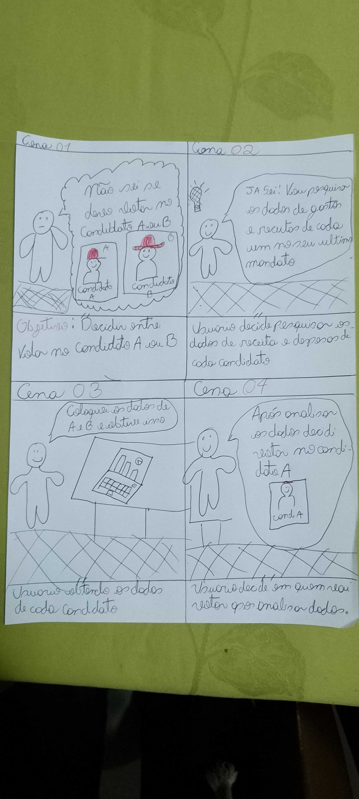
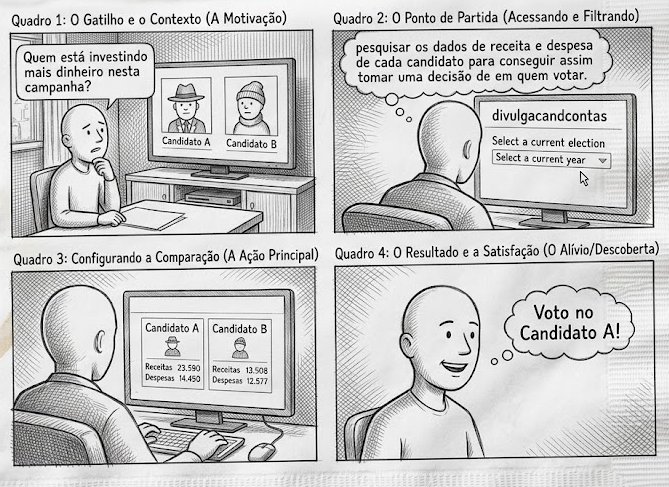

# Storyboard — Grupo 02

---

## Tabela de Contribuição

| Integrante | Contribuição |
|:----------:|:-------------|
| Tiago | Criação do documento de storyboard e Padronização do artefato |

Tabela 1: Tabela de contribuição (Fonte: SOUSA, Tiago, 2026).

---

## Introdução

O storyboard é um protótipo de baixa fidelidade amplamente utilizado no processo de design de sistemas interativos, especialmente na área de Interação Humano-Computador (IHC). Ele consiste em uma série de ilustrações sequenciais que representam os principais momentos, ações e interações de uma cena ou tarefa, acompanhadas de descrições escritas ou diálogos relacionados. Sua principal vantagem está na simplicidade, no baixo custo de produção e na facilidade de alteração, tornando-o uma ferramenta eficaz para comunicar ideias de forma visual antes do desenvolvimento do sistema.[^1]

Este artefato apresenta um storyboard desenvolvido pelo Grupo 02, referente a uma das tarefas identificadas nos cenários do projeto. O objetivo é ilustrar, de forma clara e contextualizada, a sequência de interações do usuário com o sistema, evidenciando a motivação, os passos executados e a satisfação ao final da tarefa.

Cada storyboard contempla os seguintes elementos:

- As pessoas envolvidas;
- Ambiente/contexto;
- Tarefas;
- Passos envolvidos;
- A motivação para usar o sistema;
- O que as pessoas precisam fazer para completar a tarefa;
- A satisfação da pessoa ao completar a tarefa.

---

## Storyboard

### Tarefa 1: Comparar gastos entre candidatos

Na figura 1, apresenta-se um storyboard no qual o usuario pesquisa os dados de gastos e receita de dois candidatos para se informar e decidir em quem votar, feito em papel

Imagem 1: Storyboard: [Comparar gastos entre candidatos] (Fonte: SOUSA, Tiago, 2026).

Na figura 2, apresenta-se um storyboard no qual o usuario pesquisa os dados de gastos e receita de dois candidatos para se informar e decidir em quem votar, feito em por um modelo de inteligencia artifical

Imagem 2: Storyboard: [Comparar gastos entre candidatos] (Fonte: SOUSA, Tiago, 2026).

---

## Bibliografia

> <a id="REF1" href="#anchor_1">1.</a> KLEMMER, Scott. **Storyboards, Paper Prototypes and Mockups**. Univ. Califórnia em Berkeley (Coursera). Disponível em: [https://www.youtube.com/watch?v=h2H3oIQtddU](https://www.youtube.com/watch?v=h2H3oIQtddU). Acesso em: 19 mai. 2026.

> <a id="REF1" href="#anchor_1">1.</a> BARBOSA, Simone D. J.; SILVA, Bruno S. da; SILVEIRA, Milene S.; GASPARINI, Isabela; DARIN, Ticianne; BARBOSA, Gabriel D. J. **Interação Humano-Computador e Experiência do Usuário**. Rio de Janeiro: Autopublicação, 2021.

---

## Histórico de Versão

| Data | Versão | Descrição | Autor(es) | Revisor(es) |
|:----:|:------:|:----------|:---------:|:-----------:|
| 19/05/06 | 1.0 | Criação do documento de storyboard | Tiago | Bryan |
| 23/05/2026 | 1.1 | Padronização do artefato | Tiago | Luan |

Tabela 2: Histórico de Versão (Fonte: SOUSA, Tiago, 2026).

---

## Agradecimentos

Agradecemos à IA Generativa **Claude** (Anthropic) pelo suporte na elaboração deste documento. A ferramenta foi utilizada para auxiliar na estruturação do documento, na redação da introdução e na formatação das tabelas e seções, seguindo o modelo de artefato do Grupo 02. Todo o conteúdo técnico — incluindo a definição da tarefa, o desenvolvimento do storyboard e as decisões de design — foram realizados pelos integrantes da equipe; o Claude atuou como assistente de formatação e redação, sem interferir nas escolhas metodológicas do grupo.
