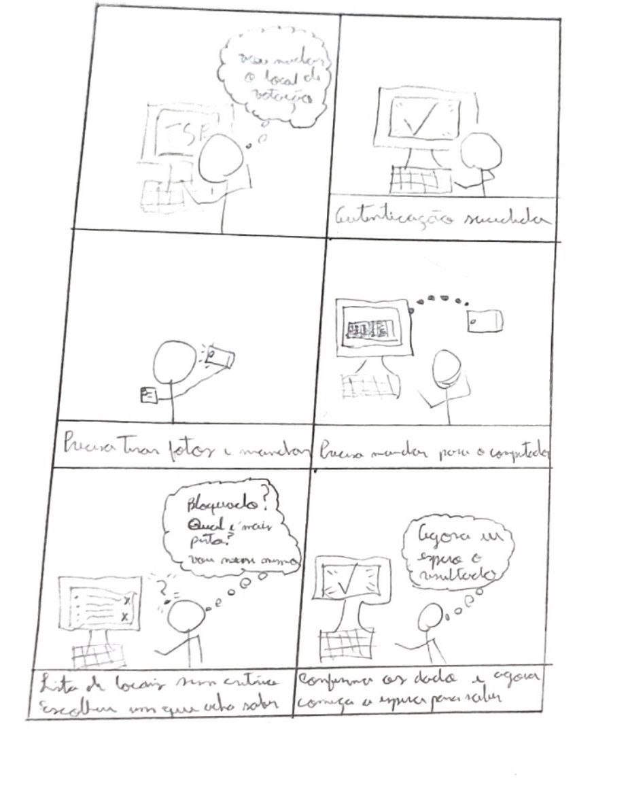

# Storyboard — Grupo 02

---

## Tabela de Contribuição

| Integrante | Contribuição |
|:----------:|:-------------|
| Tiago | Padronização do artefato |
| Guilherme | Criação do documento de storyboard |

Tabela 1: Tabela de contribuição (Fonte: CARVALHO, Guilherme, 2026).

---

Imagem 1: Storyboard — Tentando votar em local mais perto (Fonte: CARVALHO, Guilherme, 2026).

A sequência de passos é baseada na análise de tarefas realizada na etapa de levantamento de requisitos e descreve os principais pontos de atenção no fluxo atual do processo. Destacam-se a ausência de resposta imediata, a existência de diversas opções de locais sem critério de ordenação e a presença de opções indisponíveis entre as alternativas exibidas, fatores que podem gerar confusão para o usuário.

## Introdução

O storyboard é um protótipo de baixa fidelidade amplamente utilizado no processo de design de sistemas interativos, especialmente na área de Interação Humano-Computador (IHC). Ele consiste em uma série de ilustrações sequenciais que representam os principais momentos, ações e interações de uma cena ou tarefa, acompanhadas de descrições escritas ou diálogos relacionados. Sua principal vantagem está na simplicidade, no baixo custo de produção e na facilidade de alteração, tornando-o uma ferramenta eficaz para comunicar ideias de forma visual antes do desenvolvimento do sistema. [1](#referência-bibliográfica)

Este artefato apresenta um storyboard desenvolvido pelo Grupo 02, referente a uma das tarefas identificadas nos cenários do projeto. O objetivo é ilustrar, de forma clara e contextualizada, a sequência de interações do usuário com o sistema, evidenciando a motivação, os passos executados e a satisfação ao final da tarefa.

Cada storyboard contempla os seguintes elementos:

- As pessoas envolvidas;
- Ambiente/contexto;
- Tarefas;
- Passos envolvidos;
- A motivação para usar o sistema;
- O que as pessoas precisam fazer para completar a tarefa;
- A satisfação da pessoa ao completar a tarefa.

---

## Storyboard

### Tarefa 1: Tentar votar em local mais perto

Na imagem 1, apresenta-se um storyboard no qual Luiz Ribeiro, estudante universitário, utiliza o Autoatendimento Eleitoral do TSE para tentar solicitar a troca do seu local de votação para um ponto mais próximo de onde mora, feito em papel.

Imagem 2: Storyboard: Tentando votar em local mais perto (Fonte: CARVALHO, Guilherme, 2026).

---

## Bibliografia

> 1. KLEMMER, Scott. **Storyboards, Paper Prototypes and Mockups**. Univ. Califórnia em Berkeley (Coursera). Disponível em: [https://www.youtube.com/watch?v=h2H3oIQtddU](https://www.youtube.com/watch?v=h2H3oIQtddU). Acesso em: 19 mai. 2026.

> BARBOSA, Simone D. J.; SILVA, Bruno S. da; SILVEIRA, Milene S.; GASPARINI, Isabela; DARIN, Ticianne; BARBOSA, Gabriel D. J. **Interação Humano-Computador e Experiência do Usuário**. Rio de Janeiro: Autopublicação, 2021.

> TRIBUNAL SUPERIOR ELEITORAL. **Atualizar dados pessoais, endereço ou local de votação**. Disponível em: [https://www.tse.jus.br/servicos-eleitorais/autoatendimento-eleitoral](https://www.tse.jus.br/servicos-eleitorais/autoatendimento-eleitoral). Acesso em: 03 mai. 2026.

---

## Histórico de Versão

| Data | Versão | Descrição | Autor(es) | Revisor(es) |
|:----:|:------:|:----------|:---------:|:-----------:|
| 19/05/2026 | 1.0 | Criação do documento de storyboard | Guilherme | Maria Luana |
| 19/05/2026 | 1.1 | Correção da formatação | Guilherme | Maria Luana |
| 23/05/2026 | 1.2 | Criação de nova versão | Tiago | Guilherme |

Tabela 2: Histórico de Versão (Fonte: CARVALHO, Guilherme, 2026).

---

## Agradecimentos

Agradecemos à IA Generativa **Claude** (Anthropic) pelo suporte na elaboração deste documento. A ferramenta foi utilizada para auxiliar na estruturação do documento, na redação da introdução e na formatação das tabelas e seções, seguindo o modelo de artefato do Grupo 02. Todo o conteúdo técnico — incluindo a definição da tarefa, o desenvolvimento do cenário e as decisões de design — foram realizados pelos integrantes da equipe; o Claude atuou como assistente de formatação, redação e visualização, sem interferir nas escolhas metodológicas do grupo.