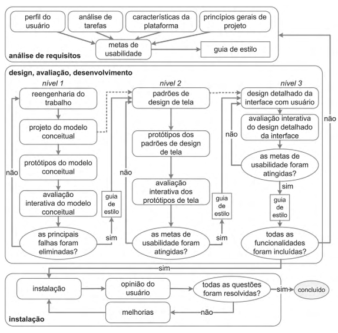

# Ciclo de Vida do Projeto 

---

## Tabela de Contribuição

| Integrante | Contribuição |
|:----------:|:-------------|
| Guilherme | Criação do documento de ciclo de vida do projeto |
| IA - Claude | Formatação do documento |

Tabela 1: Tabela de contribuição (Fonte: CARVALHO, Guilherme).

---

## Introdução

Este documento apresenta o ciclo de vida de design adotado no desenvolvimento do projeto da disciplina de Interação Humano-Computador (IHC), justificando os motivos que levaram à escolha do modelo utilizado.

Antes de definir o ciclo de vida a ser seguido, o grupo analisou os principais modelos existentes na literatura de IHC, comparando suas características, vantagens e limitações. A seguir, são descritos brevemente os modelos analisados, seguidos da justificativa da escolha final.

---

## Modelos de Ciclo de Vida Analisados

### Ciclo de Vida Simples

Proposto por Preece, Sharp e Rogers, é um modelo mais direto e menos detalhado, que organiza o processo de design em etapas amplas. É recomendado para equipes que já possuem experiência prévia em IHC, já que não detalha profundamente cada atividade. Nesse modelo, a etapa de síntese envolve tanto a concepção do design quanto a construção de uma versão interativa que permita sua avaliação.

### Ciclo de Vida em Estrela

Desenvolvido por Hix e Hartson, é um dos primeiros modelos específicos para IHC. É composto por seis atividades principais: análise de tarefas, usuários e funções; especificação de requisitos; projeto conceitual; prototipação; implementação; e avaliação. Seu principal diferencial é a centralidade da avaliação, que deve ocorrer após cada etapa, sem impor uma ordem fixa entre as atividades.

### Engenharia de Usabilidade de Nielsen

Proposta por Jakob Nielsen, organiza o processo em dez atividades, com forte ênfase nas fases iniciais do projeto, desde o conhecimento do usuário até a realização de testes empíricos e a prática do design iterativo. Destaca a importância de validar decisões antes da implementação, reduzindo retrabalho e aumentando a qualidade da interface.

### Engenharia de Usabilidade de Mayhew

Proposto por Deborah Mayhew, apresenta uma abordagem abrangente e estruturada para o desenvolvimento de sistemas interativos, dividida em três fases principais:

**Fase 1 – Análise de Requisitos:** definição das metas de usabilidade com base em quatro elementos: perfil dos usuários, análise de tarefas, plataforma e restrições, e princípios de IHC.

**Fase 2 – Design, Avaliação e Desenvolvimento:** construção da solução em níveis progressivos de fidelidade (baixa, média e alta), com avaliação constante com usuários em todos os níveis.

**Fase 3 – Instalação:** coleta de feedback real dos usuários em uso contínuo, servindo como base para melhorias futuras ou novos desenvolvimentos.

---

## Justificativa da Escolha do Modelo

Após a análise dos modelos apresentados, o grupo optou por utilizar o **ciclo de vida de Mayhew** como base para o projeto.

Essa escolha se deve, principalmente, ao **alto nível de detalhamento** do modelo, que fornece orientações claras sobre o que deve ser feito em cada etapa. Diferentemente de outros modelos mais abstratos, como o Ciclo de Vida Simples ou o Ciclo de Vida em Estrela, o modelo de Mayhew oferece um **guia estruturado** que facilita a condução do projeto do início ao fim. Veja a figura 1 para entender a estrutura desse ciclo.

Imagem 1: Ciclo de vida para a engenharia de usabilidade (adaptado de Mayhew, 1999) (Fonte: BARBOSA, 2010, p. 110).

Além disso, o modelo é **especialmente adequado para equipes que ainda estão desenvolvendo experiência em IHC**, pois reduz a dependência de conhecimento prévio ao fornecer um roteiro bem definido, com fases e atividades claramente delimitadas. Isso é particularmente relevante para o contexto do grupo, que se beneficiou de uma estrutura que orienta as decisões de design em cada etapa do desenvolvimento.

Por fim, a ênfase do modelo na avaliação contínua com usuários presente em todos os níveis da Fase 2 está alinhada aos princípios fundamentais da IHC adotados pelo grupo: foco no usuário e adoção de um ciclo iterativo de design e avaliação.

---

## Bibliografia

> <a id="REF1" href="#anchor_1">1.</a> BARBOSA, Simone; SILVA, Bruno. **Interação Humano-Computador**. Rio de Janeiro: Elsevier, 2010.

---

## Histórico de Versão

| Data | Versão | Descrição | Autor(es) | Revisor(es) |
|:----:|:------:|:----------|:---------:|:-----------:|
| 01/07/2026 | 1.0 | Criação do documento | Guilherme | Maria Luana |

Tabela 1: Histórico de Versão (Fonte: CARVALHO, Guilherme).

---

## Agradecimentos

Agradecemos à IA Generativa **Claude** (Anthropic) pelo suporte na elaboração deste documento. A ferramenta foi utilizada para auxiliar na estruturação do documento, na redação da introdução e na formatação das tabelas e seções, seguindo o modelo de artefato do Grupo 02. Todo o conteúdo técnico — incluindo a análise dos modelos de ciclo de vida e a justificativa da escolha do modelo de Mayhew — foi definido pelos integrantes da equipe; o Claude atuou como assistente de formatação e redação, sem interferir nas escolhas metodológicas do grupo.