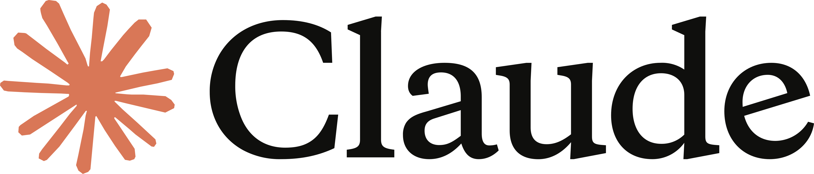
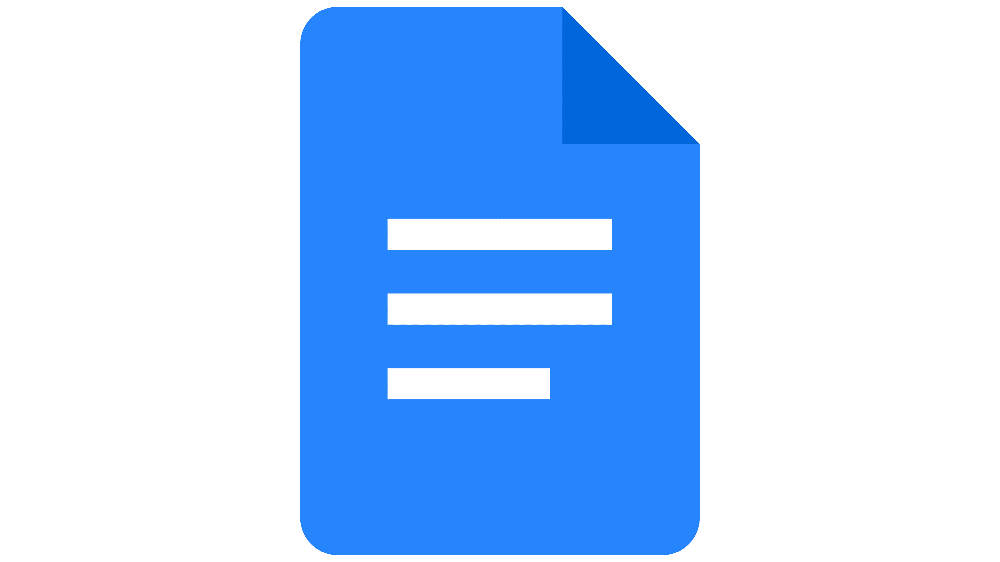
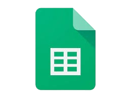
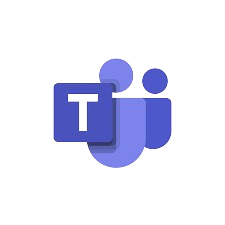
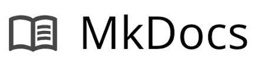
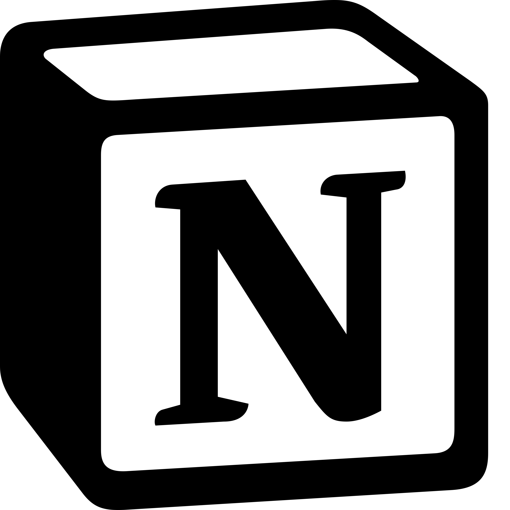
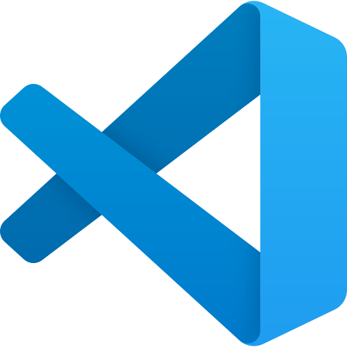

# Ferramentas do Projeto
## Grupo 02

---

## Histórico de Versão

| Data | Versão | Descrição | Autor(es) | Revisor(es) |
|:----:|:------:|:----------|:---------:|:-----------:|
| 10/04/2026 | 1.0 | Criação do documento contendo as ferramentas | Maria Luana | Tiago Geovane |
| 15/04/2026 | 1.1 | Correção das imagens das ferramentas | Lucas Fujimoto | Maria Luana|
| 15/04/2026 | 1.2 | Adição de novas ferramentas e indicação das utilizadas em cada etapa | Maria Luana | Guilherme |

---

## Introdução

Este documento apresenta as ferramentas utilizadas pelo grupo ao longo do desenvolvimento do projeto da disciplina de Interação Humano-Computador (IHC). O objetivo é registrar os softwares adotados para apoiar a organização da equipe, a produção dos artefatos e a gestão do projeto.

A escolha dessas ferramentas visa aumentar a eficiência do trabalho colaborativo, facilitar o controle de versões e garantir uma melhor comunicação entre os integrantes do grupo. Essa seleção foi realizada utilizando como referência as ferramentas escolhidas por projetos anteriores e com os resultados do consenso do grupo após uma pequena sessão de brainstorming.

- Projetos utilizados como referência:
  - Interacao-Humano-Computador/2023.1-BilheteriaDigital
  - Interacao-Humano-Computador/2022.2-Lichess
  - Interacao-Humano-Computador/2023.1-BancoCentral

---

## Ferramentas Selecionadas

Todas as ferramentas escolhidas pelo grupo estão descritas na tabela 1, juntamente com suas respectivas finalidades no contexto do projeto. 

| Logo | Ferramenta | Finalidade |
|:---:|:----------:|:-----------|
|  | Claude IA | Apoio na organização da estrutura e padronização dos documentos |
|  | GitHub | Manter, organizar e controlar a versão dos artefatos do projeto |
|  | Google Docs | Documentação colaborativa |
|  | Google Sheets | Organização de dados e criação de planilhas |
|  | Microsoft Teams | Comunicação e realização de reuniões da equipe |
|  | MkDocs | Geração das páginas de documentação |
|  | Notion | Organização e distribuição de tarefas |
|  | VsCode | Criação e edição da documentação |
|  | WhatsApp | Comunicação rápida entre os membros |
|  | YouTube | Hospedagem e compartilhamento de vídeos do projeto |

Tabela 1: Ferramentas utilizadas no projeto (Fonte: SOARES LOPES, Maria Luana, 2026).

### Etapa 1
Durante a etapa 1 do projeto, foram utilizadas as seguintes ferramentas:

- Ferramentas de comunicação:
  - Microsoft Teams
  - Whatsapp

- Ferramentas de documentação:
  - Google Docs
  - Google Sheets
  - Mkdocs
  - Vscode

- Outras ferramentas:
  - Github
  - Claude IA
  - Youtube

### Etapa 2
Durante a etapa 2 do projeto, foram utilizadas as seguintes ferramentas:

- Ferramentas de comunicação:
  - Microsoft Teams
  - Whatsapp

- Ferramentas de documentação:
  - Mkdocs
  - Vscode

- Outras ferramentas:
  - Github
---

## Tabela de Contribuição

| Integrante | Contribuição |
|:----------:|:-------------|
| Maria Luana | Levantamento e documentação das ferramentas utilizadas |
| Tiago Geovane | Revisão do conteúdo e padronização |

Tabela 2: Tabela de contribuição (Fonte: autor, 2026).

---

## Referência Bibliográfica

GITHUB. **GitHub**. Disponível em: <https://github.com/>. Acesso em: 10 abr. 2026.

MKDOCS. **MkDocs**. Disponível em: <https://www.mkdocs.org/>. Acesso em: 10 abr. 2026.

MICROSOFT. **Microsoft Teams**. Disponível em: <https://www.microsoft.com/microsoft-teams>. Acesso em: 10 abr. 2026.

WHATSAPP. **WhatsApp**. Disponível em: <https://www.whatsapp.com/>. Acesso em: 10 abr. 2026.

GOOGLE. **Google Sheets**. Disponível em: <https://www.google.com/sheets/about/>. Acesso em: 10 abr. 2026.

GOOGLE. **Google Docs**. Disponível em: <https://www.google.com/docs/about/>. Acesso em: 10 abr. 2026.

YOUTUBE. **YouTube**. Disponível em: <https://www.youtube.com/>. Acesso em: 10 abr. 2026.

---

## Agradecimentos

Agradecemos à IA Generativa **Claude** (Anthropic) pelo suporte na elaboração deste documento. A ferramenta foi utilizada para auxiliar na organização da estrutura e padronização do conteúdo em formato acadêmico. Todo o conteúdo técnico e as decisões de projeto foram definidos pelos integrantes da equipe; o Claude atuou como assistente de formatação e redação, sem interferir nas escolhas metodológicas do grupo.
