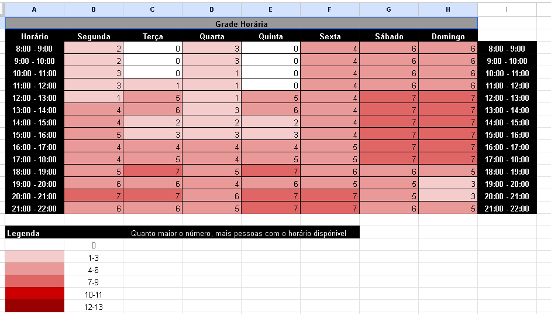

# Heatmap de Disponibilidade da Equipe
## Grupo 02

---

## Histórico de Versão

| Data | Versão | Descrição | Autor(es) | Revisor(es) |
|:----:|:------:|:----------|:---------:|:-----------:|
| 15/04/2026 | 1.0 | Criação do documento do heatmap de disponibilidade | Tiago | ----- |

---

## Introdução

Este documento apresenta o heatmap de disponibilidade dos integrantes da equipe, utilizado como ferramenta de apoio para organização de reuniões e definição de horários de trabalho colaborativo no projeto da disciplina de Interação Humano-Computador (IHC).

O heatmap, ou mapa de calor, é uma representação visual que permite identificar padrões de disponibilidade ao longo do tempo. Nesse contexto, ele foi utilizado para mapear os horários em que os integrantes do grupo estão disponíveis ou ocupados, facilitando a tomada de decisão quanto à marcação de encontros e divisão de atividades.

---

## Descrição do Heatmap

O heatmap de disponibilidade consiste em uma tabela visual onde os horários são organizados ao longo dos dias da semana e cada integrante indica seus períodos de ocupação.

A visualização utiliza cores para representar diferentes níveis de disponibilidade, permitindo identificar rapidamente os horários mais adequados para reuniões em grupo, ou aqueles com menor conflito de agenda.

---

## Construção do Heatmap

O heatmap foi construído utilizando a ferramenta **Google Sheets**, escolhida por sua facilidade de uso e colaboração em tempo real.

O processo de construção ocorreu da seguinte forma:

- Foi criada uma planilha contendo os dias da semana e intervalos de horários.  
- Cada integrante do grupo acessou a planilha e marcou os horários em que estava ocupado.  
- A partir dessas marcações, foi possível identificar juntar visualmente todos os dados para melhor interpretação deles. 

Essa abordagem permitiu uma visão clara e compartilhada da agenda do grupo, contribuindo para uma melhor organização das atividades.

Heatmap de Disponibilidade: <a href="https://docs.google.com/spreadsheets/d/1Jm0rxqWhgBwGmKBtouq9D5yVQB8GpTcptL05fGTCjNI">Heatmap</a>

---

## Representação do Heatmap

Abaixo está a representação visual do heatmap de disponibilidade da equipe:

<!-- Inserir imagem do heatmap abaixo -->

Tabela 1: Heatmap de disponibilidade da equipe (Fonte: autor, 2026).

---

## Tabela de Contribuição

| Integrante | Contribuição |
|:----------:|:-------------|
| Tiago | Criação da planilha e organização dos dados |
| Tiago, Maria, Bryan, Guilherme, Lucas, Luan e Samuel | Preenchimento do heatmap |
| Nome do Integrante 3 | Revisão do documento |

Tabela 2: Tabela de contribuição (Fonte: autor, 2026).

---

## Referência Bibliográfica

Não se aplica.

---

## Agradecimentos

Agradecemos à IA Generativa **Claude** (Anthropic) pelo suporte na elaboração deste documento. A ferramenta foi utilizada para auxiliar na organização da estrutura e padronização do conteúdo. Todo o conteúdo técnico e as decisões de projeto foram definidos pelos integrantes da equipe; o Claude atuou como assistente de formatação e redação, sem interferir nas escolhas metodológicas do grupo.
